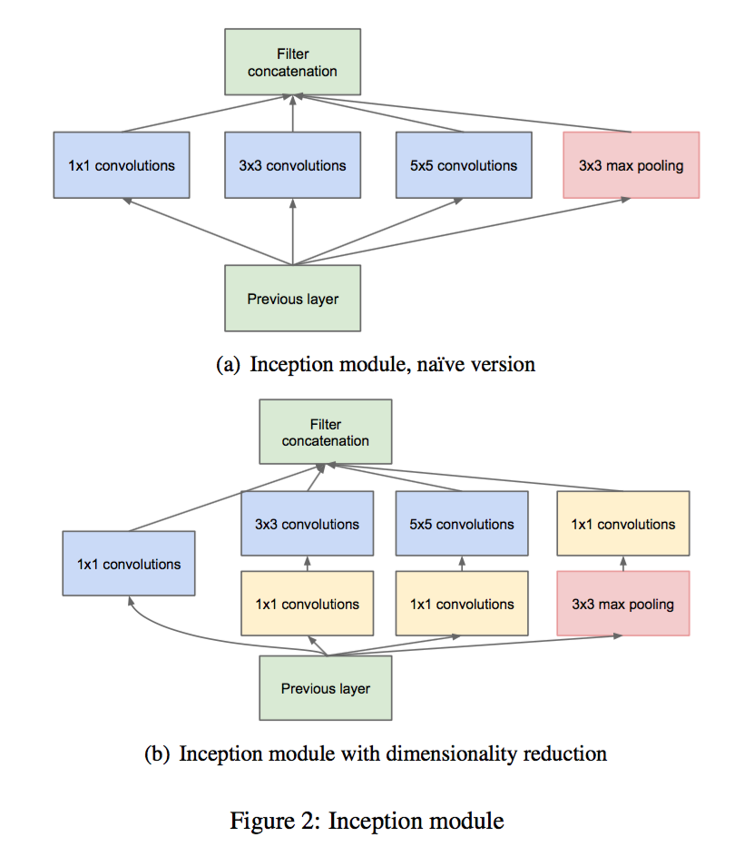

# C05. 卷积神经网络

## Outline

-   卷积层：填充、步幅、输入通道、输出通道
-   池化层
-   代表性的深度卷积神经网络
    -   AlexNet
    -   VGG
    -   NiN
    -   GoogLeNet
    -   ResNet
    -   DenseNet

## 5.1 二维卷积层

卷积神经网络是含有卷积层的神经网络

### 5.1.1 二维互相关运算

在二维卷积层中，一个二维输入数组和一个二维核数组通过互相关运算输出一个二维数组。

### 5.1.2 二维卷积层

二维卷积层将输入和卷积核做互相关运算，再加上一个标量偏差来得到输出。

### 5.1.3 图像中物体边缘检测

卷积层通过重复使用卷积核有效地表征局部空间。

### 5.1.4 通过数组学习核数组

通过迭代与反向传播算法求得核数组

### 5.1.5 互相关运算和卷积运算

### 5.1.6 特征图和感受野

二维卷积层输出的二维数组可以看作输入在空间维度(宽和高)上某一级的表征，也叫特征图(Feature Map)。

影响元素 $x$ 的前向计算的所有可能输入区域(可能大于输入的实际尺寸)叫作 $x$ 感受野(Receptive Field)。

## 5.2 填充和步幅

卷积层的输出形状由输入形状和卷积核窗口形状决定。

### 5.2.1 填充(Padding)

填充是指在输入高和宽的两侧填充元素(通常是 0 元素)

### 5.2.2 步幅(Stride)

卷积窗口从 输入数组的最左上方开始，按从左到右、从上到下的顺序，依次在输入数组上滑动。

步幅：每次滑动的行数和列数

### 5.2.3 小结

-   填充可以增加输出的高和宽。常被用来使输出与输入具有相同的高和宽
-   步幅可以减小输出的高和宽。常被用来缩小计算的规模

## 5.3 多输入通道和多输出通道

### 5.3.1 多输入通道

当输入数据包含多个通道时，需要构造一个与输入通道数相同的卷积核，从而能够与包含多输入通道的数据做互相关运算，再将多个通道的运算结果叠加在一起。

### 5.3.2 多输出通道

当输出数据包含多个通道时，需要构造多个与输入通道数相同的卷积核，从而输入数据与不同的卷积核计算的结果输出到不同的和中

### 5.3.3 $1\times 1$ 卷积层

卷积窗口形状为 $1\times 1$ 的多通道卷积层，作用与全连接层等价

### 5.3.4 小结

-   使用多通道可以拓展卷积层的模型参数
-   假设将通道维当作特征维，将高和宽维度上的元素当作数据样本，那么 $1\times 1$ 卷积层的作用与全连接层等价
-   卷积窗口形状为 $1\times 1$ 的卷积层通常用来调整网络层之间的通道数，并且控制模型复杂度

## 5.4 池化层(Pooling)

池化层：为了缓解卷积层对于位置的过度敏感性

### 5.4.1 二维最大池化层和平均池化层

-   卷积层：是计算输入和核的互相关性
-   池化层：是计算池化窗口内元素的最大值或者平均值，称之为最大池化或者平均池化

### 5.4.2 填充和步幅

池化层可以在输入的高和宽两侧进行填充，并且调整窗口的移动步幅来改变输出的形状

### 5.4.3 多通道

在处理多通道输入数据时，池化层对每个输入通道分别池化，而不会像卷积层将各个通道的输入按通道相加，因此池化层的输入通道与输出通道的数目相等

### 5.4.4 小结

-   最大池化或者平均池化分别取池化窗口中输入元素的最大值或者平均值作为输出
-   池化层叠 的主要作用是缓解卷积层对于位置的过度敏感性
-   可以指定池化层的填充和步幅
-   池化层的输入通道和输出通道的数目相同

## 5.5 卷积神经网络(LeNet)

卷积层解决的问题

-   卷积层保留输入形状，使图像的像素在高和宽两个方向上的相关性均可能被有效识别
-   卷积层通过滑动窗口将同一卷积核与不同位置的输入重复计算，从而避免参数尺寸过大

### 5.5.1 LeNet 模型

LeNet 分为卷积层块和全连接层块两个部分

-   卷积层块里的基本单位是卷积层后接最大池化层
    -   卷积层用来识别图像里面的空间模式
    -   最大池化层用来降低卷积层对位置的敏感性
    -   卷积层块由两个这样的基本单位重复堆叠构成
-   全连接层块将小批量中每个样本变平

小结

-   卷积神经网络就是含卷积层的网络
-   LeNet交替使用卷积层和最大池化层后接全连接层来进行图像分类

## 5.6 深度卷积神经网络(AlexNet)

图像分类研究的主要流程

-   获取图像数据集
-   使用已有的特征提取函数生成图像的特征
-   使用机器学习模型对图像的特征分类

机器学习中最重要的是数据和特征，使用相对干净的数据集和比较有效的特征甚至比选择合适的机器学习模型对图像分类结果影响更大。

### 5.6.1 学习特征表示

为了表征足够复杂的输入，特征本身应该分组表示。多层神经网络可以学到数据的多级表征，并且逐级表示越来越抽象的概念或者模式

无法实现多级表征的原因

-   缺失要素：数据
-   缺失要素：硬件

### 5.6.2 AlexNet

1.  包含 8 层变换：5 层卷积 + 2 层全连接隐藏层 + 1 层全连接输出层
    1.  卷积层数比 LeNet 多
    2.  卷积通道数比 LeNet 多
2.  使用 ReLU 代替 Sigmoid 为激活函数
3.  使用 Dropout 控制全连接层的模型复杂度
4.  使用数据增强技术扩大数据集来缓解过拟合

小结

-   AlexNet 与 LeNet 结构类似，但是使用了更多的卷积层和更大的参数空间来拟合大规模数据集
    -   AlexNet 是浅层神经网络和深度神经网络的分界线
-   AlexNet 相比 LeNet 的改变是观念上的转变，是多年的研究成果

## 5.7 使用重复元素的网络(VGG)

VGG 提出了可以通过重复使用简单的基础块来构建深度模型

### 5.7.1 VGG 块

连续使用数个相同的填充为 1、窗口形状为 `3*3` 的卷积层后接上一个步长为2、窗口形状为 `2*2` 的最大池化层

-   卷积层保持输入的高和宽不变
-   池化层使用输入减半

### 5.7.2 VGG 网络

VGG 网络由卷积层模块后接全连接层模块构成

-   卷积层模块串联数个 VGG 块
-   全连接层模型与 AlexNet 相同

小结：VGG-11 通过 5 个可以重复使用的卷积块来构造网络。根据每块里卷积层个数和输出通道数的不同可以定义出不同的 VGG 模型。

## 5.8 网络中的网络(NiN)

LeNet、AlexNet、VGG 的共同之处：先以由卷积层构成的模块抽取空间特征，再由全连接层构成的模块来输出分类结果。

AlexNet 和 VGG 对 LeNet 的改进：对两个模块加宽(增加通道数)和加深。

NiN：串联多个由卷积层和「全连接」层构成的小网络来构建一个深层网络。

### 5.8.1 NiN 块

卷积层的输入和输出是四维数组(样本，通道、高、宽)

全连接层的输入和输出是二维数组(样本，特征)

为了避免全连接层的输入和输出转换，使用 `1*1`的卷积层替换全连接层，其中空间维度(高和宽)上的每个元素相当于样本，通道相当于特征，从而使得空间信息能够自然传递到后面的层中

小结

-   NiN 重复使用卷积层和代替全连接层的 `1*1` 卷积层构成的 NiN 块来构建深层网络
-   NiN 去除了容易造成过拟合的全连接输出层，而是将其替换成输出通道数等于标签类别数的NiN块和全局平均池化层
-   NiN 的设计思想影响了后面的卷积神经网络的设计

## 5.9 含有并行连结的网络(GoogLeNet)

GooogLeNet 以 NiN 中的网络串联网络思想为基础，提出了 Inception 块

### 5.9.1 Inception 块

Inception块里有 4 条并行的线路。前 3 条线路使用不同的卷积层来抽取不同空间尺寸下的信息，第 4 条线路使用池化层接卷积层，最后将每条线路的输出在通道维上连接，并传递到下一层去。

小结

-   Inception 块相当于一个有 4 条线路的子网络。通过不同窗口形状的卷积层和最大池化层来并行抽取信息，并使用 `1*1` 的卷积层来减少通道数从而降低模型复杂度
-   GoogLeNet 将多个设计精细的 Inception 块和其他层串联起来。
    -   Inception 块的通道数分配之比是在 ImageNet 数据集上通过大量的实验得来的
-   GoogLeNet 及其后继者曾经是 ImageNet 上最高效的模型之一
    -   在类似的测试精度下，它们的计算复杂度往往更低

## 5.10 批量归一化

数据的标准化处理：处理后的任意一个特征在数据集中所有样本上的均值为0、标准差为1。

标准化处理输入数据使各个特征的分布相近：更容易训练出有效的模型。

批量归一化利用小批量上的均值和标准差，不断调整神经网络中间输出，从而使整个神经网络在各层的中间输出的数值更加稳定。

### 5.10.1 批量归一化层

1.  对全连接层做批量归一化：将批量归一化置于全连接层中的仿射变换和激活函数之间
2.  对卷积层做批量归一化：将批量归一化置于卷积计算和激活函数之间
3.  训练时的批量归一化：使用批量归一化训练时，将批量大小设得大一点，从而使批量内样本的均值和方差的计算更为准确
4.  预测时的批量归一化：将训练好的模型用于预测时，模型对于任意输入都有确定的输出，因此单个样本的输出不应该取决于批量归一化所需要的随机小批量中的均值和方差
    1.  通过移动平均估算整个训练数据集的样本均值和方差，并在预测时使用它们得到确定的输出
    2.  和丢弃层一样，批量归一化层在训练模式和预测模式下的计算结果是不同的

小结

-   在模型训练时，批量归一化利用小批量上的均值和标准差，不断调整神经网络的中间输出，从而使整个神经网络在各层的中间输出的数值更加稳定
-   对全连接层和卷积层做批量归一化的方法稍有不同
-   批量归一化层和丢弃层一样，在训练模式和预测模式的计算结果是不一样的

## 5.11 残差网络(ResNet)

### 5.11.1 残差块

在残差块中，输入可以通过跨层的数据线路更快地向前传播。

ResNet 没用了 VGG 的全 `3*3` 卷积层的设计。

残差块里有2个相同输出通道数的 `3*3` 卷积层，每个卷积层后接一个批量归一化层和 ReLU 激活函数，输入跳过这2个卷积运算后直接加在最后的 ReLU 激活函数前。

设计要求2个卷积层的输出与输入形状一样，从而可以相加，因此需要引入 `1*1`的卷积层将输入变换成合适的形状从而也卷积输出相加

小结：残差块通过跨层的数据通道参与网络训练，从而能够更加高效地得到训练结果

## 5.12 稠密连接网络

ResNet：输入与某些层的输出相加

DenseNet：输入与某些层的输出在通道维上连结

-   稠密块(Dense Block)：定义了输入与输出的连结方式
-   过渡层(Transition Layer)：用来控制通道数目
    -   使用 `1*1`的卷积层来减小通道数
    -   使用步幅为2的平均池化层来减少高和宽

小结

-   在跨层连接上
    -   DenseNet在通道维上连续输入和输出
    -   ResNet将输入与输出相加
-   DenseNet的主要构建模块是稠密块和过渡层

