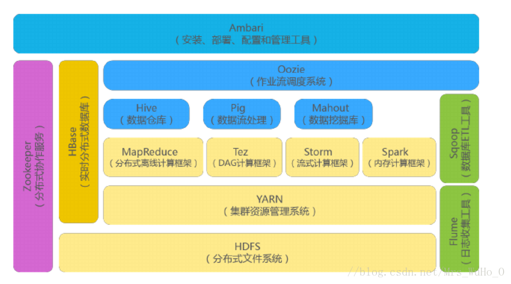
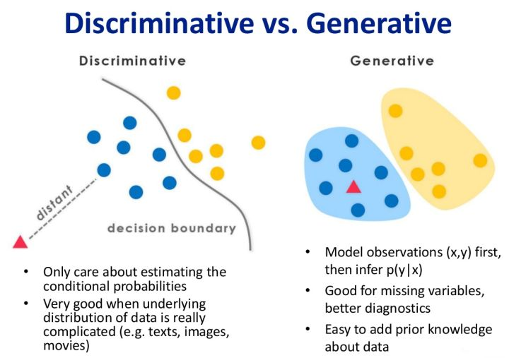

# 机器学习面试问题集

## 机器学习

### ？待分类问题

1.  为什么平方损失函数不适用于分类问题？为什么分类问题使用交叉熵误差函数？

    因为交叉熵误差函数比平方和误差函数，训练速度更快，泛化能力更强。[^Simard,2003]

2.  什么是 sigmoid 函数，它的特点及应用？

    Sigmoid 函数的形式：$\sigma(a)=\frac1{1+\exp\{-a\}}$

    -   $p(\mathcal{C}_1|\text{x})=\sigma(a),p(\mathcal{C}_0|\text{x})=1-p(\mathcal{C}_1|\text{x})$

    -   $a$ 表示激活函数的输入
        -   线性模型的 $a=\text{w}^T\text{x}+b$

    Sigmoid 函数也被称为「挤压函数」，主要应用在二分类问题中，将计算结果 $a\in(-\infty,+\infty)$ 压缩到 $\sigma(a)\in(0,1)$ 之间，将计算结果转化为概率输出。

3.  什么是 softmax 函数，它的特点及应用？

    Softmax 函数的形式：$p(\mathcal{C}_k|\text{x})=\frac{\exp\{a_k\}}{1+\sum_j \exp\{a_j\}}$

    -   $a_k$ 表示激活函数的输入
        -   线性模型的 $a_k=\text{w}_k^T\text{x}$
        -   概率模型的 $a_k=\ln(p(\text{x}|\mathcal{C}_k)p(\mathcal{C}_K))$

    Softmax 函数也被称为「归一化指数」，它的特点就是「Max」函数的平滑版本，主要应用在多分类问题中，将多个类别的计算结果$a_k\in(-\infty,+\infty)$压缩到 $p(\mathcal{C}_k|\text{x})\in(0,1)$ 之间，并且保证所有的类别之和为 1，即将计算结果转化为概率输出。

4.  常用的特征选择的方法有哪些？
    -   特征选择就是从原始特征中选出对分类作用最大的那些特征或者特征组合，基本方法：在特征子集上定义特征选择准则 $J$，并寻找使 $J$ 值最大的特征组合
    -   特征选择的方法
        -   Filter：过滤法，按照发散性或者相关性对各个特征进行评分，设定阈值或者待选择阈值的个数，选择特征。
        -   Wrapper：包装法，根据目标函数（通常是预测效果评分），每次选择若干特征，或者排除若干特征。
        -   Embedded：嵌入法，先使用某些机器学习的算法和模型进行训练，得到各个特征的权值系数，根据系数从大到小选择特征。类似于Filter方法，但是是通过训练来确定特征的优劣。
    -   特征选择的策略
        -   Filter：方差选择法：计算各个特征的方差，然后根据阈值，选择方差大于阈值的特征。
        -   Filter：相关系数法：计算各个特征对目标值的相关系数以及相关系数的 $P$ 值，选择 $P$ 值最高的前 $K$ 个特征
        -   Filter：卡方检验：计算自变量对因变量的相关性，选择相关性最高的前 $K$ 个特征
        -   Filter：互信息：计算自变量对因变量的相关性，选择相关性最高的前 $K$ 个特征
        -   Wrapper：迭代特征增加：开始时没有特征，然后逐个增加特征，直到满足某个终止条件
        -   Wrapper：迭代特征删除：开始时全部特征，然后逐个删除特征，直到满足某个终止条件
        -   Embedded：基于决策树的特征重要性的特征选择
        -   Embedded：基于线性模型的特征惩罚项的特征选择

5.  欠拟合与过拟合具体是指什么现象？降低欠拟合和过拟合有哪些常用手段？
    -   欠拟合就是模型没有很好的捕捉到数据特征，不能够很好的拟合数据，即训练集和测试集的准确率都低
        -   模型过于简单，无法充分描述数据的所有特征，可以增加更复杂的特征项用于描述数据的特征
        -   样本数据的分布无法反应真实数据的分布，也就无法提供数据的所有特征供模型学习，可以增加数据量和数据训练的次数从而增加模型对数据整体特征的理解
        -   正则化参数对模型复杂度的抑制太强，无法满足模型对更加复杂特征的描述需要，调整正则化参数，降低其对模型的抑制作用
    -   过拟合就是模型捕捉了数据中的某类特征，失去了对数据的整体特征的拟合，即训练集的准确率高而测试集的准确率低
        -   模型过于复杂，长期学习后正好对应了噪声特征的函数形式，可以「降低模型复杂度」或者「使用正则化参数」抑制模型的复杂度或者「提前终止训练」避免过度学习造成的对噪声的拟合
        -   数据量不足，无法利用噪声去抑制模型对于少量数据的过度拟合，增加数据量就可以使模型学习结果更加接近数据的整体特征
        -   单一模型对于某类特征拟合效果太好，而失去了对数据整体特征的拟合，可以基于集成学习的方法，从而不同的子模型拟合不同类别的特征，从而保证了对整体特征的拟合
        -   在神经网络训练中，使用 Dropout 的方式随机抛弃某些学习参数，从而产生了类似于集成学习的效果

6.  决策树有哪些常用的启发函数？
    -   决策树的分支结点所包含的样本尽可能属于同一类别，即结点的「纯度」越来越高。
    -   ID3：最大信息增益
        -   $H(D)=-\sum_{k=1}^K \frac{|C_k|}{D}\log_2 \frac{|C_k|}{D}$ 是类别数为 $K$ 的样本集合 $D$ 的经验熵。值越小说明数据集 $D$ 的纯度越高
        -   $C_k$ 表示样本集合 $D$ 中属于第 $k$ 类的样本子集；$|C_k|$ 表示样本子集的元素个数；$|D|$ 表示样本集的元素个数
        -   $H(D|A)=\sum_{v=1}^V \frac{|D_v|}{|D|} H(D_v)=\sum_{v=1}^V \frac{|D_v|}{|D|}(-\sum_{k=1}^K \frac{|D_{vk}|}{|D_v|}\log_2 \frac{|D_{vk}|}{|D_v|})$ 是某个特征 $A$ 对于数据集 $D$ 的经验条件熵
        -   $D_v$ 表示离散特征 $a$ 有 $V$ 个可能的取值，若使用特征 $a$ 对样本集 $D$ 进行划分则会产生 $V$ 个分支结点，其中第 $v$ 个分支结点中包含了 $D$ 中特征 $a$ 取第 $v$ 个值的样本子集；$D_{vk}$ 表示 $D_v$ 中属于第 $k$ 类的样本子集
        -   $\text{Gain}(D,A)=H(D)-H(D|A)$ 表示最大信息增益
    -   C4.5：最大信息增益比
        -   $H_a(D)=-\sum_{v=1}^V \frac{|D^v|}{|D|}\log_2\frac{|D^v|}{|D|}$ 称为特征 $A$ 的「固有值」(intrinsic value)，也叫数据集 $D$ 关于特征 $a$ 的取值熵
        -   $\text{Gain_ratio}(D,A)=\frac{\text{Gain}(D,A)}{H_A(D)}$ 表示最大信息增益比
        -   最大信息增益对取值数目较多的特征有偏好；最大信息增益比对取值数目较少的特征有偏好。
        -   使用启发式规则避免偏好：先从候选特征中找出信息增益高于平均水平的特征，再从高增益特征中选择增益比高的特征。
    -   CART：最大基尼指数(Gini)
        -   $\text{Gini}(D)=1-\sum_{k=1}^{K} (\frac{|C_k|}{D})^2$ 称为「基尼值」，反映了从数据集 $D$ 中随机抽取两个样本，其类别标记不一致的概率，因此 $\text{Gini}(D)$ 越小则数据集 $D$ 的纯度就越高
        -   $\text{Gini_index}(D,a)=\sum_{v=1}^V \frac{|D^v|}{|D|}\text{Gini}(D^v)$ 表示「基尼指数」
        -   $a^*=\arg\min_{a\in A} \text{Gini_index}(D,a)$ 表示 CART 在每一次迭代中选择基尼指数最小的特征及其对应的切分点进行分类

7.  KNN 和 K-Means 的区别？
    -   KNN：$K$ 最近邻是分类算法，属于有监督学习，没有训练过程，只有测试过程，先选择新样本点离的最近的$K$个点，统计$K$个点中样本数目最多的类别作为分类标签[^周志华，2018][Ch10](../MLW/Ch10.md)
    -   K-Means：$K$ 均值是聚类算法，属于无监督学习，训练过程如下：先随机确定 $K$ 个坐标作为聚类中心，选择新样本点离的最近的类别的均值作为分类标签，然后重新计算聚类中心，直到收敛。[^周志华，2018][Ch09](../MLW/Ch09.md)

8.  SVM 和 Logistic 的异同点？
    -   相同点
        -   都是有监督学习算法
        -   都是判别模型
        -   都是分类算法
        -   都是线性分类模型(不考虑核函数)，即它们的分类决策面都是线性的
    -   不同点
        -   损失函数不同：LR基于概率理论，使用交叉熵损失函数，通过极大似然估计方法估计出参数的值，然后计算分类概率，取概率较大的作为分类结果；SVM基于几何间隔最大化，把最大几何间隔面作为最优分类面，使用 Hinge 损失函数。(AdaBoost使用指数损失函数，回归模型使用均方误差损失函数)
        -   决策面不同：LR的决策面由全部样本点决定，尽量让所有点都远离决策面，因此LR容易受到离群点的影响；SVM的决策面由支持向量决定，即只让最靠近中间分隔线的那些点尽量远离，因此不容易受到离群点的影响。
        -   正则化方法不同：LR的损失函数没有正则化项，如果需要考虑正则化问题，需要增加正则化项；SVM损失函数则自带正则项，SVM已经是结构风险最小化算法。
        -   伸缩性不同：LR具有伸缩不变性；SVM不具有伸缩不变性。
        -   处理非线性问题时：LR如果采用核函数，则会因为每个样本点都参与核函数的计算而带来巨大的计算成本，因此LR很少用于处理非线性问题；SVM如果采用核函数，只有支持向量参与核函数的计算，因此SVM常常采用核函数处理非线性问题。

9.  简述常用的集成学习方法？

    集成方法是将几种机器学习技术组合成一个预测模型的元算法，以达到减小方差（bagging）、减小偏差（boosting）或改进预测（stacking）的效果。

    集成学习在各个规模的数据集上都有很好的策略。

    -   数据集大：划分成多个小数据集，学习多个模型进行组合

    -   数据集小：利用Bootstrap方法进行抽样，得到多个数据集，分别训练多个模型再进行组合

    Boosting：个体学习器之间存在强依赖关系，必须串行生成的序列化方法。
    -   AdaBoost：对待前一轮的弱分类器处理样本的结果，提高错误分类样本的权重，降低正确分类样本的权重，因此，在顺序训练中，接下来的分类器就更加“关注”那些分错的样本点，这样，多个弱分类器组合起来就是Adaboost
    -   前向分布算法：后来的弱分类器在不断的学习上一个分类器的输出的结果和真实label之间的残差
    -   AdaBoost：在二分类学习中，Adaboost模型就是加法模型、损失函数为指数函数、学习算法为前向分布算法
    -   AdaBoost：在回归学习中，Adaboost模型就是加法模型、损失函数为平方损失函数、学习算法为前向分布算法。
    -   梯度提升决策树(Gradient Boosting Deision Tree, GBDT)：利用损失函数的负梯度去模拟（代替）残差，这样对于一般的损失函数，只要其一阶可导就行
    -   GBDT：是由boosting tree 演变过来的，而boosting tree可以认为是Adaboost的一般方法，也就是说二分类问题的Adaboost模型是损失函数为指数损失函数的boosting tree模型，回归问题的Adaboost模型是损失函数为平方损失函数的boosting tree模型

    Bagging：个体学习器之间不存在强依赖关系，可以并行生成。自助抽样集成，这种方法将训练集分成m个新的训练集，然后在每个新训练集上构建一个模型，各自不相干，最后预测时我们将这个m个模型的结果进行整合，得到最终结果。整合方式就是：分类问题用投票，回归用均值
    -   自助法(Bootstrap)：即从样本自身中再生成很多可用的同等规模的新样本，从自己中产生和自己类似的，所以叫做自助，即不借助其他样本数据
    -   Bootstrap : 如果我们有个大小为N的样本，我们希望从中得到m个大小为N的样本用来训练。那么我们可以这样做：首先，在N个样本里随机抽出一个样本x1，然后记下来，放回去，再抽出一个x2，… ，这样重复N次，即可得到N的新样本，这个新样本里可能有重复的。重复m次，就得到了m个这样的样本。实际上就是一个有放回的随机抽样问题。每一个样本在每一次抽的时候有同样的概率（1/N）被抽中
    -   决策树(Decision Tree, DT)：
    -   随机森林(Random Forest, RF)：在随机森林中，集成中的每棵树都是由从训练集中抽取的样本（即 bootstrap 样本）构建的。另外，与使用所有特征不同，这里随机选择特征子集，从而进一步达到对树的随机化目的。因此，随机森林产生的偏差略有增加，但是由于对相关性较小的树计算平均值，估计方差减小了，导致模型的整体效果更好。

    Stacking：训练一个模型用于组合其他各个模型。首先我们先训练多个不同的模型，然后把之前训练的各个模型的输出为输入来训练一个模型，以得到一个最终的输出。理论上，Stacking可以表示上面提到的两种集成方法，只要采用合适的模型组合策略即可。但在实际中，通常使用logistic回归作为组合策略。

10.  拥有少量样本怎么进行深度学习？

     迁移学习：将其他学习得到的参数用于相似的领域学习中，可以减少学习需要的样本数量

     对抗学习：估测数据样本的潜在分布并生成新的数据样本

     自助法生成样本：随机有放回的对于小样本数据进行抽样，组合出更多数据集

     图像扭曲：图片数据，可以使用移位、旋转等方式增加新的样本

11.  Dropout 为什么可以抑制过拟合？

     在每次训练的时候，让一半的特征检测器停过工作，这样可以提高网络的泛化能力，防止过拟合

     对于一个有N个节点的神经网络，有了dropout后，可以看做是2^n个模型的集合，防止过拟合

     对于一个有N个节点的神经网络，有了dropout后，它们权值共享，同时具有相同的网络参数，网络模型是整个网络的子网络，从而基于模型平均的理论，防止过拟合

12.  列举深度学习常用的优化算法及其优缺点？

     | 算法     | 优点                                                         | 缺点                                                         | 适用情况                                                     |
     | -------- | ------------------------------------------------------------ | ------------------------------------------------------------ | ------------------------------------------------------------ |
     | BGD      | 目标函数为凸函数时，可以找到全局最优值                       | 收敛速度慢，需要用到全部数据，内存消耗大                     | 不适用于大数据集，不能在线更新模型                           |
     | SGD      | 避免冗余数据的干扰，收敛速度加快，能够在线学习               | 更新值的方差较大，收敛过程会产生波动，可能落入极小值（卡在鞍点），选择合适的学习率比较困难（需要不断减小学习率） | 适用于需要在线更新的模型，适用于大规模训练样本情况           |
     | Momentum | 能够在相关方向加速SGD，抑制振荡，从而加快收敛                | 需要人工设定学习率                                           | 适用于有可靠的初始化参数                                     |
     | Adagrad  | 实现学习率的自动更改                                         | 仍依赖于人工设置一个全局学习率，学习率设置过大，对梯度的调节太大。中后期，梯度接近于0，使得训练提前结束 | 需要快速收敛，训练复杂网络时；适合处理稀疏梯度               |
     | Adadelta | 不需要预设一个默认学习率，训练初中期，加速效果不错，很快，可以避免参数更新时两边单位不统一的问题 | 在局部最小值附近震荡，可能不收敛                             | 需要快速收敛，训练复杂网络时                                 |
     | Adam     | 速度快，对内存需求较小，为不同的参数计算不同的自适应学习率   | 在局部最小值附近震荡，可能不收敛                             | 需要快速收敛，训练复杂网络时；善于处理稀疏梯度和处理非平稳目标的优点，也适用于大多非凸优化，适用于大数据集和高维空间 |

13.  残差网络主要目的是解决什么问题？

     Accuracy degradation problem（精度下降问题）

     Gradient vanishing/exploding problem（梯度消失/爆炸问题）

14.  简述大数据的生态组件

     

     1.  客户端向 nameNode 发送要上传文件的请求

     2.  nameNode 返回给用户是否能上传数据的状态

     3.  加入用户端需要上传一个 1024M 的文件，客户端会通过 Rpc 请求
         NameNode，并返回需要上传给那些
         DataNode(分配机器的距离以及空间的大小等),namonode会选择就近原则分配机器。

     4.  客户端请求建立 block 传输管道 chnnel 上传数据

     5.  在上传是 datanode 会与其他的机器建立连接并把数据块传送到其他的机器上

     6.  dataNode 向 namenode 汇报自己的储存情况以及自己的信息

     7.  档第一个快上传完后再去执行其他的复制的传送

15.  如何使用 MapReduce 处理数据倾斜？

     数据倾斜：map /reduce程序执行时，reduce节点大部分执行完毕，但是有一个或者几个reduce节点运行很慢，导致整个程序的处理时间很长，这是因为某一个key的条数比其他key多很多（有时是百倍或者千倍之多），这条key所在的reduce节点所处理的数据量比其他节点就大很多，从而导致某几个节点迟迟运行不完，此称之为数据倾斜。

     数据倾斜就是数据的key 的分化严重不均，造成一部分数据很多，一部分数据很少的局面。

     业务逻辑造成的数据倾斜会多很多，日常使用过程中，容易造成数据倾斜的原因可以归纳为几点

     -   分组
         -   注：group by 优于distinct
         -   group
             情形：group by 维度过小，某值的数量过多
         -   group 后果：处理某值的reduce非常耗时
     -   去重
         -   distinct
         -   count(distinct xx)
             情形：某特殊值过多
         -   count(distinct xx) 后果：处理此特殊值的reduce耗时
     -   连接
         join
         -   情形1：其中一个表较小，但是key集中
         -   后果1：分发到某一个或几个Reduce上的数据远高于平均值
         -   情形2：大表与大表，但是分桶的判断字段0值或空值过多
         -   后果2：这些空值都由一个reduce处理，非常慢

     处理数据倾斜问题

     -   调优参数
         -   set hive.map.aggr=true
         -   set hive.groupby.skewindata=true;
     -   在 key 上面做文章，在 map 阶段将造成倾斜的key 先分成多组
     -   能先进行 group 操作的时候先进行 group 操作，把 key 先进行一次 reduce,之后再进行 count 或者 distinct count 操作
     -   join 操作中，使用 map join 在 map 端就先进行 join ，免得到reduce 时卡住

16.  快排算法实现

17.  「懒惰学习」和「急切学习」的区别？
     -   懒惰学习(Lazy Learning)：在训练阶段仅仅把样本保存起来，训练时间开销为零，待收到测试样本后再进行处理
     -   急切学习(Eager Learning)：在训练阶段就对样本进行学习处理的方法

18.  空

### 基本概念

1.  有监督学习与无监督学习的区别？
    -   有监督学习。输入数据有标签信息。基于「误差-修正」机制的闭环反馈学习系统，使用「平方误差和」或者「均方误差」作为代价函数和评测标准，通过「参数估计」或者「梯度学习」求得最优参数。常见的学习目标：「回归」和「分类」。
    -   无监督学习。输入数据无标签信息。基于数据某种内在关系进行学习，使用「距离关系」或者「统计特性」作为代价函数和评测标准，通过「矩阵计算」或者「参数迭代」求得最优参数。常见的两类学习目标：「数据聚类」和「特征提取」。

2.  传统学习、统计学习、深度学习的区别？
    -   传统学习，也称样本学习，从样本中归纳出学习结果。
    -   统计学习，利用概率统计模型描述数据。
    -   深度学习，「很多层」的神经网络，从多层次组合中得到学习结果，是统计学习和集成学习的组合。
        -   卷积神经网络：不同的卷积层抽取图像的不同颗粒度的特征，基于集成学习的理论实现最优分类。
        -   循环神经网络：通过不断加深的循环网络学习，可以得到序列数据的的特征。

3.  回归问题、标注问题、分类问题的区别？

    -   回归问题：主要用于处理输出为连续值的问题或者输出为无限离散值的问题
    -   分类问题：主要用于处理输出为有限离散值的问题，输出的类别数目较小
    -   标注问题：主要用于处理输出为有限离散值的问题，输出的类别数目较大

4.  Bias ( 偏差 ) 与 Variance ( 方差 ) 的区别？
    -   采样数据与真实数据的区别，偏差是均值区别，方差是幅度区别
        -   偏差：度量了学习算法的期望预测与真实结果的偏离程度，刻画了学习算法的拟合能力
        -   方差：度量了训练集大小相同、数据不同时导致的学习结果的变化，刻画了数据扰动的影响力
        -   噪声：表达了算法学习能力的下界，刻画了学习问题的难度。
    -   偏差与方差分解是解释学习算法泛化性能的重要工具。说明泛化性能由学习算法的能力、数据的充分性和学习任务的难度共同决定的。
    -   偏差与方差的困境：
        -   训练不足时，泛化性能主要受偏差影响
        -   训练过度时，泛化性能主要受方差影响

5.  欠定、正定、超定的区别？

    -   欠定方程组：方程个数小于未知量个数的方程组，解有无穷个
        -   常用方法：内点法与梯度投影法
    -   正定方程组：方程个数等于未知量个数的方程组，解有惟一一个
    -   超定方程组：方程个数大于未知量个数的方程组，解不存在
        -   常用方法：最小二乘法
    -   正定矩阵：所有**特征值**大于零的对称矩阵 ( 或厄米矩阵 )
        -   正定矩阵一定是非奇异的
        -   正定矩阵的任一主子矩阵也是正定矩阵
        -   正定矩阵的**Cholesky** ( 乔列斯基 ) 分解
        -   若 A 为 n 阶正定矩阵，则 A 为 n 阶可逆矩阵

6.  经验风险最小化与结构风险最小化的区别？
    -   同属于风险最小化问题$R ( \mathbb{w} ) =\int L ( y,f ( \mathbf{x},\mathbb{w} )) dF ( \mathbf{x},y )$
    -   经验风险最小化 ( Empirical Risk Minimization, ERM ) ：$R_{emr} ( \mathbb{w} ) =\frac{1}{N}\sum_{n=1}^N Q ( z_n,\mathbb{w} )$
        -   回归估计问题中的最小二乘问题：$R_{emr} ( \mathbb{w} ) =\frac{1}{N}\sum_{n=1}^N ( y_n-f ( \mathbf{x}_n,\mathbb{w} ))^2$
        -   概率密度估计中的最大似然估计：$R_{emr} ( \mathbb{w} ) =\frac{1}{N}\sum_{n=1}^N \ln p ( \mathbf{x}_n,\mathbb{w} )$
    -   结构风险最小化 ( Structural Risk Minimization, SRM ) ：$R_{smr} ( \mathbb{w} ) =\frac{1}{N}\sum_{n=1}^N Q ( z_n,\mathbb{w} ) +\lambda J ( f )$
        -   回归估计问题中的最小二乘问题+正则化项：$R_{emr} ( \mathbb{w} ) =\frac{1}{N}\sum_{n=1}^N ( y_n-f ( \mathbf{x}_n,\mathbb{w} ))^2 + \frac{1}{2}\lambda||\mathbb{w}||^2$
        -   概率密度估计中的最大后验估计：$R_{emr} ( \mathbb{w} ) =\frac{1}{N}\sum_{n=1}^N \ln ( p ( \mathbf{x}_n,\mathbb{w} ) p ( \mathbb{w},\alpha ))$

7.  解决分类问题的三种基本方法？

    -   分类问题划分为两个阶段：
        -   推断 ( Inference ) ：使用训练数据学习$p ( C_k|\mathbb{x} )$模型
        -   决策 ( Decision ) ：使用后验概率进行最优的分类
    -   分类问题区分出三种方法：
        -   判别模型：学习函数$C=f ( \mathbb{x} )$，直接将新的输入向量 $\mathbb{x}$ 分到具体的类别$C_k$中，不需要概率支持
        -   概率判别模型：先学习条件概率分布$p ( C_k|\mathbb{x} )$模型，基于决策论将新的输入向量 $\mathbb{x}$ 分到具体的类别$C_k$中，需要概率支持
        -   概率生成模型：先推断类的条件概率$p ( \mathbb{x}|C_k )$，再推断类的先验概率$p ( C_k )$，再使用贝叶斯定理求出类的后验概率$p ( C_k|\mathbb{x} ) =\frac{p ( \mathbb{x}|C_k ) p ( C_k )}{p ( \mathbb{x} )}$。再基于决策论将新的输入向量 $\mathbb{x}$ 分到具体的类别$C_k$中，需要概率支持

8.  分类问题中的生成模型与判别模型的区别？

    

    -   生成式模型：显式地或者隐式地对输入和输出进行建模，所有变量的全概率模型
        -   特点：
            -   模型首先观测到 $p ( x,y )$，然后推导$p ( y|\mathbb{x} ) =\frac{p ( \mathbb{x},y )}{p ( \mathbb{x} )}=\frac{p ( y ) p ( \mathbb{x}|y )}{p ( \mathbb{x} )}=\frac{p ( y )}{p ( \mathbb{x} )}\prod_{d=1}^D p ( x_d|y )$
            -   适合处理缺失变量的问题，得到更好的分析结果
            -   容易加入先验信息
            -   常用于无监督学习，例如：分类和聚类
        -   实例：
            -   混合模型 ( 高斯混合模型 )
            -   隐 Markov 模型
            -   贝叶斯网络 ( 朴素贝叶斯分类 )
            -   随机上下文无关文法
    -   判别式模型：只对输入建模，得到给定观测变量下目标变量的条件概率模型
        -   特点：
            -   给定观测$\mathbb{x}$，可以直接建模条件概率分布$p ( y|\mathbb{x} )$来预测$y$
            -   参数少，计算快，质量好，适合处理复杂的潜在数据分布
        -   实例：
            -   K-近邻模型
            -   Logistic 回归模型
            -   支持向量机
            -   最大熵 Markov 模型
            -   条件随机场
            -   神经网络

9.  机器学习问题解决流程？

    -   问题描述：有监督 ( 分类、标注、回归 ) 、无监督 ( 聚类 )
    -   数据准备：数据采集、数据归一化
    -   特征提取：特征映射变换
    -   模型选择：线性模型、非线性模型、统计模型、深度模型
    -   代价函数：L2 范数、L1 范数、似然函数、后验概率、交叉熵
    -   参数估计→寻找最优参数：最小二乘估计、最大似然估计、最大后验估计、
    -   模型评估：准确率、召回率、F1 指标、交叉验证
    -   模型上线：

### 数据准备

1.  数据预处理方法？
    -   剔除离群点
        -   离群点：与相应随机变量的平均值距离很远的点，这个距离由给定的阈值来测量，通常是标准差的整数倍。例如：正态分布随机变量的标准差的两倍距离包含了95%的点，三倍距离包含了99%的点。
        -   因为离群点多是受噪声影响形成的，所以远离平均值的点可能会对训练模型产生较大的误差，因此剔除离群点可以提升数据质量。例如：最小平方准则对离群点非常敏感
        -   如果数据本身具有长尾分布，那么设计者只能采用对离群点不敏感的代价函数，例如：Smooth L1 Loss
    -   数据向量化
    -   数据标准化：依照特征矩阵的列处理数据，其通过求z-score的方法，将样本的特征值转换到同一量纲下。
    -   数据归一化：依照特征矩阵的行处理数据，其目的在于样本向量在点乘运算或其他核函数计算相似性时，拥有统一的标准，也就是说都转化为“单位向量”。
    -   数据白化
    -   处理缺失值
    -   特征选择
    -   特征提取
2.  为什么需要对数值类型的特征做归一化？列举常用的「数值归一化」方法。
    -   避免某个特征在整体特征中占比过重引起的数据分布不均衡问题。
    -   归一化数据，有利于梯度下降算法。
    -   归一化数据，属于线性特征变换，不影响计算结果。
    -   常用的「数值归一化」方法
        -   线性函数归一化：对原始数据进行线性变换，使结果映射到$[0,1]$ 的范围内，实现对原始数据的等比缩放。$X_{\text{norm}}=\frac{X-X_{\text{min}}}{X_{\text{max}}-X_{\text{min}}}$，$X$为原始数据，$X_{\text{max}}$是数据集中最大值，$X_{\text{min}}$是数据集中最小值
        -   零均值归一化：将原始数据映射到均值为0，标准差为1的分布上。$z=\frac{x-\mu}{\sigma}$，$\mu$ 为均值，$\sigma$ 为标准差
3.  对类别数据进行编码的方法？
    -   序号编码：简单排序，顺序编码
    -   One-Hot 编码：一个 1，剩下是 0
    -   二进制编码：简单排序，顺序二进制编码
4.  「数据扩充」的基本方法？

    -   「自助法」
        -   优点：通过自助采样扩充较小的数据集。
        -   缺点：改变了初始数据集的分布，引入了估计偏差。
5.  计算向量数据距离的基本方法？

    -   余弦距离：$\cos ( A,B ) =\frac{A \cdot B}{||A||_2 ||B||_2}$

### 特征抽取

1.  构造组合特征的方法？
    -   多项式特征
    -   时-频特征
    -   小波特征
2.  「LDA」的基本原理？
    -   是有监督的线性降维方法。
3.  「PCA ( 主成分分析 ) 特征」的基本原理？
    -   是无监督的线性降维方法。
    -   分析数据中的主要信息，基于主要信息的排序进行数据降维，实现数据压缩。
    -   常用的主要信息的排序依据：数据的特征值
    -   降维的作用：
        -   舍弃部分信息使得样本的采样密度增大
        -   舍弃次要信息使得样本的极端噪声减少

### 模型建立

1.  正则化方法的基本原理？
    -   结构风险最小化策略的实现。是在经验风险最小化上增加正则化项。
    -   正则化项是模型复杂度的单调递增函数。
    -   从模型选择的角度看：正则化方法符合 Occam 剃刀原理。
    -   从贝叶斯估计的角度看：正则化项是对模型参数增加了先验。
2.  线性模型
    1.  线性回归模型+正则化
    2.  线性基函数模型
    3.  广义线性模型
3.  统计学习模型与贝叶斯学习模型
4.  神经网络模型
5.  支持向量机模型
6.  决策树模型
7.  集成学习模型
8.  常用的机器学习模型？
9.  用的非线性模型？

### 模型评估

1.  交叉验证的基本原理？
    -   数据集分割为「训练集」和「测试集」，「训练集」用于学习参数，「测试集」用于评估模型。
    -   K 折交叉验证：K 个大小相似的互斥子集。循环使用 ( K-1 ) 个子集训练，1 个子集测试。
    -   常用的三种交叉验证方法：简单交叉验证、K 折交叉验证、留一交叉验证。
2.  模型调参的基本方法？
    -   「训练集」分割为「训练集」和「验证集」，「验证集」用于调参。
3.  分类问题有哪些评估指标？相互之间的区别？
    -   P-R 曲线：横坐标是准确率 ( $P=\frac{真阳性}{真阳性+假阳性}$ ) ，纵坐标是召回率 ( $R=\frac{真阳性}{真阳性+假阴性}$ ) ，平稳点 ( 准确率=召回率 )
    -   F1 指标：基于准确率和召回率的调和平均。$\frac{1}{F1}=\frac{1}{2} ( \frac{1}{P}+\frac{1}{R} )$
    -   ROC 曲线 ( Receiver Operating Characteristic Curve ) ：横坐标是假阳性率 ( False Positive Rate，$FPR=\frac{假阳性}{真阴性+假阳性}$ ) ，纵坐标是真阳性率 ( True Positive Rate，$TPR=\frac{真阳性}{真阳性+假阴性}$ ) 。
    -   AUC ( Area Under Curve ) ：ROC 曲线下的面积大小，反映基于 ROC 曲线衡量的模型性能。
4.  如何处理类别不平衡的数据？[^周志华，2018][Sec 3.6](../MLW/Ch03.md)
    -   解决类别不平衡的基本策略——再缩放，得到新的决策边界： $\frac{y'}{1-y'}=\frac{y}{1-y}\times\frac{m^-}{m^+}$
    -   选择正确的度量标准：不使用准确率，而使用召回率、F1 指标
    -   调整数据集的平衡点：欠采样 ( 去除多的样例 ) ，过采样 ( 增加少的样例 )
5.  回归问题的评估指标？
    -   均方误差：$MSE=\frac{1}{m}\sum_{n=1}^N [y_n-f ( x_n )]^2$
6.  模型的超参数调优的基本方法？
    -   网格搜索：查找搜索范围内的所有点来确定最优值。
    -   随机搜索：随机测试搜索范围内的点来确定最优值。
        -   优点：速度快
        -   缺点：无法保证全局最优
7.  模型欠拟合与过拟合的原因？
    -   模型容量：
        -   欠拟合模型容量低，未能充分描述问题
        -   过拟合模型容量高，可能描述数据噪声
            -   可以通过正则化手段解决过拟合问题

## 线性模型

### 线性回归

1.  线性回归解决的问题？
2.  基本的线性回归模型？
3.  正则化的线性回归模型？
4.  一元回归问题与多元回归问题的区别？

## 统计学习

1.  贝叶斯学习的特点？

## 深度学习

1.  数据 Batch Normalization 的作用？
    -   避免模型求导时出现的不稳定问题
    -   避免模型求导时出现的饱和问题
    -   正则化方式，避免过拟合
2.  训练深度学习模型时，Epoch、Batch、Iteration 的区别？
    -   Epoch：整个数据集的迭代次数
    -   Batch：小数据集的大小。因为无法将整个数据集放到内存中，故被抽取或者分割成小数据集。
    -   Iteration：一次迭代中，小数据集的执行次数。
3.  反向传播算法及其机制？
4.  激活函数和饱和区间的含义？
5.  模型的超参数与参数的区别？
6.  学习率如何调整？
7.  深度模型已经有 1000 万个人脸向量，如何快速查询匹配？
    -   将数据划分为便于查询的数据结构 ( 树结构 )
    -   在树中快速查询距离最近的向量

## 决策树模型

## 集成学习

1.  Bagging 和 Boosting 的区别？
    -   Bagging 中各个弱分类器可以独立训练
    -   Boosting 中各个弱分类器需要依次生成

### Bagging

### Boosting

1.  梯度提升算法 ( Gradient Boosting ) 的基本原理？
    -   是 Boosting 算法中的一大类算法
    -   根据当前模型损失函数的负梯度信息来训练新加入的弱分类器，然后将训练好的弱分类器以累加的形式结合到现有模型中。

### GBDT ( 梯度提升决策树，Gradient Boosting Decision Tree )

1.  GBDT 的基本原理？
    -   采用决策树作为弱分类器的梯度提升算法是 GBDT，也称为 MART ( Multiple Additive Regressive Tree ) 。
2.  梯度提升与梯度下降的联系与区别？
    -   两者都在迭代中利用损失函数相对于模型的负梯度方向的信息来对模型进行更新
    -   梯度下降中，模型是以参数化的形式表示，模型更新就是参数更新
    -   梯度提升中，模型不需要参数化表示，而是直接定义在函数空间中，扩展了模型的种类
3.  GBDT 的优点与缺点？
    -   优点：
        -   预测阶段的计算速度快，树与树之间可以并行化计算
        -   在分布稠密的数据集上，泛化与表达能力都很好
        -   基于决策树的弱分类器，解释性和鲁棒性都很好，能够自动发现特征间的高阶关系，不需要对数据进行预处理。
    -   缺点：
        -   在高维稀疏数据集上，不如支持向量机和神经网络
        -   在处理文本分类特征不如处理数值特征的效果好
        -   整个训练过程是串行化的
4.  XGBoost 与 GBDT 的联系与区别？
    -   GBDT 是机器学习算法；XGBoost 是算法的工程实现
    -   原始的 GBDT 算法：采用 CART 基分类器，基于经验损失函数的负梯度来构造决策树，构造完成后再进行剪枝。XGBoost 支持多种类型的基分类器。
    -   基于 CART 基分类器时，XGBoost 在决策树构建阶段加入了正则化项，防止过拟合，提高泛化能力$L_t=\sum_i l ( y_i, F_{t-1} ( x_i ) + f_t ( x_i ) + \Omega ( f_t ))$
    -   GBDT 在模型训练时只使用代价函数的一阶导数；XGBoost 对代价函数进行二阶泰勒展开，同时使用一阶和二阶导数
    -   原始的 GBDT 算法在每轮迭代时使用全部的数据；XGBoost 采用与随机森林相似的策略，支持对数据采样
    -   原始的 GBDT 算法不对缺失值进行处理；XGBoost 能够自动学习出缺失值的处理策略

## 软件开发

1.  C/C++、Java、Python 的区别，适用的环境？
    -   面向对象编程：C++、Java、Python 都支持，C 不支持。
    -   垃圾回收：C 和 C++需要程序员回收，Java 和 Python 会自动回收
    -   虚拟机：C 和 C++基于 OS 编译运行，Java 一次编译处处运行于不同虚拟机，Python 解释运行于虚拟机。
    -   开发速度：Python>Java>C++>C
    -   适用范围：Python 科学计算，Java 项目开发，C++高速计算，C 底层开发
2.  线程、进程、分布式的区别，适用的环境？
    -   线程：最小的运行单位，不同的线程运行于同一寻址空间内，可以通过地址进行数据共享
    -   进程：不同的进程运行于同一个操作系统上，需要通过一定的协议进行数据共享
    -   分布式：不同的进程运行行不同的操作系统上，需要通过一定的协议进行数据共享

## 硬件搭建

1.  超线程的特点？
    -   一个核心多个线程，某个执行线程因为某个原因 ( 读数据 ) 无法继续运行时，就把执行的资源交给另一个线程，从而提高了执行单元的利用率。
2.  CPU 与 GPU 的区别？
    -   CPU：核少，主频高，缓存大，吞吐量小，串行速度快，服务于控制
    -   GPU：核多，主频低，缓存小，吞吐量大，并发速度快，专注于计算
