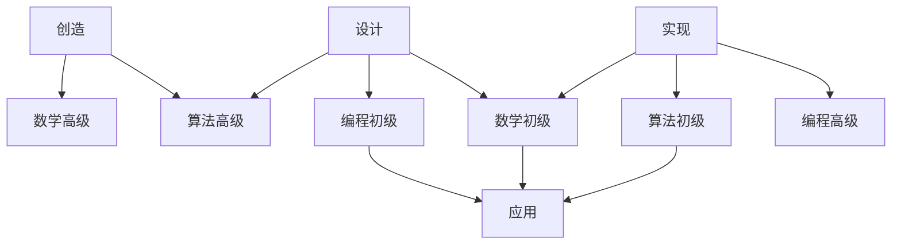
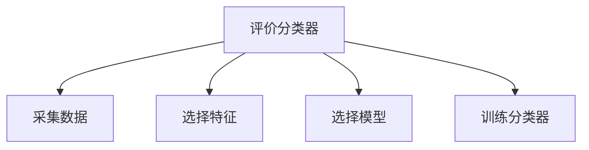
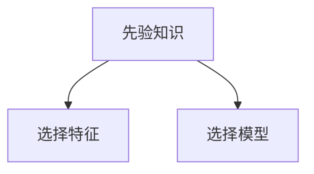

# 算法工程师技能表

## 算法工程师分类

-   算法创造工程师
    -   方向：开拓性研究
    -   目标：算法创新、流程创建、模式创新
    -   成果：论文发表
-   算法设计工程师
    -   方向：根据应用建立模型
    -   目标：选择合适的算法、平衡各方面的需求
    -   内容：需求分析、模型设计、模型验证
    -   成果：算法模型
-   算法实现工程师
    -   方向：根据算法实现模型
    -   目标：构建工业级别的算法代码库
    -   内容：高质量代码库开发、高性能的代码库框架、高可用性的代码库管理
    -   成果：算法代码库
-   算法应用工程师
    -   方向：根据代码库在现实中应用
    -   目标：快速、稳定、高效地应用代码库实现项目
    -   内容：项目开发、项目测试、项目上线
    -   成果：算法应用项目

### 数学初级

-   微积分
-   线性代数
-   概率与统计

### 数学高级

-   数值分析
-   泛函分析
-   随机过程

### 算法初级

-   线性回归模型
-   线性分类模型
-   朴素 Bayes 模型

### 算法高级

-   神经网络
-   支持向量机
-   深度学习

### 编程初级

-   软件开发
-   系统集成
-   项目实施

### 编程高级

-   体系结构
-   操作系统
-   分布式计算

## 模式识别流程图

