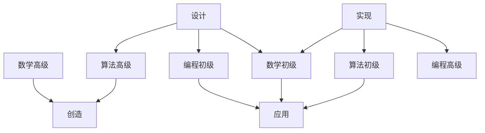
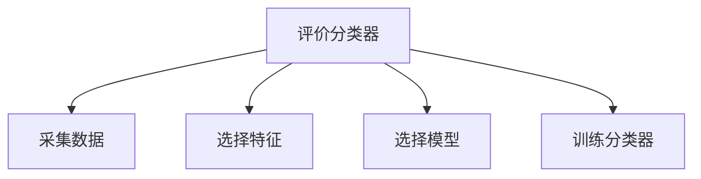
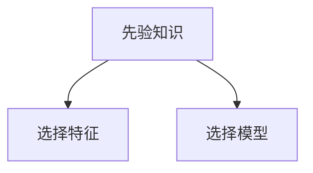

# 算法工程师技能表

## 算法工程师分类

-   算法创造工程师：研究算法，算法创新、模式创新，发表论文
-   算法设计工程师：应用算法，算法选择、模型设计，建立模型
-   算法实现工程师：实现算法，构建工业级别的代码库(保证质量、性能和可用性)
-   算法应用工程师：推广算法，算法快速、稳定、高效地在项目中实施

## 算法技能分类

数学初级：微积分、线性代数、概率与统计

数学高级：数值分析、泛函分析、随机过程

算法初级：线性回归模型、线性分类模型、朴素 Bayes 模型

算法高级：神经网络、支持向量机、深度学习

编程初级：软件开发、系统集成、项目实施

编程高级：体系结构、操作系统、分布式计算

## 模式识别流程图

-   问题描述：有监督 ( 回归、分类、标注 ) 、无监督 ( 聚类、降维 )
-   数据准备：数据采集、数据归一化
-   特征提取：特征映射变换
-   模型选择：线性模型、非线性模型、统计模型、深度模型
-   代价函数：L2 范数、L1 范数、似然函数、后验概率、交叉熵
-   参数估计→寻找最优参数：最小二乘估计、最大似然估计、最大后验估计、
-   模型评估：准确率、召回率、F1 指标、交叉验证
-   模型上线：

