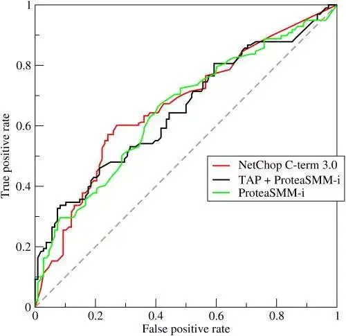
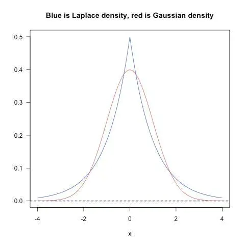
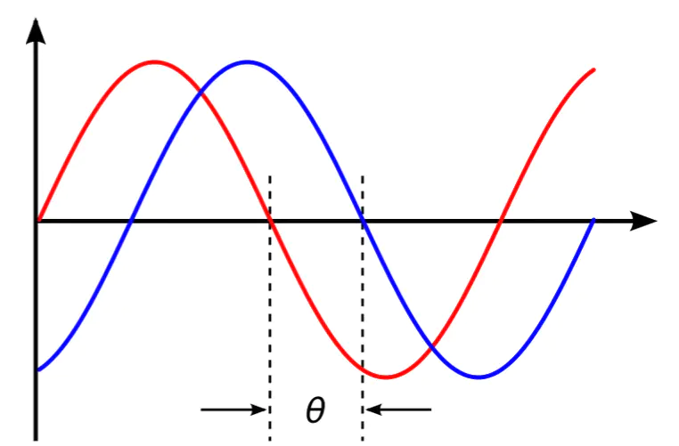
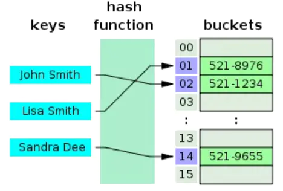

# 机器学习高频面试题 ( 41 道 )

[41 Essential Machine Learning Interview
Questions](https://www.springboard.com/blog/machine-learning-interview-questions/)

## Comment

部分题目有参考价值，总体还是个公司教学课程的推广文案。

## Questions List

### Q1:Bias vs Variance

**Q1: What is the trade-off between bias and variance?**

**问题 1: 什么是偏差 ( bias )、方差 ( variable ) 之间的均衡？**

Bias 是因为使用的学习算法过度简单地拟合结果或者错误地拟合结果导致的错误。

-   Bias
    反映的是模型在样本上的输出与真实值之间的误差，即模型本身的精准度，即算法本身的拟合能力。

-   Bias
    可能会导致模型欠拟合，使其难以具有较高的预测准确性，也很难将你的知识从训练集推广到测试集。

Variance 是因为使用的学习算法过于复杂而产生的错误。

-   Variance
    反映的是模型每一次输出结果与模型输出期望之间的误差，即模型的稳定性。反应预测的波动情况。

-   Variance
    过高会导致算法对训练数据的高纬度变化过于敏感，这样会导致模型过度拟合数据。从而模型会从训练集里带来太多噪音，这会对测试数据有一定的好处。

Bias-Variance
的分解，本质上是通过在基础数据集中添加偏差、方差和一点由噪声引起的不可约误差，来分解算法上的学习误差。从本质上讲，如果你使模型更复杂并添加更多变量，你将会失去一些
Bias 但获得一些 Variance，这就是我们所说的权衡 ( tradeoff
)。这也是为什么在建模的过程中，不希望这个模型同时拥有高的偏差和方差。

### Q2: Supervised vs Unsupervised

**Q2: What is the difference between supervised and unsupervised machine
learning?**

**问题 2：有监督学习和非监督学习有什么不同？**

-   有监督学习需要基于有标记的数据进行训练。

-   无监督学习不需要基于有标记的数据进行训练。

### Q3:KNN vs K-Means

**Q3: How is KNN different from k-means clustering?**

**问题 3: KNN 和 k-means 聚类由什么不同？**

-   K-Nearest Neighbors 是有监督分类算法，需要标记点

    -   需要标记数据，以便将未标记的点分类 ( 因此是最近邻居部分 )。

-   k-means 聚类是无监督聚类算法，不需要标记点

    -   算法基于未标记的点和阈值，并逐渐通过计算不同点之间的距离的平均值将它们聚类成组。

### Q4: ROC

**Q4: Explain how a ROC curve works.**

**问题4:解释一下 ROC 曲线的原理?**

-   ROC 曲线是真阳率与各种阈值下的假阳率之间的对比度的图形表示。



### Q5: Precision vs Recall

**Q5: Define precision and recall.**

**问题 5：查准率 ( precision,精确度 ) 和查全率 ( recall, 召回率 )的区别是什么？**

-   召回 ( 率 ) 也称为真阳性率：您的模型声称的阳性数量与整个数据中的实际阳性数量相比。(recall：$\frac{\text{TP}}{\text{TP} + \text{FN}}$)

-   精确度也称为阳性预测值，它衡量的是您的模型声称与实际声称的阳性数量相比的准确阳性数量。(precision: $\frac{\text{TP}}{\text{TP} + \text{FP}}$)

在您预测在 10 个苹果的情况下有 10 个苹果和 5
个橙子的情况下，可以更容易地想到回忆和精确度。你有完美的召回 ( 实际上有 10
个苹果，你预测会有 10 个 )，但 66.7％的精度，因为在你预测的 15 个事件中，只有 10
个 ( 苹果 ) 是正确的。

| \-     | 预测正 | 预测负 |
|--------|--------|--------|
| 真实正 | TP     | FN     |
| 真实负 | FP     | TN     |

### Q6: Bayesian Theorem

**Q6: What is Bayes Theorem? How is it useful in a machine learning context?**

**问题 6：什么是贝叶斯定理？它在机器学习环境中如何有用？**

贝叶斯定理描述了当你不能准确知悉一个事物的本质时，你可以依靠与事物特定本质相关的事件出现的多少去判断其本质属性的概率。它给出了已知先验知识下事件的后验概率。

在数学上，它表示为条件样本的真阳性率除以总体的假阳性率和条件的真阳性率之和。假设你在流感测试后有
60% 的机会真的感染了流感，但是在感染了流感的人中，50%
的测试都是错误的，总人口只有 5% 的机会感染了流感。在做了阳性测试后，你真的有 60%
的机会患上流感吗？

$$
P(A|B) = \frac{P(B|A)P(A)}{P(B)}
$$

贝叶斯定理说不，它说你有一个`( 0.6*0.05 ) ( 条件样本的真阳性率 ) / ( 0.6*0.05 )
( 条件样本的真阳性率 ) + ( 0.5*0.95 ) ( 人群的假阳性率 ) =
5.94%`的机会感染流感。

### Q7: Naive Bayes

**Q7: Why is「Naive」Bayes naive?**

**问题 7：为什么我们要称「朴素」贝叶斯？**

尽管 Naive Bayes
具有实际应用，特别是在文本挖掘中，但它被认为是「天真的」，因为它假设在实际数据中几乎不可能看到：条件概率被计算为组件个体概率的纯乘积。这意味着特征的绝对独立性
– 这种情况在现实生活中可能永远不会遇到。

正如 Quora 上一些评论者所说的那样，Naive Bayes
分类器发现你喜欢泡菜和冰淇淋之后，可能会天真地推荐你一个泡菜冰淇淋。

### Q8: Regularization(L1 vs L2)

**Q8: Explain the difference between L1 and L2 regularization.**

**问题 8: L1、L2 正则之间有什么不同？**

-   L2 正则，对应的是加入 2
    范数，使得对权重进行衰减，从而达到惩罚损失函数的目的，防止模型过拟合。保留显著减小损失函数方向上的权重，而对于那些对函数值影响不大的权重使其衰减接近于
    0。相当于加入一个 gaussian prior。

-   L1 正则 对应得失加入 1
    范数，同样可以防止过拟合。它会产生更稀疏的解，即会使得部分权重变为
    0，达到特征选择的效果。相当于加入了一个 Laplace Prior。



img

### Q9: Favorite Algorithm

**Q9: What is your favorite algorithm, and can you explain it to me in less than
a minute?**

**问题 9：你最喜欢的算法是什么？把它解释一下。**

这种类型的问题测试了你对如何用平衡来传达复杂和技术上的细微差别的理解，以及快速和有效地总结的能力。确保你有选择，确保你能简单有效地解释不同的算法，使一个五岁的孩子能够掌握基础知识！

### Q10: Type I Error vs Type II Error

**Q10: What is the difference between Type I and Type II error?**

**问题 10：第一类误差和第二类误差有什么区别？**

-   第一类误差指的是假正率，第二类指的是假负率。简单来说，第一类误差意味着假设为真的情况下，作出了拒绝原假设的一种错误推断。

-   第二类误差意味着假设为假的情况下，做出了接受原假设的一种错误判断。

举个例子：第一类误差，你误判一个男的他怀孕了。第二类误差，你误判了一位其实已经怀孕的女子没怀孕。

### Q11: Fourier Transform

**Q11: What is a Fourier transform?**

**问题 11：什么是傅立叶变换？**

傅立叶变换是将一般函数分解成对称函数叠加的一般方法。

傅立叶变换找到一组循环速度、振幅和相位，以匹配任何时间信号。

傅立叶变换将信号从时间域转换为频率域，是从音频信号或其他时间序列 ( 如传感器数据
) 中提取特征的一种常见方法。

### Q12: Probability and Likelihood

**Q12: What is the difference between probability and likelihood?**

**问题 12：概率和似然有什么区别？**

概率和似然都是指可能性，但在统计学中，概率和似然有截然不同的用法。

-   概率描述了已知参数时的随机变量的输出结果；

-   似然则用来描述已知随机变量输出结果时，未知参数的可能取值。

例如，对于「一枚正反对称的硬币上抛十次」这种事件，我们可以问硬币落地时十次都是正面向上的「概率」是多少；而对于「一枚硬币上抛十次，我们则可以问，这枚硬币正反面对称的「似然」程度是多少。

-   概率 ( 密度 ) 表达给定θ下样本随机向量 X=x 的可能性

-   似然表达了给定样本 X=x 下参数θ1 ( 相对于另外的参数θ2 ) 为真实值的可能性。

对随机变量的取值谈概率，而在非贝叶斯统计的角度下，参数是一个实数而非随机变量，所以一般不谈一个参数的概率，而说似然。



img

### Q13: Machine Learning vs Deep Learning

**Q13: What is deep learning, and how does it contrast with other machine
learning algorithms?**

**问题 13：什么是深度学习，它与机器学习算法之间有什么联系？**

深度学习是与神经网络有关的机器学习的一个子集

### Q14: Generative Model vs Discriminative Model

**Q14: What is the difference between a generative and discriminative model?**

**问题 14：生成模型与判别模型有什么区别？**

-   生成模型：学习数据的类别

-   判别模型：学习不同类别数据之间的区别。

在分类任务中，判别模型通常优于生成模型。

### Q15: Cross-Validation and Series Dataset

**Q15- What cross-validation technique would you use on a time series dataset?**

**问题 15：交叉检验如何用在时间序列数据上？**

与标准的 k-folds
交叉检验不同，数据不是随机分布的，而是具有时序性的。如果模式出现在后期，模型仍然需要选择先前时间的数据，尽管前期对模式无影响。我们可以如下这么做：

```txt
fold1: training [1], test [2]
fold2: training [1 2], test [3]
fold3: training [1 2 3], test [4]
fold4: training [1 2 3 4], test [5]
fold5: training [1 2 3 4 5], test [6]
```

### Q16: Decision Tree Pruned

**Q16- How is a decision tree pruned?**

**问题 16：如何对决策树进行剪枝？**

剪枝是在决策树中，为了降低模型的复杂度，提高决策树模型的预测精度，去除预测能力较弱的分支后所发生的现象。

修剪可以自下而上和自上而下进行，方法包括：减少错误修剪和成本复杂度修剪。

-   减少错误修剪可能是最简单的版本：替换每个节点。如果不降低预测精度，则保持修剪。虽然很简单，但这种启发式方法实际上非常接近于一种可以最大限度地优化准确性的方法。

### Q17: Model Accuracy vs Model Performance

**Q17: Which is more important to you? Model accuracy, or model performance?**

**问题 17：模型的精度和模型的性能哪个对你更重要？**

这个问题测试您对机器学习模型性能细微差别的理解！机器学习面试问题往往着眼于细节。有些模型具有更高的准确度，而在预测能力方面表现较差—这有什么意义？

好吧，这一切都与模型的准确性仅仅是模型性能的一个子集有关，在这一点上，有时是一个误导。例如，如果你想在一个拥有数百万样本的海量数据集中检测欺诈行为，那么一个更准确的模型很可能会预测，如果只有极少数的案例是欺诈行为，那么根本就不会有欺诈行为。然而，对于预测模型来说，这是无用的——一个旨在发现声称根本没有欺诈的欺诈的模型！这样的问题可以帮助您证明您理解模型的准确性并不是模型性能的全部。

### Q18: F1 Score

**Q18: What is the F1 score? How would you use it?**

**问题 18：什么是 F1 数，怎么使用它？**

F1 分数是衡量模型性能的指标。它是模型精度和召回的加权平均值，结果趋向于 1
是最好的，结果趋向于 0
是最差的。你可以在分类测试中使用它，而真正的否定并不重要。

### Q19: Imbalanced Dataset

**Q19: How would you handle an imbalanced dataset?**

**问题 19：如何处理一个不平衡的数据集？**

例如，当您有一个分类测试，并且 90%
的数据都在一个类中时，就会产生一个不平衡的数据集。这就导致了问题：如果您对其他类别的数据没有预测能力，那么
90% 的精度然而可能会出现偏差！

常用策略：

-   收集更多数据，甚至数据集中的不平衡。

-   对数据集重新取样以纠正不平衡。

-   在你的数据集中尝试一个不同的算法。

这里重要的是，您对不平衡数据集可能造成的损害以及如何平衡具有敏锐的感知。

### Q20: Classification vs Regression

**Q20: When should you use classification over regression?**

**问题 20：什么时候你应该使用分类而不是回归？**

-   分类产生离散值并将数据集转换为严格的类别

-   回归则提供连续的结果，使您能够更好地区分各个点之间的差异。

如果希望结果反映数据集中数据点对某些明确类别的归属性 (
例如：如果您希望知道某个名称是男性还是女性，而不仅仅是它们与男性和女性名称之间的关联性
)，则可以使用分类而不是回归。

### Q21: Ensemble Learning

**Q21: Name an example where ensemble techniques might be useful.**

**问题 21：举个例子，说明使用集成学习会很有用。**

集成学习通过组合一些基学习算法来优化得到更好的预测性能，通常可以防止模型的过拟合使模型更具有鲁棒性。

你可以列举一些集成学习的例子，如 bagging、boosting、stacking
等，并且了解他们是如何增加模型预测能力的。

### Q22: Overfitting

**Q22: How do you ensure you are not overfitting with a model?**

**问题 22：你如何确保你的模型没有过拟合？**

过拟合的原因：拟合了训练数据中的噪声

避免过拟合：

-   保持模型尽可能地简单：通过考量较少的变量和参数来减少方差，达到数据中消除部分噪音的效果。

-   使用交叉检验的手段如：k-folds cross-validation。

-   使用正则化的技术如：LASSO 方法来惩罚模型中可能导致过拟合的参数。

### Q23: Model Effectiveness

**Q23: What evaluation approaches would you work to gauge the effectiveness of a
machine learning model?**

**问题 23：如何评估你的机器学习模型的有效性？**

首先你需要将数据分成训练集和测试集，或者使用给交叉验证方法分割。然后你需要选择度量模型表现的
metrics，如 F1
数、准确率、混淆矩阵等。更重要的是，根据实际情况你需要理解模型度量的轻微差别，以便于选择正确的度量标准。

### Q24: Logistic Regression Model

**Q24: How would you evaluate a logistic regression model?**

**问题 24：如何评估一个 LR model？**

上述问题的一部分。你必须演示对逻辑回归的典型目标 ( 分类、预测等 )
的理解，并提供一些示例和用例。

### Q25: Kernel Trick

**Q25: What is the「kernel trick」and how is it useful?**

**问题 25：什么是核技巧，有什么用处？**

核技巧使用核函数，确保在高维空间不需要明确计算点的坐标，而是计算数据的特征空间中的内积。这使其具有一个很有用的属性：更容易的计算高维空间中点的坐标。许多算法都可以表示称这样的内积形式，使用核技巧可以保证低维数据在高维空间中运用算法进行计算。

### Q26: Corrupted Data

**Q26: How do you handle missing or corrupted data in a dataset?**

**问题 26：如何处理数据集中丢失或损坏的数据？**

您可以在数据集中找到丢失/损坏的数据，然后删除这些行或列，或者决定用另一个值替换它们。

在 pandas 中，有两种非常有用的方法：isNull ( ) 和 dropna (
)，这两种方法将帮助您查找缺少或损坏数据的数据列，并删除这些值。如果要用占位符值
( 例如 0 ) 填充无效值，可以使用 fillna ( ) 方法。

### Q27: Spark

**Q27: Do you have experience with Spark or big data tools for machine
learning?**

**问题 27：你是否有使用 Spark 或大数据工具进行机器学习的经验？**

您需要熟悉不同公司的大数据含义以及他们想要的不同工具。Spark
是目前最受欢迎的大数据工具，能够快速处理海量数据集。老实说，如果你没有所需工具的经验，同时看看工作描述，看看什么工具需要：你会想投资去熟悉它们。

### Q28: Psuedo-Code

**Q28: Pick an algorithm. Write the psuedo-code for a parallel implementation.**

**问题 28：选择一个算法。为并行实现编写 psuedo 代码。**

这类问题展示了您并行思考的能力，以及如何在处理大数据的编程实现中处理并发性。请看一下伪代码框架
( 如 peril-L ) 和可视化工具 ( 如 Web 序列图
)，以帮助您展示编写反映并行性的代码的能力。

### Q29: Linked List vs Array

**Q29: What are some differences between a linked list and an array?**

**问题 29：链表和数组之间有什么区别？**

-   数组是有序的对象集合。

    -   数组假定每个元素具有相同的大小。

    -   改组数组更复杂并占用更多内存。

-   链表是一系列带有指针的对象，指示如何按顺序处理它们。

    -   链表可以更容易地有机增长：必须预先定义或重新定义阵列以进行有机增长。

    -   改组链接列表涉及改变哪些点指向哪里

### Q30: Hash Table

**Q30: Describe a hash table.**

**问题 30：描述哈希表。**

哈希表是一种产生关联数组的数据结构。通过使用散列函数将键映射到某些值。它们通常用于数据库索引等任务。



img

### Q31: Data Visualization Tools

**Q31: Which data visualization libraries do you use? What are your thoughts on
the best data visualization tools?**

**问题 31：你使用哪些数据可视化库？你对最佳数据可视化工具有何看法？**

这里重要的是定义您对如何在工具方面正确可视化数据和个人偏好的看法。流行的工具包括
R 的 ggplot, Python 的 seaborn 和 matplotlib，以及 Plot.ly 和 Tableau 等工具。

这些机器学习面试问题涉及如何将您的一般机器学习知识应用于特定公司的要求。您将被要求创建案例研究，并通过您的机器学习技能扩展您所申请的公司和行业的知识。

### Q32: Recommendation System

**Q32: How would you implement a recommendation system for our company is
users?**

**问题 32：您如何为我们公司的用户实施推荐系统？**

许多这种类型的机器学习面试问题将涉及机器学习模型的实施以解决公司的问题。您必须深入研究公司及其行业，尤其是公司的收入驱动因素，以及公司在其所在行业中所采用的用户类型。

### Q33: Revenue

**Q33: How can we use your machine learning skills to generate revenue?**

**问题 33：我们如何利用您的机器学习技能来创造收入？**

这是一个棘手的问题。理想的答案将证明您对推动业务发展的因素以及您的技能如何关联的了解。例如，如果你正在面试音乐流初创公司
Spotify，你可以说，你在开发更好的推荐模式方面的技能将增加用户保留率，从长远来看这将增加收入。

上面链接的 Startup Metrics Slideshare
将帮助您准确了解在考虑支出和成长时，哪些绩效指标对初创技术公司是重要的。

### Q34: Data Process Procedure

**Q34: What do you think of our current data process?**

**问题 34：你认为我们当前的数据处理过程如何？**

这类问题要求你认真倾听，并以富有建设性和洞察力的方式传达反馈。你的面试官正在试图判断您是否是他们团队中的重要成员，以及你是否根据公司或行业特定条件，掌握了为什么某些事情按照公司数据流程的方式设置的细微差别。他们试图看看你是否可以成为有见地同行。随行而动。

这一系列的机器学习面试问题试图衡量你对机器学习的热情和兴趣。正确的答案将作为你承诺终身学习机器学习的证明。

### Q35: Paper

**Q35: What are the last machine learning papers you have read?**

**问题 35：你读过的最后一篇机器学习论文是什么？**

如果你想表现出对机器学习职位的兴趣，就必须掌握最新的机器学习科学文献。这篇深入学习的后代
( 从 Hinton 到 Bengio 再到 LeCun )
对自然的深入学习的概述可以是一篇很好的参考论文，也可以是一篇深入学习中正在发生的事情的概述，以及你可能想引用的那种论文。

### Q36: Research Experience

**Q36: Do you have research experience in machine learning?**

**问题 36：你在机器学习方面有研究经验吗？**

与最后一点相关的是，大多数为机器学习职位招聘的组织都会寻找你在该领域的正式经验。由该领域的先行者共同撰写或监督的研究论文，可以使你在被雇佣和不被雇佣之间产生差异。确保你已经准备好了一份关于你的研究经验和论文的总结，如果你不准备的话，还要对你的背景和缺乏正式研究经验做出解释。

### Q37: Use Cases

**Q37: What are your favorite use cases of machine learning models?**

**问题 37：你最喜欢的机器学习模型的用例是什么？**

这里我们拿 Quora 上面的一个帖子为例，帖子在这里：
[https://bit.ly/2MGYyQY](https://links.jianshu.com/go?to=https%3A%2F%2Fbit.ly%2F2MGYyQY)

上面的 Quora
帖子里包含一些示例，例如决策树，它根据智商分数将人们分类为不同的智力层次。确保你心里有几个例子，并描述与你产生共鸣的地方。重要的是你要对机器学习的实现方式表现出兴趣。

### Q38: Netflix

**Q38: How would you approach the「Netflix Prize」competition?**

**问题 38：你想以什么方式赢得「Netflix 奖」比赛？**

Netflix 奖是一项著名的竞赛，Netflix 提供了 \$1,000,000
的奖金，以获得更好的协同过滤算法 ( collaborative filtering algorithm
)。关于这个比赛的最后赢家，BellKor；他们让这个算法效率提升百分之十，并且给出了多种解法。多了解这些行业相关的
Case 并且和你面试官侃侃而谈能够体现你对于机器学习这个领域的关注

### Q39: Datasets

**Q39: Where do you usually source datasets?**

**问题 39：您通常在哪里寻找数据集？**

像这样的机器学习面试问题试图让你了解机器学习兴趣的核心。真正热衷于机器学习的人将会独自完成侧面项目，并且很清楚那些伟大的数据集是什么。如果您遗失任何内容，请查看
Quandl 获取的经济和财务数据，以及 Kaggle 的数据集集合，以获取其他优秀列表。

### Q40: Training Datas

**Q40: How do you think Google is training data for self-driving cars?**

**问题 40：你认为谷歌是如何为自动驾驶汽车提供培训数据的？**

像这样的机器学习面试问题确实测试了你对不同机器学习方法的知识，如果你不知道答案，你的创造力。谷歌目前正在使用
recaptcha 来获取店面和交通标志上的标签数据。他们还建立在由 Sebastian Thrun
在谷歌 ( Googlex )
收集的培训数据的基础上—其中一些数据是由他在沙漠沙丘上驾驶马车的研究生获得的！

### Q41: Reinforcemant Learning

**Q41: How would you simulate the approach AlphaGo took to beat Lee Sedol at
Go?**

**问题 41：你将如何模拟阿尔法戈在围棋中击败李世乭的方法？**

在五个系列赛中，阿尔法戈击败了围棋中最优秀的人类选手李思多，这是机器学习和深度学习史上一个真正具有开创性的事件。上面的
Nature 论文描述了这是如何通过「蒙特卡洛树搜索 ( Monte Carlo Tree Search )
和深神经网络 ( Deep Neural Networks )
来实现的，这些神经网络经过有监督的学习、人类专家游戏和加强自玩游戏的学习。」

看完这篇文章，你是不是觉得自己在机器学习的道理上可以走的更顺畅了呢
