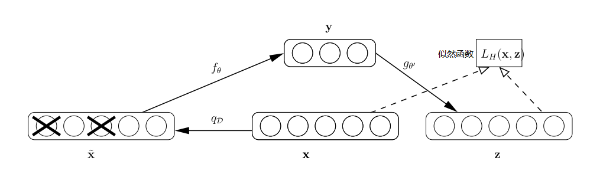

BERT介绍与训练

# 主流模型介绍

如何简单地、自动地、智能地从原始信息中提取出有用信息是人工智能任务的核心。

## 自编码模型与自回归模型的区别

自回归模型：根据上文预测下一个可能的单词，即自左向右的语言模型；也可以根据下文预测前面的单词，即自右向左的语言模型

-   例子：ELMO、GPT、XLNET
-   优点：容易带入到下游模型中
-   缺点：数据预测必须依据顺序，从左到右只能看到下文；从右到左只能看到上文

自编码模型：让语言模型去还原原始输入的系统。

-   例子：BERT、RoBerta
-   优点：训练的时候可以同时看到全局信息，从而最大化利用原始信息
-   缺点：与下游任务存在不匹配的问题

### 降噪自编码器(Denosing AutoEncoder)

自编码器是一种无监督的学习方式，可以用于特征提取与降维，将输入x加权映射之后得到y,再对y通过方向加权映射成为z,通过优化x与z之间的似然函数或者误差函数，得到y。降噪自编码器(DAE)是有自编码器发展而来，通过对原始信息建模从原始数据中学习到特征的表示，用于提取具有鲁棒性的特征。

解决自编码模型存在的过拟合问题的方法

-   加入随机噪声。以一定的概率抹掉原始数据集中的某些数据，然后通过破损的输入来学习输出与输入之间的误差。
    -   通过与非破损数据训练的对比，破损数据训练出来的「权重」的噪声较小。
        -   因为噪声都是高斯噪声，并且噪声存在有很大的随机性，那么随机地抹掉数据然后训练模型，最后保留下来的肯定会出现次数最多的数据本身的特性，而噪声就会因为随机的次数而被无限地减弱
    -   破损数据还在一定程度上减轻了训练数据与测试数据之间的代沟。
        -   因为数据被随机抹掉，而训练数据与测试数据最大的判别就是因为噪声形成的，所以噪声的减弱就会减轻两种数据之间的代沟

### BERT模型

-   BERT 模型是基于 Transformer Encoder来构建的模型
-   BERT 模型是基于DAE来构建的模型，DAE在BERT中称为MLM(Masked Language Model)
    -   MLM并不是严格意义上的语言模型，而是训练语言模型的一种方式
    -   DAE的过程：BERT随机把一些单词通过MASK标签来代替，并接着去预测被MASK的这个单词

## Transformer 模型介绍

## Bert模型介绍

## Bert模型预训练(Pre-Train)方式

## Bert模型调优(Fine-Tune)方式