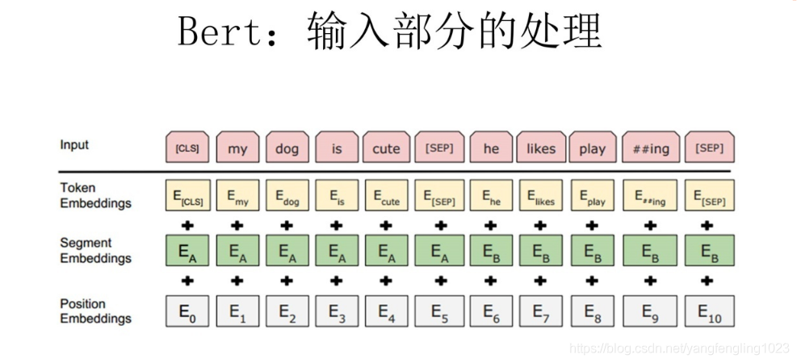
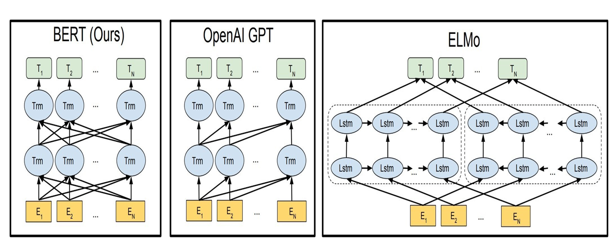
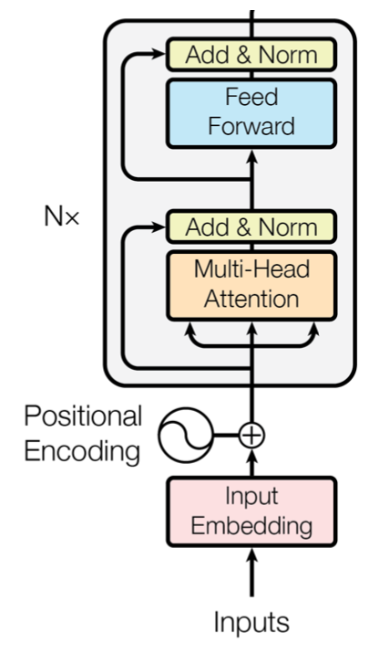

# BERT原理及实现

# 1. 输入序列与嵌入表示

可以编码一个单句或者一串单句

-   Input：线性序列，两个句子通过分隔符分割，最前面和每个句子后面增加标识符号
    -   CLS表示序列开始符号，SEP表示单句分隔符号

每个单词有三个Embedding

-   Token Embedding：表示词向量，每个词被表示成一个768维的向量
    -   使用WordPiece Tokenization可以减少Bert存储的词汇数量，并且很少遇到未登陆词
    -   单词符号嵌入：$Embedding_{tok}(input)\in\mathbb{R}^{N\times d_{model}}$
        -   输入符号的个数$N$
        -   符号嵌入的维度$d_{model}$
-   Segment Embedding：用于区分单词所归属的句子，因为预训练不光做语言模型，还要做分类任务
    -   $E_A$表示单词归属A句；$E_B$表示单词归属B句
    -   句子分割嵌入：$Embedding_{seg}(input)\in\mathbb{R}^{N\times d_{model}}$
    -   对于单句嵌入，只使用句子A嵌入
-   Position Embedding：与 Transformer中的一样，用于区分句子中词的位置关系
    -   Bert中的最大句子长度是512，所以Position Embedding Layer的大小为(512，768)的查询表
    -   单词在不同的句子中同样的位置时，位置编码应该是一样的
    -   符号位置嵌入：$Embedding_{pos}(input)\in\mathbb{R}^{N\times d_{model}}$
-   联合表示：将三个部分的表示对应的元素相加形成一个(1,n,768)的表示

# 2. 预训练任务(目标函数)

(论文没有使用传统的从左到右语言模型或者从右到左语言模型来进行预训练)

BERT的预训练基于两个无监督预测任务

-   任务1：单词级的学习，遮蔽语言模型(Masked Language Model，MLM)
    -   只计算Mark位置的损失
-   任务2：句子级的学习，下一句预测

## 2.1 遮蔽语言模型训练任务

遮蔽语言模型是在给定单词上下文序列后，当前单词出现的条件概率的乘积：$P(w_1^T)=\prod_{t=1}^T P(w_t|w_1^{t-1},w_{t+1}^T)$

-   第$t$个单词$w_t$
-   第$i$个单词到第$j$个单词的子序列：$w_i^j=(w_i,w_{i+1},\cdots,w_{j-1},w_j)$

训练数据集中随机选择15%的遮蔽单词$w_t$，并且以特殊的标记$[MASK]$进行替换。为了减少标记对微调阶段的影响，数据生成器将执行以下操作，而不是始终使用标记替换所选单词：

-   80%的时间：将单词替换为标记
-   10%的时间：将单词替换为单词
-   10%的时间：保持单词不变，使得表示偏向实际观察到的单词

## 2.2 下一句预测任务

从语料库中生成二值化的下一句句子预测任务

-   当为每个预训练选择句子A和B时，数据集中50%的时间A的下一个句子是B，另50%的时间A的下一个句子从语料库中随机取得，因此不具备序列关系
    -   input=[CLS] the man went to [MASK] store [SEP] he bought a gallon [MASK] milk [SEP] label=lsNext
    -   input=[CLS] the man [MASK] to the store [SEP] penguin [MASK] are flight ##less birds [SEP] label=NotNext

# 3. 模型架构

是一个多层的双向的Transformer Encoder。

Transformer模型输入的是经过Embedding处理后的词向量

## 3.1 编码器结构

## BERT完成NLP的四大类任务

1.  序列标注：分词、实体识别、语义标注
2.  分类任务：文本分类、情感计算
3.  句子关系判断：Entailment、QA、自然语言
4.  生成式任务：机器翻译、文本摘要