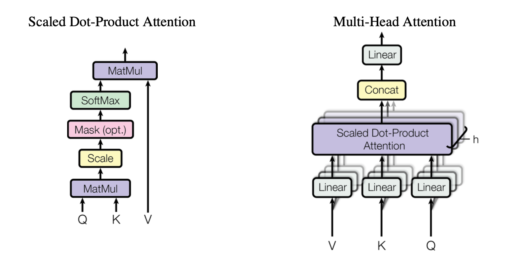

# 1. Transformer 特征提取器

## 1.1 Word Embedding

Word2Vec

Glove

## 1.2 RNN的改进与拓展

Seq2Seq

LSTM/GRU

attention/self-attention

# 2. Transformer 模型编码

全部采用 self-attention 层进行 编码，引入了三个变换矩阵，得到Q、K、V三个向量，然后利用词与词之间Q和K相乘的结构进行注意力计算，将权重系数乘以V就是新的词向量表示。

 ( 图 1-Transformer 模型结构 )

课件地址：
链接：http://47.93.208.249:9825/tree/0.Teacher/Online
密码：807d4a2c

## 2.1 Sequence

模型的输入

-   输入序列：$\text{inputs}= ( i_1,i_2,\cdots,i_p,\cdots,i_N )$，其中$i_p\in\mathbb{N}^*$为输入符号表中的序号。用于图 1 中的$\text{Inputs}$

-   目标序列：$\text{targets}= ( t_1,t_2,\cdots,t_q,\cdots,t_M )$，其中$t_q\in\mathbb{N^*}$为目标符号表中的序号。用于图 1 中的$\text{Outputs}$

模型的输出

-   输出序列：$\text{outputs}= ( o_1,o_2,\cdots,o_q,\cdots,o_M )$，其中$o_q\in\mathbb{N}^*$为目标符号表中的序号。用于图 1 中的$\text{Output Probabilities}$

$$
\begin{aligned}
    \text{outputs}=Transformer\text{( inputs,targets )}\\
    \text{loss function}=\mathcal{L} ( \text{targets,outputs} )
\end{aligned}
$$

## 2.2 Embedding and Encoding

### 2.2.1 Embedding

序列的词嵌入编码

-   输入序列的词嵌入编码：$Embedding ( \text{inputs} ) \in\mathbb{R}^{N\times d_{\text{model}}}$
    -   输入序列的长度：$N$；
-   目标序列的词嵌入编码：$Embedding ( \text{targets}\in\mathbb{R}^{M\times d_{\text{model}}} )$
    -   $M$为目标序列的长度
-   $d_{\text{model}}$为词嵌入的维度

### 2.2.2 Positional Encoding

自注意力机制并没有考虑位置信息，因此需要引入位置信息

位置嵌入的维度和字向量的维度一致，将每个位置编号，然后每个编号对应这个向量，最后将该向量与词向量相加，从而实现为每个词引入位置信息。

#### Encoding Function

编码函数：

$$
\begin{aligned}
    Pos\_Enc ( \text{pos},2i ) =\sin ( \text{pos}/10000^{2i/d_{\text{model}}} ) \\
    Pos\_Enc ( \text{pos},2i+1 ) =\cos ( \text{pos}/10000^{2i/d_{\text{model}}} )
\end{aligned}
$$

注：使用 sin 和 cos 函数，是因为基于和差化积公式，<!--TODO：公式推导-->

#### Sequence Positional Encoding

输入序列的位置编码：$Pos\_Enc ( \text{inputs_position} ) \in\mathbb{R}^{N\times d_{\text{model}}}$

-   输入序列中输入符号对应的位置序列：$\text{inputs_position}\in\{1,2,\cdots,p,\cdots,N\}$
    -   $\text{pos}\in\text{inputs_position}$
    -   $i\in\{1,2,\cdots,d_{\text{model}}/2\}$

目标序列的位置编码：$Pos\_End ( \text{targets_position} ) \in\mathbb{R}^{N\times d_{\text{model}}}$

-   目标序列中输入符号对应的位置序列：$\text{targets_position}=\{1,2,\cdots,q,\cdots,M\}$
    -   $\text{pos}\in\text{targets_position}$
    -   $i\in\{1,2,\cdots,d_{\text{model}}/2\}$

# 3. Encoder

## 3.1 Encoder Structure

编码器的结构

-   输入层：$e_0=Embedding ( \text{inputs} ) +Pos\_Enc ( \text{inputs_position} ) ，e_0\in\mathbb{R}^{N\times d_{model}}$
-   编码层：$e_l=EncoderLayer ( e_{l-1} ) ,e_l\in\mathbb{R}^{N\times d_{model}},l\in [1,n]$
    -   编码层的输入：$e_{\text{in}}\in\mathbb{R}^{N\times d_{\text{model}}}$
    -   编码层的过渡：$e_{\text{mid}}=LayerNorm ( e_{\text{in}}+MultiHeadAttention ( e_{\text{in}} ))$
        -   多头注意力机制：$MultiHeadAttention ( \cdot )$
        -   前馈神经网络：$FFN ( \cdot )$
        -   层归一化：$LayerNorm ( \cdot )$
    -   编码层的输出：$e_{\text{out}}=LayerNorm ( e_{\text{mid}}+FFN ( e_{\text{mid}} )) ,e_{\text{out}}\in\mathbb{R}^{N\times d_{\text{model}}}$
    -   编码器的编码层的叠加数目：$n$

## 3.2 Multi-Head Attention

 ( 图 2-多头注意力机制与缩放点积 )

输入向量序列$e_{in}= ( e_{in1},e_{in2},\cdots,e_{inN} ) \in\mathbb{R}^{N\times d_{model}}$，分别得到：

-   查询向量序列$Q=e_{in}$，
-   键向量序列$K=e_{in}$，
-   值向量序列$V=e_{in}$。

多头注意力 ( Multi-Head Attention )

-   多头输入：$head_i=Attention ( QW_i^Q,KW_i^K,VW_i^V )$
-   可以学习的参数矩阵
    -   $W_i^Q\in\mathbb{R}^{d_{model}\times d_k}$
    -   $W_i^K\in\mathbb{R}^{d_{model}\times d_k}$
    -   $W_i^V\in\mathbb{R}^{d_{model}\times d_v}$
    -   $W^O\in\mathbb{R}^{hd_v\times d_{model}}$
    -   输出扩展的维度：$h$

$$
MultiHeadAttention ( e_{in} ) =MultiHead ( Q,K,V ) =Concat ( head_1,\cdots,head_h ) W^O )
$$

使用缩放点积注意力 ( Scaled Dot-Product Attention ) 作为打分函数的自注意力机制
$$
Attention ( QW_i^Q,KW_i^K,VW_i^V ) =softmax ( \frac{QW_i^Q ( KW_i^K )^T}{\sqrt{d_k}} ) VW_i^V
$$
注：$QW_i^Q ( KW_i^K )$可以理解为相关矩阵，然后通过 softmax 将相关矩阵的值转化为概率，即归一化，相关性强的概率值大，将这个概率矩阵作为值的权重矩阵，使得输出结果具有更加明显的结构信息。这个结构信息可以作为输出数据的结构参考信息使用

## 3.3 编码器 PAD 掩码

pad掩码：是用于长句子对齐的，对于短句子进行填充

-   因为pad掩码如果为0，当进行 softmax 计算时，0会使计算产生偏差，因此采用mask方法进行补偿，即把0的位置填充$-\infty$求导后为零

-   $\text{enc_pad_mask}\in\mathbb{R}^{N\times N}$
-   $e_{jp}=\begin{cases}True,i_p=0\\False,i_p\neq 0\end{cases},j=1,2,\cdots,N$
    -   $i_p$为输入序列 inputs 对应的位置序号

$$
\text{enc_pad_mask}_j= ( e_{j1},e_{j2},\cdots,e_{jp},\cdots,e_{jN} )
$$

## 3.4 残差连接

经过注意力矩阵加权之后的V，即Attention(Q,K,V)，进行转置使其与$X_{embedding}$的维度一致，即[batch_size,sequence length, embedding dimension]，然后把他们加起来做残差连接

## 3.5 层归一化

把神经网络中的隐藏层归一化为标准正态分布，从而加快训练速度，加速模型收敛

## 3.6 前馈神经网络

-   参数矩阵：$W_1\in\mathbb{R}^{d_{model}\times d_{ff}},W_2\in\mathbb{R}^{d_{ff}\times d_{model}}$
-   偏置：$b_1\in\mathbb{R}^{d_{ff}},b_2\in\mathbb{R}^{d_{model}}$
-   前馈神经网络的维度：$d_{ff}$

$$
\begin{aligned}
FFN ( e_{mid} )
    &=ReLU ( e_{mid}W_1+b_1 ) W_2+b_2\\
    &=max ( 0,e_{mid}W_1+b_1 ) W_2+b_2
\end{aligned}
$$

# 4. Decoder

## 4.1 Decoder Structure

解码器的结构

-   输入层：$d_0=Embedding(targets)+Pos\_Enc(targets_position),d_0\in\mathbb{R}^{M\times d_{model}}$
-   解码层：$d_l=DecoderLayer(d_{l-1}),l\in[1,n],d_l\in\mathbb{R}^{M\times d_{model}}$
    -   解码层的层数：$n$
-   输出层：$output\_probabilities=softmax(d_nW),W\in\mathbb{R}^{d_{model}\times \text{tgt_vocab_size}}$
    -   目标单词库的大小：$\text{tgt_vocab_size}$

解码层的结构

-   第一子层：$d_{mid1}=LayerNorm(d_{in}+MaskedMultiHeadAttention(d_{in}))$
    -   解码层输入：$d_{in}\in\mathbb{R}^{M\times d_{model}}$
-   第二子层：$d_{mid2}=LayerNorm(d_{mid1}+MultiHeadAttention(d_{mid1},e_{out}))$
-   输出子层：$d_{out}=LayerNorm(d_{mid2}+FFN(d_{mid2}))$
    -   解码层的输出：$d_{out}\in\mathbb{R}^{M\times d_{model}}$

## 4.2 Mask Encoding

注：pad掩码、sequence掩码的区别

-   pad掩码：是用于长句子对齐的，对于短句子进行填充
-   sequence掩码：解码阶段，后序单词应该是用于预测前序的单词，因此需要掩掉