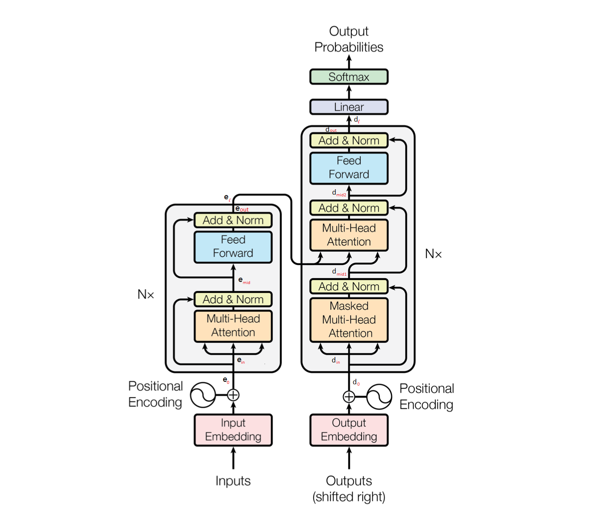
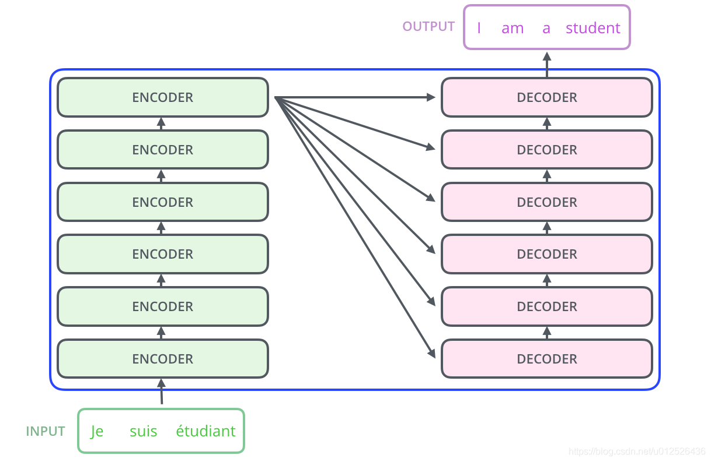
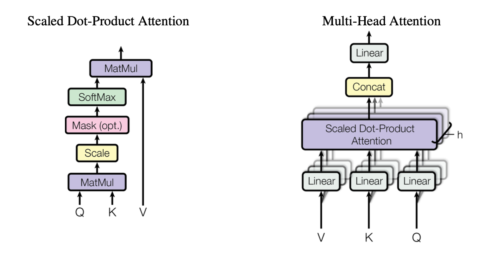
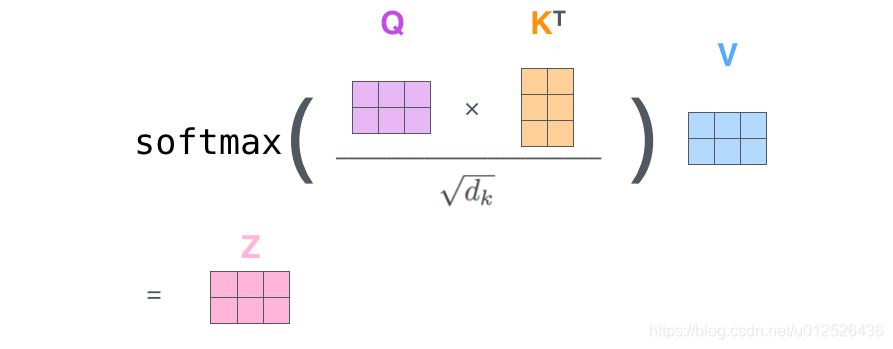

# Preface

三种序列转换模型的对比

-   CNN 模型
    -   优点：可以并行计算，计算效率高
    -   缺点：感受野小，受卷积核窗口大小的影响，不能同时考虑整个上下文
-   RNN 模型
    -   优点：可以考虑数据的时序特征，序列的位置信息自然获得
    -   缺点：受顺序计算的影响，无法并行计算
-   Transformer 模型
    -   优点：可以并行计算，还可以考虑数据的全局信息
    -   缺点：计算量大，训练参数多

# 1. 基础知识

建立 Transformer 模型之前，需要将序列数据转换为词向量数据。

# 2. Transformer 模型结构

全部采用自注意力 ( self-attention ) 层进行 编码，引入了三个变换矩阵，得到查询 ( Query, Q ) 、键 ( Key, K ) 、值 ( Value, V ) 三个向量，然后利用词与词之间 Q 和 K 相乘的结构进行注意力计算，将权重系数乘以 V 就是新的词向量表示。

 ( 图 1-Transformer 模型结构 )

## 2.1 序列

模型的输入

-   输入序列：$\text{inputs}= ( i_1,i_2,\cdots,i_p,\cdots,i_N )$，其中$i_p\in\mathbb{N}^*$为输入符号表中的序号。用于图 1 中的$\text{Inputs}$
-   目标序列：$\text{targets}= ( t_1,t_2,\cdots,t_q,\cdots,t_M )$，其中$t_q\in\mathbb{N^*}$为目标符号表中的序号。用于图 1 中的$\text{Outputs}$

模型的输出

-   输出序列：$\text{outputs}= ( o_1,o_2,\cdots,o_q,\cdots,o_M )$，其中$o_q\in\mathbb{N}^*$为目标符号表中的序号。用于图 1 中的$\text{Output Probabilities}$
    -   $\text{outputs}=Transformer\text{( inputs,targets )}$
-   代价函数：$\text{loss function}=\mathcal{L} ( \text{targets,outputs} )$

## 2.2 Embedding and Encoding

### 2.2.1 Word Embedding

序列的词嵌入(Word Embedding)编码

-   词嵌入的维度：$d_{model}$
-   输入序列
    -   序列长度：$N$
    -   词嵌入编码：$InputsEmbedding ( \text{inputs} ) \in\mathbb{R}^{N\times d_{model}} )$
-   目标序列
    -   序列长度：$M$
    -   词嵌入编码：$TargetsEmbedding ( \text{targets} ) \in\mathbb{R}^{M\times d_{model}}$

### 2.2.2 Positional Encoding

位置编码(Positional Encoding)：因为自注意力机制并没有考虑位置信息，因此需要将每个位置编号，然后每个编号对应这个向量，最后将该向量与词向量相加，从而实现为每个词引入位置信息。

位置编码的维度和词嵌入的维度一致：$d_{model}$

-   编码函数

$$
PositionEncode(pos,i)=
\begin{cases}
    \sin ( \text{pos}/10000^{\frac{i}2\frac1{d_{model}}} ) ,&\text{if i is 偶数}\\
    \cos ( \text{pos}/10000^{\frac{i-1}2\frac1{d_{model}}} ),&\text{if i is 奇数}
\end{cases}
$$

注 1：使用 sin 和 cos 函数，是因为基于和差化积公式，<!--TODO：公式推导-->

注 2：编码函数还有其他方式，Encoder 与 Decoder 的编码函数是相同的

-   序列的位置编码
    -   输入序列位置编码：$InputsPositionEncode=\{PositionEncode ( \text{inputs-position},i )\}$
        -   输入符号对应的位置序列：$\text{inputs-position}\in\{1,2,\cdots,p,\cdots,N\}$
        -   输入符号对应的编码维度： $i\in\{0,1,2,\cdots,(d_{model}-1)\}$
        -   输入序列位置编码的维度：$InputsPositionEncode\in\mathbb{R}^{N\times d_{model}}$

    -   目标序列位置编码：$TargetsPositionEncode=\{PositionEncode ( \text{targets-position},i )\}$
        -   输入符号对应的位置序列：$\text{targets-position}\in\{1,2,\cdots,q,\cdots,M\}$
        -   输入符号对应的编码维度：$i\in\{0,1,2,\cdots,(d_{model}-1)\}$
        -   目标序列位置编码的维度：$TargetsPositionEncode \in\mathbb{R}^{M\times d_{model}}$

## 2.3 Encoder

### 2.3.1 Encoder Structure

编码器的结构

-   输入层：$e_{0}=InputsEmbedding ( \text{inputs} ) + PositionEncode ( \text{inputs-position} ) ，e_{0}\in\mathbb{R}^{N\times d_{model}}$
-   编码层：$e_l=EncoderLayer ( e_{l-1} ) ,e_l\in\mathbb{R}^{N\times d_{model}},l\in [1,n]$
    -   编码器的编码层的叠加层数：$n$
    -   第$l$个编码层的输入：$e_{in}\in\mathbb{R}^{N\times d_{model}}$
    -   第$l$个编码层的过渡：$e_{\text{mid}}=LayerNorm ( e_{in}+MultiHeadAttention ( e_{in} )) ,e_{mid}\in\mathbb{R}^{N\times d_{model}}$
        -   多头注意力机制：$MultiHeadAttention ( \cdot )$
        -   层归一化：$LayerNorm ( \cdot )$
    -   第$l$个编码层的输出：$e_{\text{out}}=LayerNorm ( e_{\text{mid}}+FFN ( e_{\text{mid}} )) ,e_{\text{out}}\in\mathbb{R}^{N\times d_{model}}$
        -   前馈神经网络：$FFN ( \cdot )$

### 2.3.2 Multi-Head Attention

 ( 图 2-多头注意力机制与缩放点积 )

多头注意力 ( Multi-Head Attention )

$$
MultiHeadAttention ( e_{in} ) =MultiHead ( Q,K,V ) =Concat ( head_1,\cdots,head_h ) W^O
$$

-   输入向量序列$e_{in}= ( e_{in_1},e_{in_2},\cdots,e_{in_N} ) \in\mathbb{R}^{N\times d_{model}}$，分别得到：
    -   查询向量序列：$Q=e_{in}$
    -   键向量序列：$K=e_{in}$
    -   值向量序列：$V=e_{in}$
    
-   多头输入：$head_i=Attention ( QW_i^Q,KW_i^K,VW_i^V ),i\in[1,h]，head_i\in\mathbb{R}^{N\times d_v}$
    
    -   使用缩放点积注意力 ( Scaled Dot-Product Attention ) 作为打分函数的自注意力函数
-   
  
  $$
Attention ( QW_i^Q,KW_i^K,VW_i^V ) =softmax ( \frac{QW_i^Q ( KW_i^K )^T}{\sqrt{d_k}} ) VW_i^V
  $$

-   多头输出：$MultiHeadAttention(e_{in})\in\mathbb{R}^{N\times d_{model}}$
    
-   可以学习的参数矩阵
    
    -   $W_i^Q\in\mathbb{R}^{d_{model}\times d_k},QW_i^Q\in\mathbb{R}^{N\times d_k}$
    -   $W_i^K\in\mathbb{R}^{d_{model}\times d_k},KW_i^Q\in\mathbb{R}^{N\times d_k}$
    -   $W_i^V\in\mathbb{R}^{d_{model}\times d_v},VW_i^V\in\mathbb{R}^{N\times d_v}$
    -   $W^O\in\mathbb{R}^{hd_v\times d_{model}}$
    -   输出扩展的维度(头的数量)：$h$

注：$QW_i^Q ( KW_i^K )$可以理解为相关矩阵，然后通过 softmax 将相关矩阵的值转化为概率，即归一化，相关性强的概率值大，将这个概率矩阵作为值的权重矩阵，使得输出结果具有更加明显的结构信息。这个结构信息可以作为输出数据的结构参考信息使用

### 2.3.3 Encoder Padding Mask

编码器的PAD掩码：因为每个批次输入序列长度不同，为了将输入序列对齐，需要将长句子截断，对短句子填充 0.

-   编码函数：$EncodePadMask(\cdot)\in\mathbb{R}^{N\times N}$

  $$
  EncodePadMask_j= ( e_{j1},e_{j2},\cdots,e_{jp},\cdots,e_{jN} )
  $$

-   $e_{jp}=\begin{cases}True,i_p=0\\False,i_p\neq 0\end{cases},j=1,2,\cdots,N$
    -   $i_p$为输入序列 inputs 对应的单词序号，默认填充序号为 0
    -   因为 pad 掩码如果为 0，当进行 softmax 计算时，0 会使计算产生偏差，因此采用 mask 方法进行补偿，即把 0 的位置填充很大的负值 ( 代码中为-1e9 ) ，从而经过 Softmax 函数时对数据分布影响很小
-   Softmax 函数：$S_i=\frac{\exp{x_i}}{\sum_j\exp{x_j}}$

### 2.3.4 Residual

残差连接：经过注意力矩阵加权之后的 V，即 $MultiHeadAttention(e_{in})$ 与 $e_{in}$ 的维度一致，

### 2.3.5 Layer Normalization

层归一化：把神经网络中的隐藏层归一化为标准正态分布，从而加快训练速度，加速模型收敛

### 2.3.6 Feedforward Network

前馈神经网络

-   参数矩阵：$W_1\in\mathbb{R}^{d_{model}\times d_{ff}},W_2\in\mathbb{R}^{d_{ff}\times d_{model}}$
-   偏置：$b_1\in\mathbb{R}^{d_{ff}},b_2\in\mathbb{R}^{d_{model}}$
-   前馈神经网络的维度：$d_{ff}$

$$
\begin{aligned}
FFN ( e_{mid} )
    &=ReLU ( e_{mid}W_1+b_1 ) W_2+b_2\\
    &=max ( 0,e_{mid}W_1+b_1 ) W_2+b_2
\end{aligned}
$$

## 2.4 Decoder

### 2.4.1 Decoder Structure

解码器的结构

-   输入层：$d_0=TargetsEmbedding ( \text{targets} ) +PositionEncode ( \text{targets-position} ) ,d_0\in\mathbb{R}^{M\times d_{model}}$
-   编码层：$d_l=DecoderLayer ( d_{l-1} ) ,l\in [1,n],d_l\in\mathbb{R}^{M\times d_{model}}$
    -   解码器的编码层的层数：$n$
    -   第 $l$ 个编码层的输入：$d_{in}\in\mathbb{R}^{M\times d_{model}}$
    -   第 $l$ 个编码层的第一子层：$d_{mid1}=LayerNorm ( d_{in}+MaskedMultiHeadAttention ( d_{in} ))$
        -   $MaskedMultiHeadAttention(\cdot)\in\mathbb{R}^{M\times d_{model}}$
    -   第 $l$ 个编码层的第二子层：$d_{mid2}=LayerNorm ( d_{mid1}+MultiHeadAttention ( d_{mid1},e_{out} ))$
        -   $MultiHeadAttention(\cdot)\in\mathbb{R}^{M\times d_{model}}$
    -   第 $l$ 个编码层的输出：$d_{out}=LayerNorm ( d_{mid2}+FFN ( d_{mid2} )),d_{out}\in\mathbb{R}^{M\times d_{model}}$
-   输出层：$\text{output-probabilities}=\text{softmax} ( d_n W ) ,W\in\mathbb{R}^{d_{model}\times \text{tgt-vocab-size}}$
    -   目标单词库的大小：$\text{tgt-vocab-size}$

### 2.4.2 Decoder Padding Mask

解码器的 PAD 掩码：与编码器相同

### 2.4.3 Decoder Sequence Mask

解码器的序列掩码：因为解码阶段，后序单词不应该用于预测前序的单词，因此需要掩掉

-   生成方法：产生一个下三角矩阵，下三角矩阵中的值全为1，矩阵中其它值都为0，将这个矩阵应用于序列上即可