# 一文读懂BERT(原理篇)

[sunhua93](https://me.csdn.net/sunhua93) 2019-10-27 11:02:30  45333  收藏 220

分类专栏： [机器学习、NLP](https://blog.csdn.net/sunhua93/category_9461756.html)

版权

版权声明：本文为博主原创文章，遵循[ CC 4.0 BY-SA ](http://creativecommons.org/licenses/by-sa/4.0/)版权协议，转载请附上原文出处链接和本声明。

本文链接：https://blog.csdn.net/jiaowoshouzi/article/details/89073944

# 一文读懂BERT（原理篇）

2018年的10月11日，Google发布的论文《Pre-training of Deep Bidirectional Transformers for Language Understanding》，成功在 11 项 NLP 任务中取得 state of the art 的结果，赢得自然语言处理学界的一片赞誉之声。

本文是对近期关于BERT论文、相关文章、代码进行学习后的知识梳理，仅为自己学习交流之用。因笔者精力有限，如果文中因引用了某些文章观点未标出处还望作者海涵，也希望各位一起学习的读者对文中不恰当的地方进行批评指正。

## 1)资源梳理

-   BERT: Pre-training of Deep Bidirectional Transformers for Language Understanding
-   论文原文:
    [BERT: Pre-training of Deep Bidirectional Transformers for Language Understanding](https://arxiv.org/abs/1810.04805)
-   官方代码和预训练模型
    Github: https://github.com/google-research/bert
-   Google AI Blog:
    [Open Sourcing BERT: State-of-the-Art Pre-training for Natural Language Processing](https://link.zhihu.com/?target=https%3A//ai.googleblog.com/2018/11/open-sourcing-bert-state-of-art-pre.html)
-   第三方代码
    1.  [pytorch-pretrained-BERT](https://github.com/huggingface/pytorch-pretrained-BERT)
        Google官方推荐的PyTorch BERB版本实现，可加载Google预训练的模型：PyTorch version of Google AI’s BERT model with script to load Google’s pre-trained models
    2.  [BERT-pytorch](https://github.com/codertimo/BERT-pytorch)
        另一个Pytorch版本实现：Google AI 2018 BERT pytorch implementation
    3.  [BERT-tensorflow](https://github.com/guotong1988/BERT-tensorflow)
        Tensorflow版本：BERT: Pre-training of Deep Bidirectional Transformers for Language Understanding
    4.  [bert-chainer](https://github.com/soskek/bert-chainer)
        Chanier版本: Chainer implementation of “BERT: Pre-training of Deep Bidirectional Transformers for Language Understanding”
    5.  [bert-as-service](https://github.com/hanxiao/bert-as-service)
        将不同长度的句子用BERT预训练模型编码，映射到一个固定长度的向量上：Mapping a variable-length sentence to a fixed-length vector using pretrained BERT model
        进一步是否可以做一个句子相似度计算服务？有没有同学一试？
    6.  [bert_language_understanding](https://github.com/brightmart/bert_language_understanding)
        BERT实战：Pre-training of Deep Bidirectional Transformers for Language Understanding: pre-train TextCNN
    7.  [sentiment_analysis_fine_grain](https://github.com/brightmart/sentiment_analysis_fine_grain)
        BERT实战，多标签文本分类，在 AI Challenger 2018 细粒度情感分析任务上的尝试：Multi-label Classification with BERT; Fine Grained Sentiment Analysis from AI challenger
    8.  [BERT-NER](https://github.com/kyzhouhzau/BERT-NER)
        BERT实战，命名实体识别: Use google BERT to do CoNLL-2003 NER !
    9.  [BERT-keras](https://github.com/Separius/BERT-keras)
        Keras版: Keras implementation of BERT with pre-trained weights
    10.  [tbert](https://github.com/innodatalabs/tbert)
         PyTorch port of BERT ML model

## 2）NLP发展史

关于NLP发展史，特别推荐weizier大佬的[NLP的巨人肩膀](https://zhuanlan.zhihu.com/p/50443871)。学术性和文学性都很棒，纵览NLP近几年的重要发展，对各算法如数家珍，深入浅出，思路清晰，文不加点，一气呵成。
现对NLP发展脉络简要梳理如下：
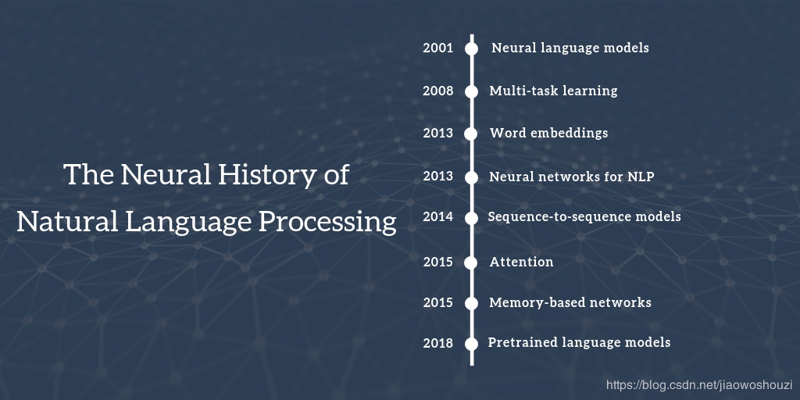

-   2001 - Neural language models（神经语言模型）
-   2008 - Multi-task learning（多任务学习）
-   2013 - Word embeddings（词嵌入）
-   2013 - Neural networks for NLP（NLP神经网络）
-   2014 - Sequence-to-sequence models
-   2015 - Attention（注意力机制）
-   2015 - Memory-based networks（基于记忆的网络）
-   2018 - Pretrained language models（预训练语言模型）

### 2001 - 神经语言模型

第一个神经语言模型是Bengio等人在2001年提出的前馈神经网络，如图所示：
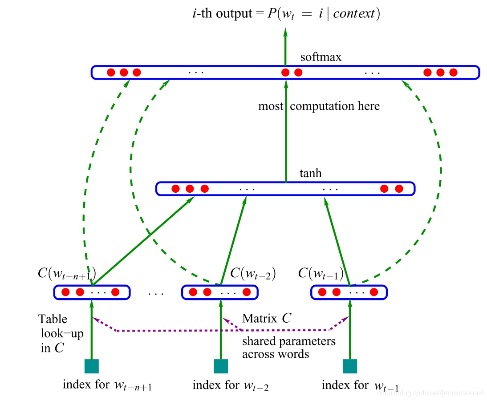这个模型将从表C中查找到的n个单词作为输入向量表征。这种向量被现在的学者们称做“词嵌入”。这些词嵌入级联后被输入到一个隐藏层中，该隐藏层的输出又被输入到softmax层。[更多关于模型的信息](http://ruder.io/word-embeddings-1/index.html#classicneurallanguagemodel)。

语言建模通常是应用RNN时的第一步，是一种非监督学习形式。尽管它很简单，但却是本文后面讨论的许多技术发展的核心：

-   词嵌入：word2vec 的目标是简化语言建模。
-   sequence-to-sequence 模型：这种模型通过一次预测一个单词生成一个输出序列。
-   预训练语言模型：这些方法使用来自语言模型的表述进行迁移学习。

反过来讲，这意味着近年来 NLP 的许多重要进展都可以归结为某些形式的语言建模。为了“真正”理解自然语言，仅仅从文本的原始形式中学习是不够的。我们需要新的方法和模型。

### 2008- 多任务学习

多任务学习是在多个任务上训练的模型之间共享参数的一种通用方法。在神经网络中，可以通过给不同层施以不同的权重，来很容易地实现多任务学习。多任务学习的概念最初由Rich Caruana 在1993年提出，并被应用于道路跟踪和肺炎预测（Caruana,1998）。直观地说，多任务学习鼓励模型学习对许多任务有用的表述。这对于学习一般的、低级的表述形式、集中模型的注意力或在训练数据有限的环境中特别有用。[详情请看这篇文章](https://www.facebook.com/722677142/posts/10155393881507143/)

在2008年，Collobert 和 Weston 将多任务学习首次应用于 NLP 的神经网络。在他们的模型中，查询表（或单词嵌入矩阵）在两个接受不同任务训练的模型之间共享，如下面的图所示。
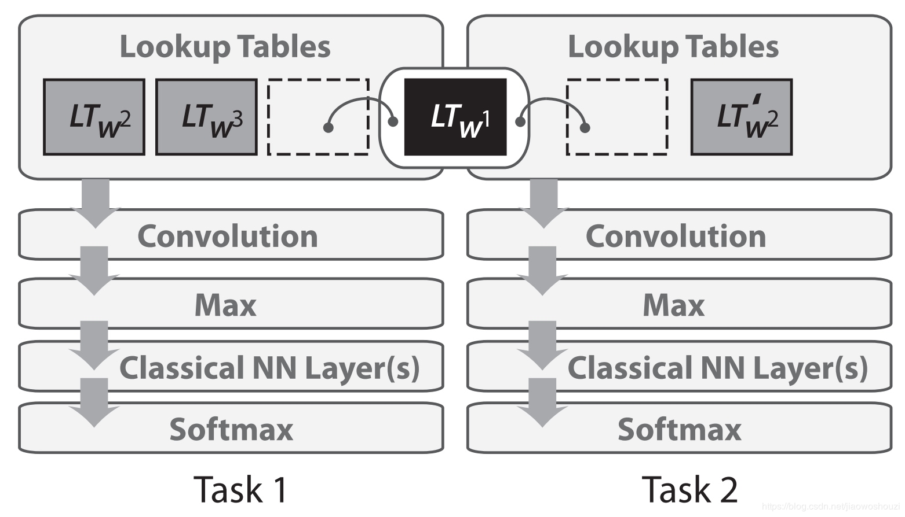

### 2013- 词嵌入

用稀疏向量表示文本，即所谓的词袋模型在 NLP 有着悠久的历史。正如上文中介绍的，早在 2001年就开始使用密集向量表示词或词嵌入。Mikolov等人在2013年提出的创新技术是通过去除隐藏层，逼近目标，进而使这些单词嵌入的训练更加高效。虽然这些技术变更本质上很简单，但它们与高效的word2vec配合使用，便能使大规模的词嵌入训练成为可能。

Word2vec有两种风格，如下面的图所示：连续字袋 CBOW 和 skip-gram。不过他们的目标不同：一个是根据周围的单词预测中心单词，而另一个则相反。
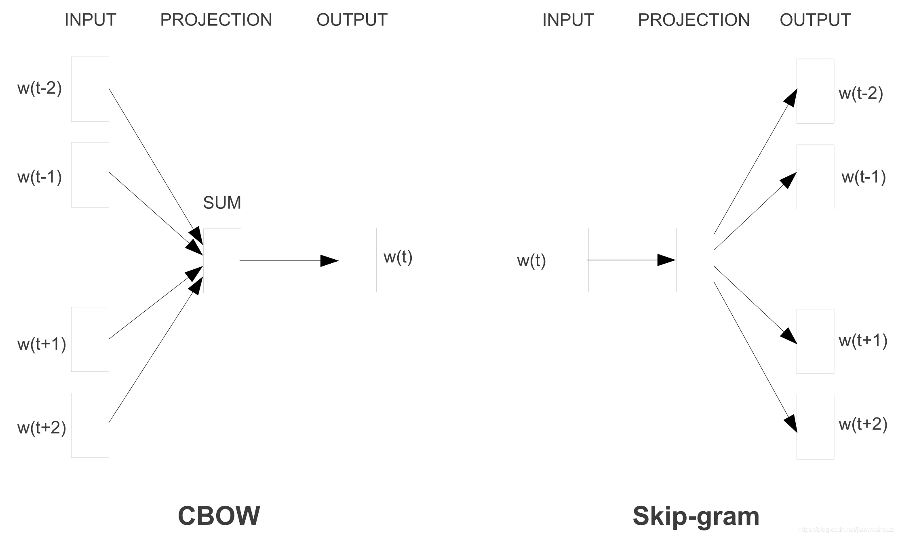虽然这些嵌入在概念上与使用前馈神经网络学习的嵌入在概念上没有区别，但是在一个非常大的语料库上训练之后，它们就能够捕获诸如性别、动词时态和国家-首都关系等单词之间的特定关系，如下图所示。
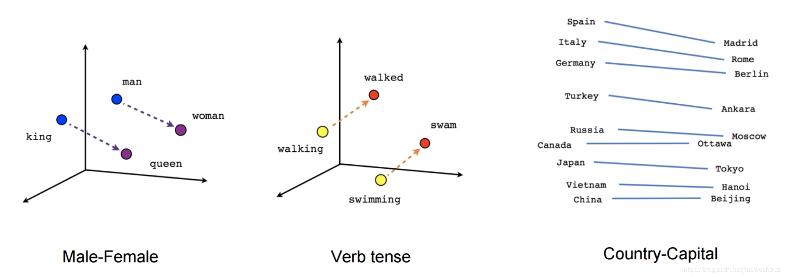

### 2013 - NLP 神经网络

2013 年和 2014 年是 NLP 问题开始引入神经网络模型的时期。使用最广泛的三种主要的神经网络是：循环神经网络、卷积神经网络和递归神经网络。

**循环神经网络（RNNs）** 循环神经网络是处理 NLP 中普遍存在的动态输入序列的一个最佳的技术方案。Vanilla RNNs （Elman,1990）很快被经典的长-短期记忆网络（Hochreiter & Schmidhuber,1997）所取代，它被证明对消失和爆炸梯度问题更有弹性。在 2013 年之前，RNN 仍被认为很难训练；Ilya Sutskever 的博士论文为改变这种现状提供了一个关键性的例子。下面的图对 LSTM 单元进行了可视化显示。双向 LSTM（Graves等,2013）通常用于处理左右两边的上下文。
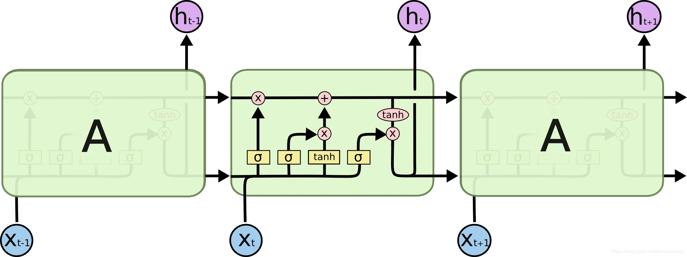**卷积神经网络（CNNs）** 卷积神经网络本来是广泛应用于计算机视觉领域的技术，现在也开始应用于语言（Kalchbrenner等,2014；Kim等,2014）。文本的卷积神经网络只在两个维度上工作，其中滤波器（卷积核）只需要沿着时间维度移动。下面的图显示了NLP中使用的典型 CNN。
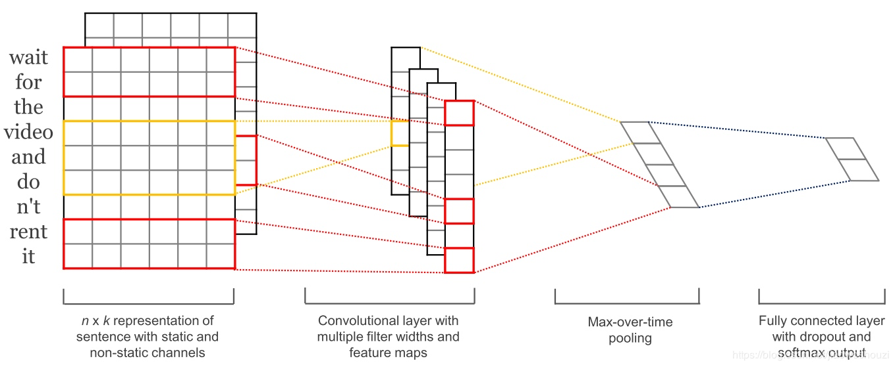卷积神经网络的一个优点是它们比 RNN 更可并行化，因为其在每个时间步长的状态只依赖于本地上下文（通过卷积运算），而不是像 RNN 那样依赖过去所有的状态。使用膨胀卷积，可以扩大 CNN 的感受野，使网络有能力捕获更长的上下文（Kalchbrenner等,2016）。CNN 和 LSTM 可以组合和叠加（Wang等,2016），卷积也可以用来加速 LSTM（Bradbury等, 2017）。

**递归神经网络** RNN 和 CNN 都将语言视为一个序列。然而，从语言学的角度来看，语言本质上是层次化的：单词被组合成高阶短语和从句，这些短语和从句本身可以根据一组生产规则递归地组合。将句子视为树而不是序列的语言学启发思想产生了递归神经网络（Socher 等人， 2013），如下图所示
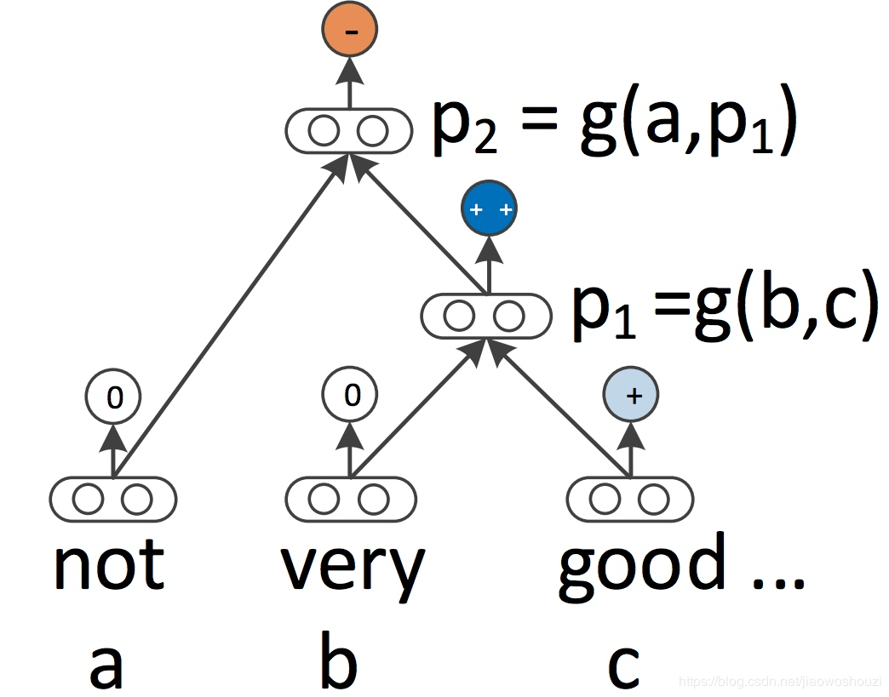递归神经网络从下到上构建序列的表示，这一点不同于从左到右或从右到左处理句子的 RNN。在树的每个节点上，通过组合子节点的结果来计算新的结果。由于树也可以被视为在 RNN 上强加不同的处理顺序，所以 LSTM 自然地也被扩展到树上（Tai等,2015）。

RNN 和 LSTM 可以扩展到使用层次结构。单词嵌入不仅可以在本地学习，还可以在语法语境中学习（Levy & Goldberg等,2014）；语言模型可以基于句法堆栈生成单词（Dyer等,2016）；图卷积神经网络可以基于树结构运行（Bastings等,2017）。

### 2014-sequence-to-sequence 模型

2014 年，Sutskever 等人提出了 sequence-to-sequence 模型。这是一个使用神经网络将一个序列映射到另一个序列的通用框架。在该框架中，编码器神经网络逐符号处理一个句子，并将其压缩为一个向量表示；然后，一个解码器神经网络根据编码器状态逐符号输出预测值，并将之前预测的符号作为每一步的输入，如下图所示。
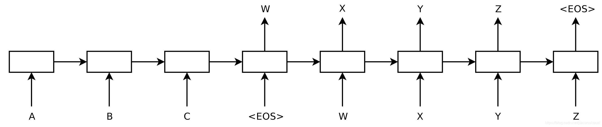
机器翻译是对这个框架比较成功的应用。2016 年，谷歌宣布将开始用神经 MT 模型取代基于单片短语的 MT 模型（Wu等,2016）。根据 Jeff Dean 的说法，这意味着用 500 行神经网络模型替换 50 万行基于短语的MT代码。

由于其灵活性，这个框架现在是自然语言生成任务的首选框架，其中不同的模型承担了编码器和解码器的角色。重要的是，解码器模型不仅可以解码一个序列，而且可以解码任意表征。例如，可以基于图像生成标题（Vinyals等,2015）（如下图所示）、基于表生成文本（Lebret等,2016）和基于应用程序中源代码更改描述（Loyola等,2017）。
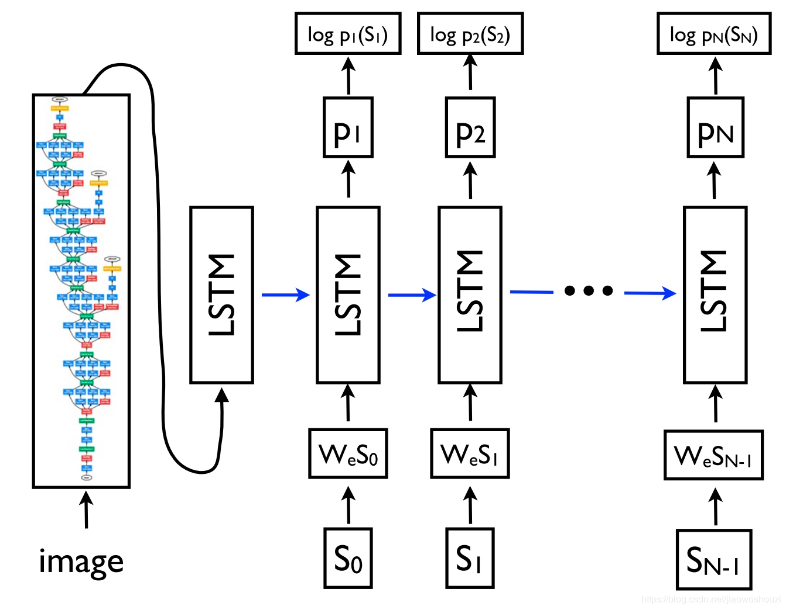sequence-to-sequence 学习甚至可以应用于 NLP 中输出具有特定结构的结构化预测任务。为了简单起见，输出被线性化，如下面的图所示，用于进行选区解析。神经网络已经证明了在有足够数量的训练数据进行选区分析（Vinyals等,2015）和命名实体识别（Gillick等, 2016）的情况下，直接学习可以产生这种线性化输出的能力。
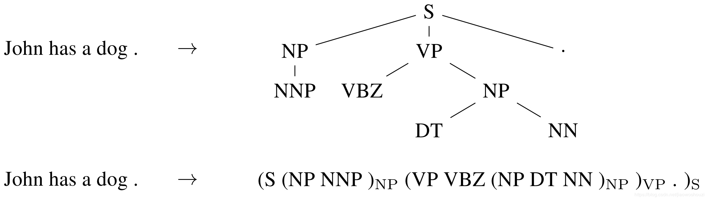

### 2015- 注意力机制

注意力机制（Bahdanau 等,2015）是神经网络机器翻译（NMT）的核心创新之一，也是使 NMT模型胜过经典的基于短语的MT系统的关键思想。sequence-to-sequence模型的主要瓶颈是需要将源序列的全部内容压缩为一个固定大小的向量。注意力机制通过允许解码器回头查看源序列隐藏状态来缓解这一问题，然后将其加权平均作为额外输入提供给解码器，如下面的图所示

注意力机制有很多不同的形式（Luong等,2015）。这里有一个简短的概述。注意力机制广泛适用于任何需要根据输入的特定部分做出决策的任务，并且效果不错。它已被应用于一致性解析（Vinyals等,2015）、阅读理解（Hermann等,2015）和一次性学习（Vinyals等,2016）等诸多领域。输入甚至不需要是一个序列，即可以包含其他表示，如图像字幕（Xu等,2015），如下图所示。注意力机制的一个额外的功能是，它提供了一种少见的功能，我们可以通过检查输入的哪些部分与基于注意力权重的特定输出相关来了解模型的内部工作方式。

### 2015 - 基于记忆的网络

注意力机制可以看作是模糊记忆的一种形式。记忆由模型的隐藏状态组成，模型选择从记忆中检索内容。研究者们提出了许多具有更明确记忆的模型。这些模型有不同的变体，如神经图灵机（Graves等,2014）、记忆网络（Weston等,2015）和端到端记忆网络（Sukhbaatar等,2015）、动态记忆网络（Kumar等,2015）、神经微分计算机（Graves等,2016）和循环实体网络（Henaff等,2017）。

记忆的访问通常基于与当前状态的相似度，类似于注意力，通常可以写入和读取。模型在如何实现和利用内存方面有所不同。例如，端到端记忆网络多次处理输入，并更新记忆以实现多个推理步骤。神经图灵机也有一个基于位置的寻址，这允许他们学习简单的计算机程序，如排序。基于记忆的模型通常应用于一些特定任务中，如语言建模和阅读理解。在这些任务中，长时间保存信息应该很有用。记忆的概念是非常通用的：知识库或表可以充当记忆，而记忆也可以根据整个输入或它的特定部分填充。

### 2018 - 预训练语言模型

预训练的词嵌入与上下文无关，仅用于初始化模型中的第一层。一系列监督型任务被用于神经网络的预训练。相反，语言模型只需要无标签的文本；因此，训练可以扩展到数十亿个tokens, new domains, new languages。预训练语言模型于 2015 年被首次提出（Dai & Le,2015）；直到最近，它们才被证明在各种任务中效果还是不错的。语言模型嵌入可以作为目标模型中的特征（Peters等，2018），或者使用语言模型对目标任务数据进行微调（Ramachandranden等,2017; Howard & Ruder,2018）。添加语言模型嵌入可以在许多不同的任务中提供比最先进的技术更大的改进，如下面的图所示。

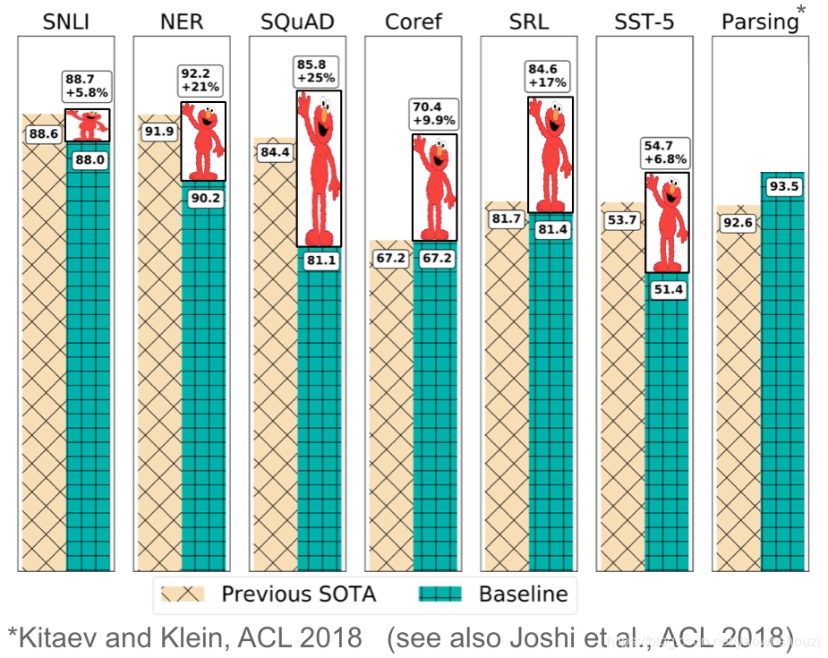
预训练的语言模型已经被证明可以用更少的数据进行学习。由于语言模型只需要无标记的数据，因此对于标记数据稀缺的低资源语言尤其有用。

### 其他里程碑事件

其他一些技术发展没有上面提到的那样流行，但仍然有广泛的影响。

-   **基于字符的表示**
    在字符上使用 CNN 或 LSTM 以获得基于字符的词表示的做法现在相当普遍，特别是对于形态信息重要或有许多未知单词的丰富的语言和任务，效果更加明显。据我所知，序列标签使用基于字符的表示（Lample 等人，2016；普兰克等人，2016），可以减轻在计算成本增加的情况下必须处理固定词汇表的需要，并支持完全基于字符的 NMT （Ling 等人， 2016；Lee 等人，2017）。
-   **对抗学习**
    对抗学习方法已经在 ML 领域掀起了风暴，在 NLP 中也有不同形式的应用。对抗性的例子越来越被广泛使用，它不仅是作为一种工具来探究模型和理解它们的失败案例，而且也使自身更加鲁棒（Jia & Liang， 2017）。（虚拟）对抗性训练，即最坏情况扰动（Miyato 等人，2017）和领域对抗性损失（Ganin 等人， 2016；Kim 等人，2017），同样可以使模型更加鲁棒。生成对抗网络（GANs）对于自然语言生成还不是很有效（Semeniuta 等人， 2018），但在匹配分布时很有用（Conneau 等人， 2018）。
-   **强化学习**
    强化学习已被证明对具有时间依赖性的任务有效，例如在训练期间选择数据（Fang 等人， 2017；Wu 等人， 2018）和建模对话（Liu 等人， 2018）。RL 对于直接优化不可微的末端度量（如 ROUGE 或 BLEU）也有效，反而在汇总中优化替代损失（如交叉熵）（Paulus 等人， 2018；Celikyilmaz 等人，2018）和机器翻译场景效果就不明显了（Ranzato 等人，2016）。类似地，逆向强化学习在过于复杂而无法指定数据的情况下也很有用，比看图说话任务（Wang 等人， 2018）。

## 3）BERT：一切过往， 皆为序章

### Attention机制讲解

attention是一种能让模型对重要信息重点关注并充分学习吸收的技术，它不算是一个完整的模型，应当是一种技术，能够作用于任何序列模型中。

#### Seq2Seq

在开始讲解Attention之前，我们先简单回顾一下Seq2Seq模型，传统的机器翻译基本都是基于Seq2Seq模型来做的，该模型分为encoder层与decoder层，并均为RNN或RNN的变体构成，如下图所示：
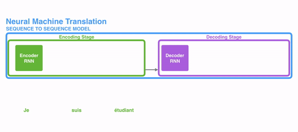
在encode阶段，第一个节点输入一个词，之后的节点输入的是下一个词与前一个节点的hidden state，最终encoder会输出一个context，这个context又作为decoder的输入，每经过一个decoder的节点就输出一个翻译后的词，并把decoder的hidden state作为下一层的输入。该模型对于短文本的翻译来说效果很好，但是其也存在一定的缺点，如果文本稍长一些，就很容易丢失文本的一些信息，为了解决这个问题，Attention应运而生。

#### Attention

Attention，正如其名，注意力，该模型在decode阶段，会选择最适合当前节点的context作为输入。Attention与传统的Seq2Seq模型主要有以下两点不同。

1）encoder提供了更多的数据给到decoder，encoder会把所有的节点的hidden state提供给decoder，而不仅仅只是encoder最后一个节点的hidden state。

2）decoder并不是直接把所有encoder提供的hidden state作为输入，而是采取一种选择机制，把最符合当前位置的hidden state选出来，具体的步骤如下

-   确定哪一个hidden state与当前节点关系最为密切
-   计算每一个hidden state的分数值（具体怎么计算我们下文讲解）
-   对每个分数值做一个softmax的计算，这能让相关性高的hidden state的分数值更大，相关性低的hidden state的分数值更低

这里我们以一个具体的例子来看下其中的详细计算步骤：

把每一个encoder节点的hidden states的值与decoder当前节点的上一个节点的hidden state相乘，如上图，h1、h2、h3分别与当前节点的上一节点的hidden state进行相乘(如果是第一个decoder节点，需要随机初始化一个hidden state)，最后会获得三个值，这三个值就是上文提到的hidden state的分数，注意，这个数值对于每一个encoder的节点来说是不一样的，把该分数值进行softmax计算，计算之后的值就是每一个encoder节点的hidden states对于当前节点的权重，把权重与原hidden states相乘并相加，得到的结果即是当前节点的hidden state。可以发现，其实Atttention的关键就是计算这个分值。

明白每一个节点是怎么获取hidden state之后，接下来就是decoder层的工作原理了，其具体过程如下：

第一个decoder的节点初始化一个向量，并计算当前节点的hidden state，把该hidden state作为第一个节点的输入，经过RNN节点后得到一个新的hidden state与输出值。注意，这里和Seq2Seq有一个很大的区别，Seq2Seq是直接把输出值作为当前节点的输出，但是Attention会把该值与hidden state做一个连接，并把连接好的值作为context，并送入一个前馈神经网络，最终当前节点的输出内容由该网络决定，重复以上步骤，直到所有decoder的节点都输出相应内容。
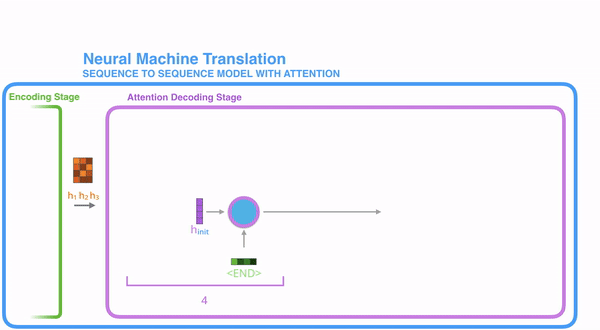

Attention模型并不只是盲目地将输出的第一个单词与输入的第一个词对齐。实际上，它在训练阶段学习了如何在该语言对中对齐单词(示例中是法语和英语)。Attention函数的本质可以被描述为一个查询（query）到一系列（键key-值value）对的映射。

在计算attention时主要分为三步，第一步是将query和每个key进行相似度计算得到权重，常用的相似度函数有点积，拼接，感知机等；然后第二步一般是使用一个softmax函数对这些权重进行归一化；最后将权重和相应的键值value进行加权求和得到最后的attention。目前在NLP研究中，key和value常常都是同一个，即key=value。
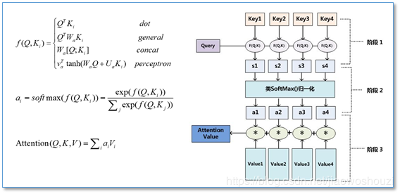

### Transrofmer模型讲解

接下来我将介绍《Attention is all you need》这篇论文。这篇论文是google机器翻译团队在2017年6月放在arXiv上，最后发表在2017年nips上，到目前为止google学术显示引用量为2203，可见也是受到了大家广泛关注和应用。这篇论文主要亮点在于
1）不同于以往主流机器翻译使用基于RNN的seq2seq模型框架，该论文用attention机制代替了RNN搭建了整个模型框架。
2）提出了多头注意力（Multi-headed attention）机制方法，在编码器和解码器中大量的使用了多头自注意力机制（Multi-headed self-attention）。
3）在WMT2014语料中的英德和英法任务上取得了先进结果，并且训练速度比主流模型更快。

[《Attention Is All You Need》](https://arxiv.org/abs/1706.03762)是一篇Google提出的将Attention思想发挥到极致的论文。这篇论文中提出一个全新的模型，叫 Transformer，抛弃了以往深度学习任务里面使用到的 CNN 和 RNN ，Bert就是基于Transformer构建的，这个模型广泛应用于NLP领域，例如机器翻译，问答系统，文本摘要和语音识别等等方向。关于Transrofmer模型的理解特别推荐一位国外博主文章[《The Illustrated Transformer》](https://jalammar.github.io/illustrated-transformer/)。

#### Transformer总体结构

和Attention模型一样，Transformer模型中也采用了 encoer-decoder 架构。但其结构相比于Attention更加复杂，论文中encoder层由6个encoder堆叠在一起，decoder层也一样。
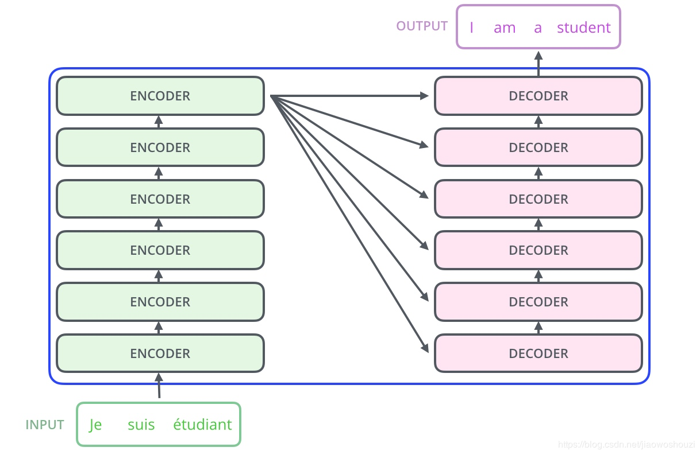每一个encoder和decoder的内部简版结构如下图
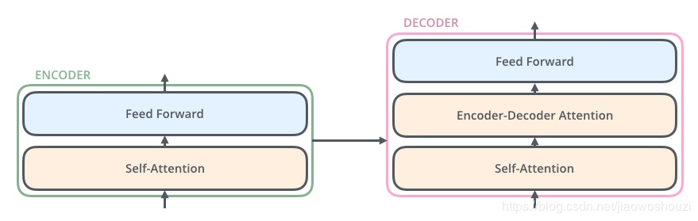
对于encoder，包含两层，一个self-attention层和一个前馈神经网络，self-attention能帮助当前节点不仅仅只关注当前的词，从而能获取到上下文的语义。decoder也包含encoder提到的两层网络，但是在这两层中间还有一层attention层，帮助当前节点获取到当前需要关注的重点内容。

现在我们知道了模型的主要组件，接下来我们看下模型的内部细节。首先，模型需要对输入的数据进行一个embedding操作，（也可以理解为类似w2c的操作），enmbedding结束之后，输入到encoder层，self-attention处理完数据后把数据送给前馈神经网络，前馈神经网络的计算可以并行，得到的输出会输入到下一个encoder。
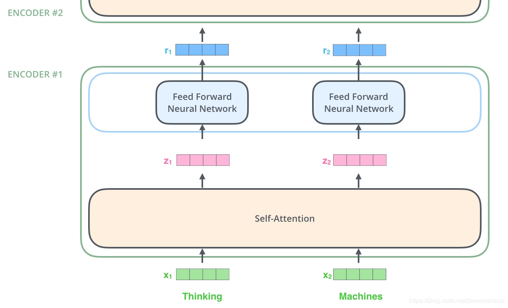

#### Self-Attention

接下来我们详细看一下self-attention，其思想和attention类似，但是self-attention是Transformer用来将其他相关单词的“理解”转换成我们正常理解的单词的一种思路，我们看个例子：
`The animal didn't cross the street because it was too tired`
这里的it到底代表的是animal还是street呢，对于我们来说能很简单的判断出来，但是对于机器来说，是很难判断的，self-attention就能够让机器把it和animal联系起来
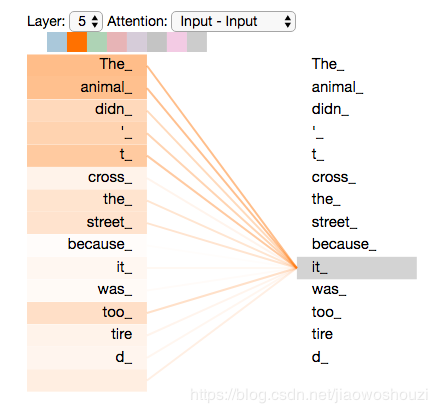
接下来我们看下详细的处理过程。

1、首先，self-attention会计算出三个新的向量，在论文中，向量的维度是512维，我们把这三个向量分别称为Query、Key、Value，这三个向量是用embedding向量与一个矩阵相乘得到的结果，这个矩阵是随机初始化的，维度为（64，512）注意第二个维度需要和embedding的维度一样，其值在BP的过程中会一直进行更新，得到的这三个向量的维度是64低于embedding维度的。

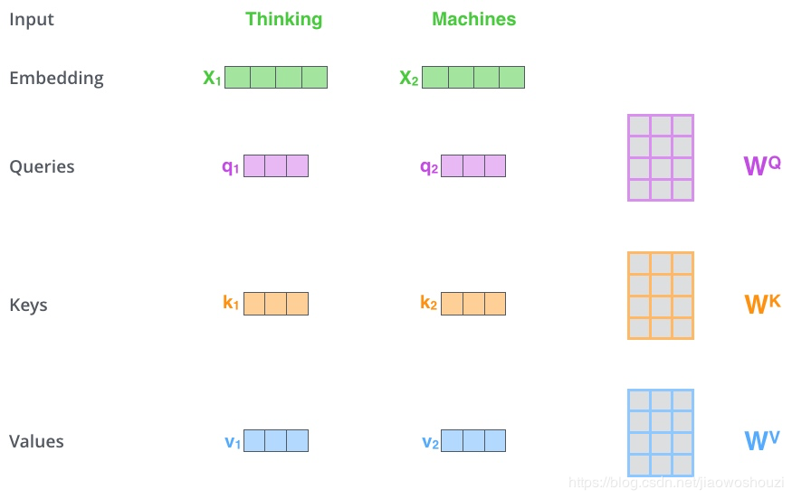
那么Query、Key、Value这三个向量又是什么呢？这三个向量对于attention来说很重要，当你理解了下文后，你将会明白这三个向量扮演者什么的角色。

2、计算self-attention的分数值，该分数值决定了当我们在某个位置encode一个词时，对输入句子的其他部分的关注程度。这个分数值的计算方法是Query与Key做点乘，以下图为例，首先我们需要针对Thinking这个词，计算出其他词对于该词的一个分数值，首先是针对于自己本身即q1·k1，然后是针对于第二个词即q1·k2
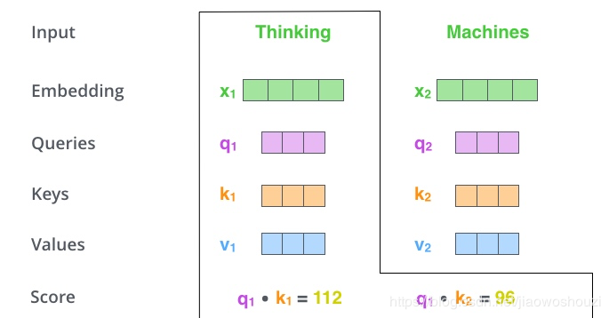
3、接下来，把点成的结果除以一个常数，这里我们除以8，这个值一般是采用上文提到的矩阵的第一个维度的开方即64的开方8，当然也可以选择其他的值，然后把得到的结果做一个softmax的计算。得到的结果即是每个词对于当前位置的词的相关性大小，当然，当前位置的词相关性肯定会会很大
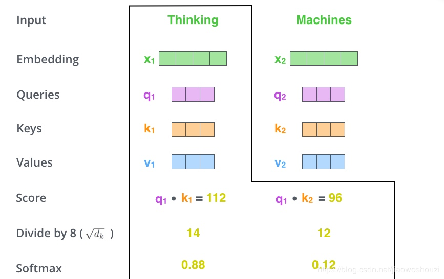
4、下一步就是把Value和softmax得到的值进行相乘，并相加，得到的结果即是self-attetion在当前节点的值。

在实际的应用场景，为了提高计算速度，我们采用的是矩阵的方式，直接计算出Query, Key, Value的矩阵，然后把embedding的值与三个矩阵直接相乘，把得到的新矩阵Q与K相乘，乘以一个常数，做softmax操作，最后乘上V矩阵
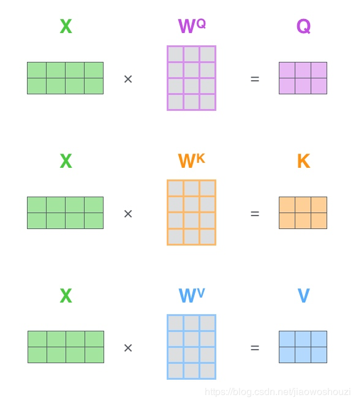

这种通过 query 和 key 的相似性程度来确定 value 的权重分布的方法被称为scaled dot-product attention。其实scaled dot-Product attention就是我们常用的使用点积进行相似度计算的attention，只是多除了一个（为K的维度）起到调节作用，使得内积不至于太大。
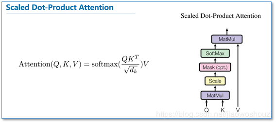

#### Multi-Headed Attention

这篇论文更厉害的地方是给self-attention加入了另外一个机制，被称为“multi-headed” attention，该机制理解起来很简单，就是说不仅仅只初始化一组Q、K、V的矩阵，而是初始化多组，tranformer是使用了8组，所以最后得到的结果是8个矩阵。
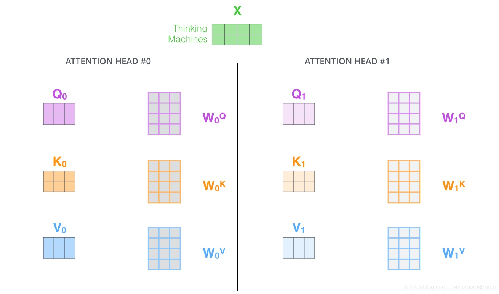
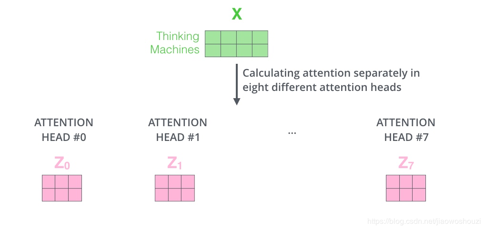
这给我们留下了一个小的挑战，前馈神经网络没法输入8个矩阵呀，这该怎么办呢？所以我们需要一种方式，把8个矩阵降为1个，首先，我们把8个矩阵连在一起，这样会得到一个大的矩阵，再随机初始化一个矩阵和这个组合好的矩阵相乘，最后得到一个最终的矩阵。
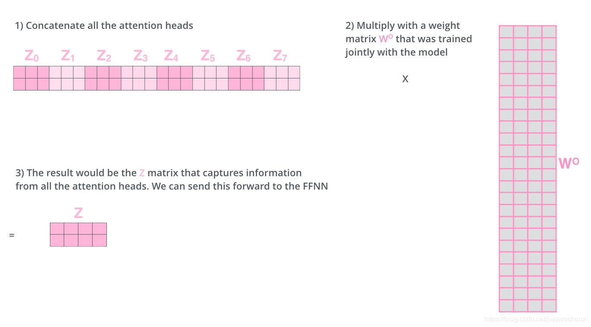
这就是multi-headed attention的全部流程了，这里其实已经有很多矩阵了，我们把所有的矩阵放到一张图内看一下总体的流程。
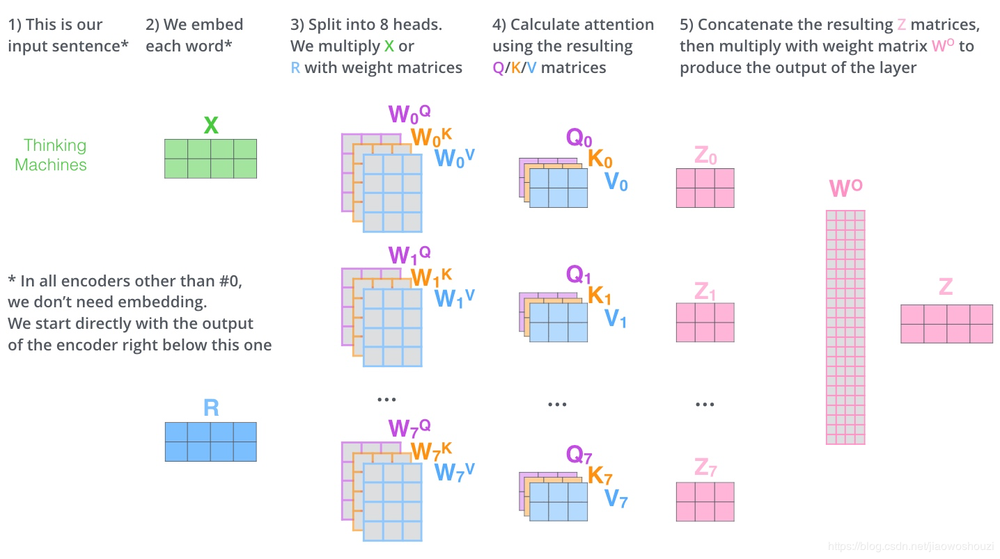
多头attention（Multi-head attention）整个过程可以简述为：Query，Key，Value首先进过一个线性变换，然后输入到放缩点积attention（注意这里要做h次，其实也就是所谓的多头，每一次算一个头，而且每次Q，K，V进行线性变换的参数W是不一样的），然后将h次的放缩点积attention结果进行拼接，再进行一次线性变换得到的值作为多头attention的结果。可以看到，google提出来的多头attention的不同之处在于进行了h次计算而不仅仅算一次，论文中说到这样的好处是可以允许模型在不同的表示子空间里学习到相关的信息，后面还会根据attention可视化来验证。
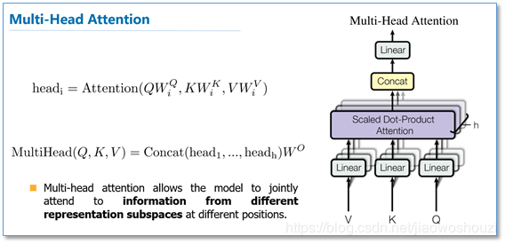
那么在整个模型中，是如何使用attention的呢？如下图，首先在编码器到解码器的地方使用了多头attention进行连接，K，V，Q分别是编码器的层输出（这里K=V）和解码器中都头attention的输入。其实就和主流的机器翻译模型中的attention一样，利用解码器和编码器attention来进行翻译对齐。然后在编码器和解码器中都使用了多头自注意力self-attention来学习文本的表示。Self-attention即K=V=Q，例如输入一个句子，那么里面的每个词都要和该句子中的所有词进行attention计算。目的是学习句子内部的词依赖关系，捕获句子的内部结构。

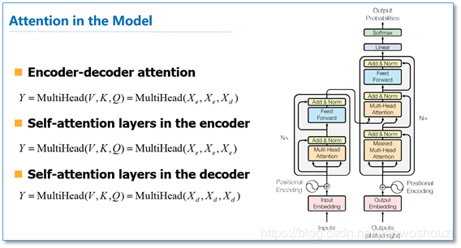
对于使用自注意力机制的原因，论文中提到主要从三个方面考虑（每一层的复杂度，是否可以并行，长距离依赖学习），并给出了和RNN，CNN计算复杂度的比较。可以看到，如果输入序列n小于表示维度d的话，每一层的时间复杂度self-attention是比较有优势的。当n比较大时，作者也给出了一种解决方案self-attention（restricted）即每个词不是和所有词计算attention，而是只与限制的r个词去计算attention。在并行方面，多头attention和CNN一样不依赖于前一时刻的计算，可以很好的并行，优于RNN。在长距离依赖上，由于self-attention是每个词和所有词都要计算attention，所以不管他们中间有多长距离，最大的路径长度也都只是1。可以捕获长距离依赖关系。
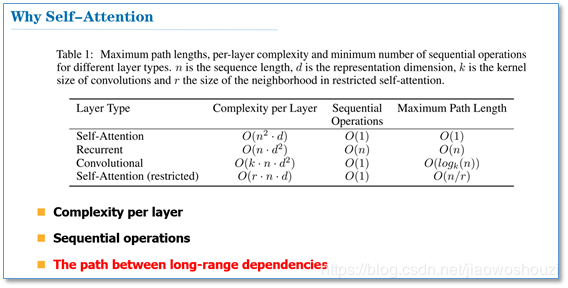
现在我们已经接触了attention的header，让我们重新审视我们之前的例子，看看例句中的“it”这个单词在不同的attention header情况下会有怎样不同的关注点（这里不同颜色代表attention不同头的结果，颜色越深attention值越大）。
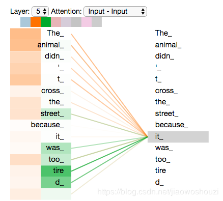
当我们对“it”这个词进行编码时，一个注意力的焦点主要集中在“animal”上，而另一个注意力集中在“tired”（两个heads）
但是，如果我们将所有注意力添加到图片中，可能有点难理解：
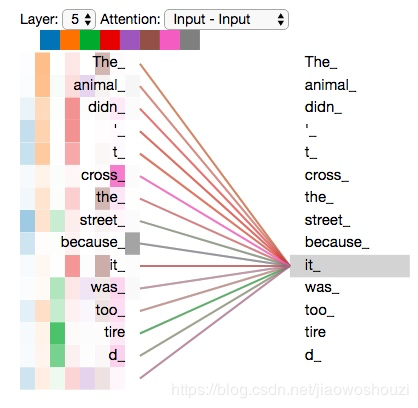

#### Positional Encoding

到目前为止，transformer模型中还缺少一种解释输入序列中单词顺序的方法。为了处理这个问题，transformer给encoder层和decoder层的输入添加了一个额外的向量Positional Encoding，维度和embedding的维度一样，这个向量采用了一种很独特的方法来让模型学习到这个值，这个向量能决定当前词的位置，或者说在一个句子中不同的词之间的距离。这个位置向量的具体计算方法有很多种，论文中的计算方法如下

其中pos是指当前词在句子中的位置，i是指向量中每个值的index，可以看出，在偶数位置，使用正弦编码，在奇数位置，使用余弦编码。最后把这个Positional Encoding与embedding的值相加，作为输入送到下一层。
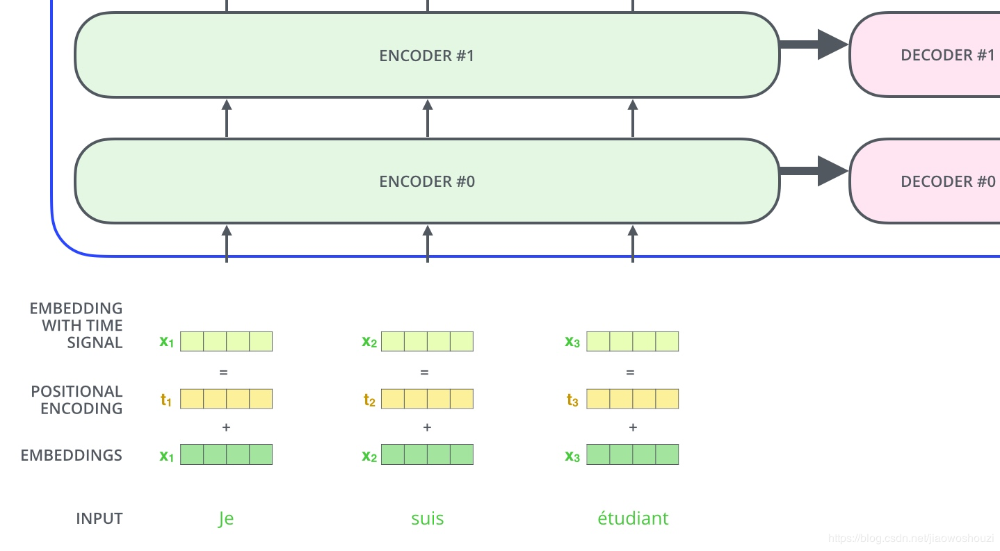
为了让模型捕捉到单词的顺序信息，我们添加位置编码向量信息（POSITIONAL ENCODING），位置编码向量不需要训练，它有一个规则的产生方式（上图公式）。

如果我们的嵌入维度为4，那么实际上的位置编码就如下图所示：

那么生成位置向量需要遵循怎样的规则呢？

观察下面的图形，每一行都代表着对一个矢量的位置编码。因此第一行就是我们输入序列中第一个字的嵌入向量，每行都包含512个值，每个值介于1和-1之间。我们用颜色来表示1，-1之间的值，这样方便可视化的方式表现出来：
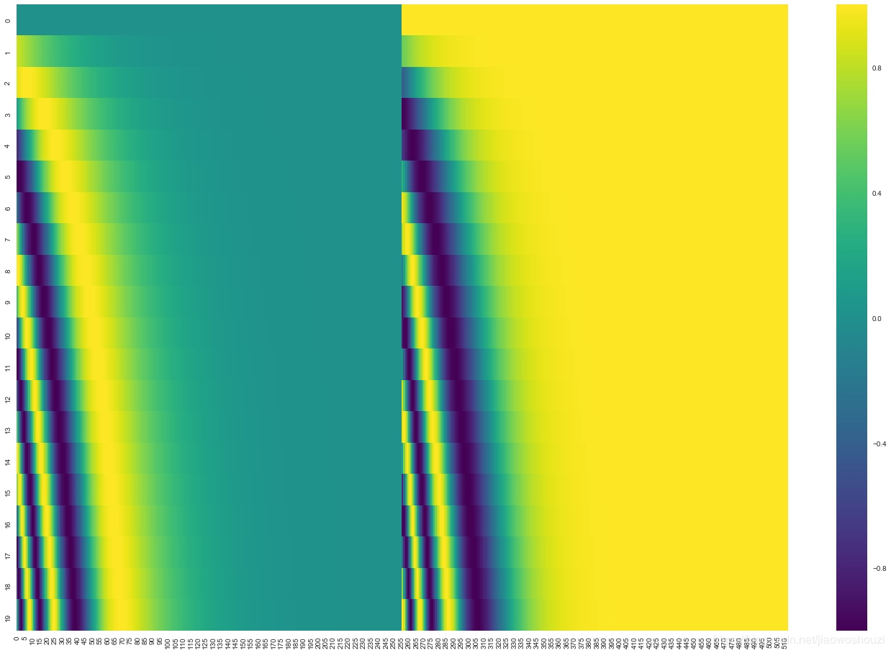
这是一个20个字（行）的（512）列位置编码示例。你会发现它咋中心位置被分为了2半，这是因为左半部分的值是一由一个正弦函数生成的，而右半部分是由另一个函数（余弦）生成。然后将它们连接起来形成每个位置编码矢量。

#### Layer normalization

在transformer中，每一个子层（self-attetion，ffnn）之后都会接一个残差模块，并且有一个Layer normalization
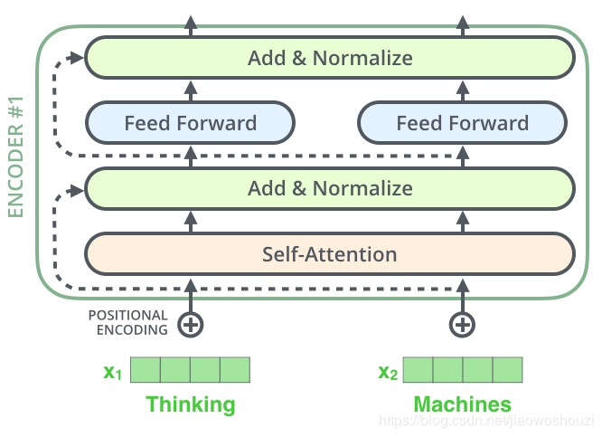
在进一步探索其内部计算方式，我们可以将上面图层可视化为下图：
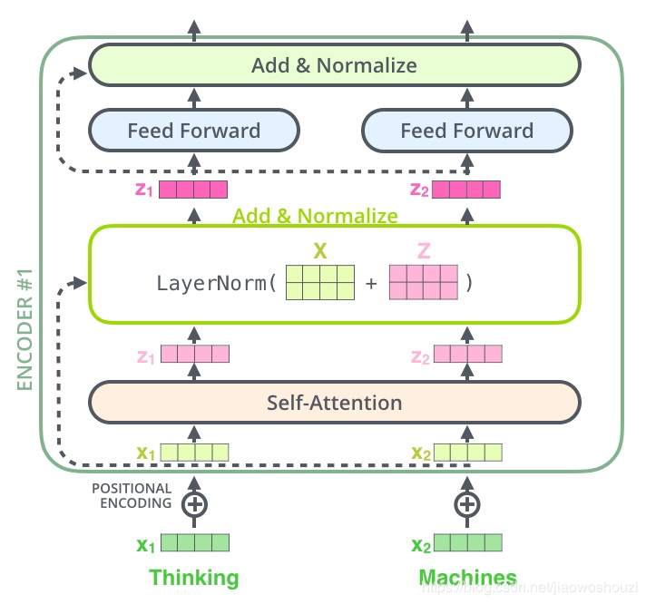
残差模块相信大家都很清楚了，这里不再讲解，主要讲解下Layer normalization。Normalization有很多种，但是它们都有一个共同的目的，那就是把输入转化成均值为0方差为1的数据。我们在把数据送入激活函数之前进行normalization（归一化），因为我们不希望输入数据落在激活函数的饱和区。

说到 normalization，那就肯定得提到 [Batch Normalization](https://terrifyzhao.github.io/2018/02/08/Batch-Normalization浅析.html)。BN的主要思想就是：在每一层的每一批数据上进行归一化。我们可能会对输入数据进行归一化，但是经过该网络层的作用后，我们的数据已经不再是归一化的了。随着这种情况的发展，数据的偏差越来越大，我的反向传播需要考虑到这些大的偏差，这就迫使我们只能使用较小的学习率来防止梯度消失或者梯度爆炸。

BN的具体做法就是对每一小批数据，在批这个方向上做归一化。如下图所示：
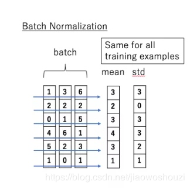
可以看到，右半边求均值是沿着数据 batch_size的方向进行的，其计算公式如下：

那么什么是 Layer normalization 呢？它也是归一化数据的一种方式，不过 LN 是在每一个样本上计算均值和方差，而不是BN那种在批方向计算均值和方差！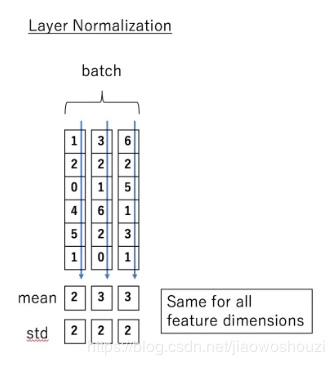
下面看一下 LN 的公式：

到这里为止就是全部encoders的内容了，如果把两个encoders叠加在一起就是这样的结构，在self-attention需要强调的最后一点是其采用了残差网络中的short-cut结构，目的是解决深度学习中的退化问题。
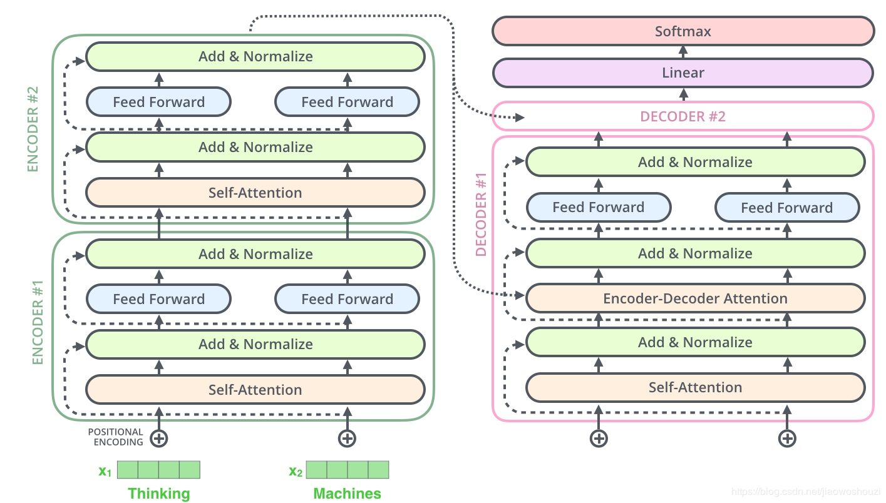

#### Decoder层

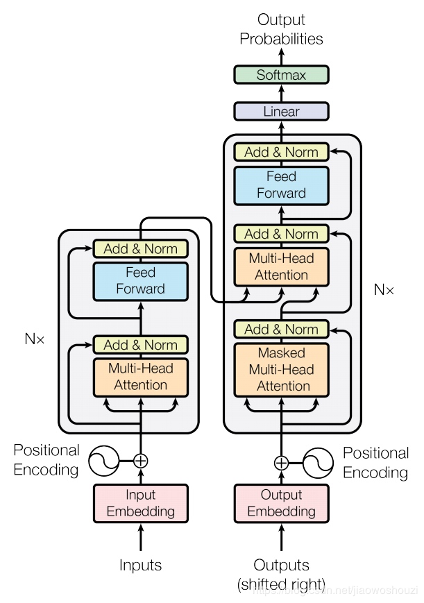
上图是transformer的一个详细结构，相比本文一开始结束的结构图会更详细些，接下来，我们会按照这个结构图讲解下decoder部分。

可以看到decoder部分其实和encoder部分大同小异，不过在最下面额外多了一个masked mutil-head attetion，这里的mask也是transformer一个很关键的技术，我们一起来看一下。

#### Mask

mask 表示掩码，它对某些值进行掩盖，使其在参数更新时不产生效果。Transformer 模型里面涉及两种 mask，分别是 padding mask 和 sequence mask。

其中，padding mask 在所有的 scaled dot-product attention 里面都需要用到，而 sequence mask 只有在 decoder 的 self-attention 里面用到。

##### Padding Mask

什么是 padding mask 呢？因为每个批次输入序列长度是不一样的也就是说，我们要对输入序列进行对齐。具体来说，就是给在较短的序列后面填充 0。但是如果输入的序列太长，则是截取左边的内容，把多余的直接舍弃。因为这些填充的位置，其实是没什么意义的，所以我们的attention机制不应该把注意力放在这些位置上，所以我们需要进行一些处理。

具体的做法是，把这些位置的值加上一个非常大的负数(负无穷)，这样的话，经过 softmax，这些位置的概率就会接近0！

而我们的 padding mask 实际上是一个张量，每个值都是一个Boolean，值为 false 的地方就是我们要进行处理的地方。

##### Sequence mask

文章前面也提到，sequence mask 是为了使得 decoder 不能看见未来的信息。也就是对于一个序列，在 time_step 为 t 的时刻，我们的解码输出应该只能依赖于 t 时刻之前的输出，而不能依赖 t 之后的输出。因此我们需要想一个办法，把 t 之后的信息给隐藏起来。

那么具体怎么做呢？也很简单：产生一个上三角矩阵，上三角的值全为0。把这个矩阵作用在每一个序列上，就可以达到我们的目的。

-   对于 decoder 的 self-attention，里面使用到的 scaled dot-product attention，同时需要padding mask 和 sequence mask 作为 attn_mask，具体实现就是两个mask相加作为attn_mask。
-   其他情况，attn_mask 一律等于 padding mask。

编码器通过处理输入序列启动。然后将顶部编码器的输出转换为一组注意向量k和v。每个解码器将在其“encoder-decoder attention”层中使用这些注意向量，这有助于解码器将注意力集中在输入序列中的适当位置：

完成编码阶段后，我们开始解码阶段。解码阶段的每个步骤从输出序列（本例中为英语翻译句）输出一个元素。
以下步骤重复此过程，一直到达到表示解码器已完成输出的符号。每一步的输出在下一个时间步被送入底部解码器，解码器像就像我们对编码器输入所做操作那样，我们将位置编码嵌入并添加到这些解码器输入中，以表示每个字的位置。

#### 输出层

当decoder层全部执行完毕后，怎么把得到的向量映射为我们需要的词呢，很简单，只需要在结尾再添加一个全连接层和softmax层，假如我们的词典是1w个词，那最终softmax会输入1w个词的概率，概率值最大的对应的词就是我们最终的结果。
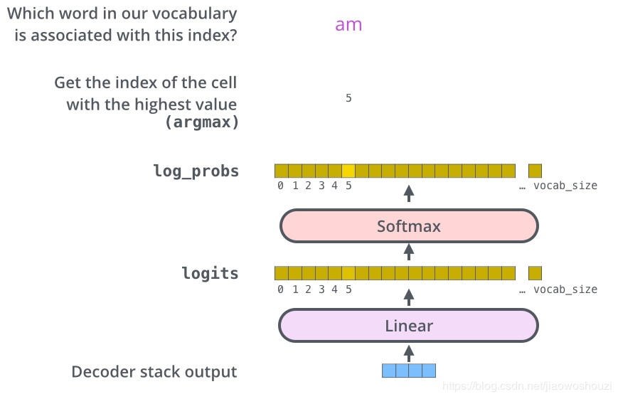

### BERT原理详解

从创新的角度来看，bert其实并没有过多的结构方面的创新点，其和GPT一样均是采用的transformer的结构，相对于GPT来说，其是双向结构的，而GPT是单向的，如下图所示
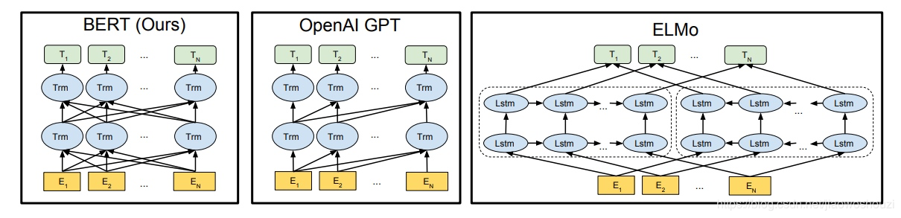
elmo：将上下文当作特征，但是无监督的语料和我们真实的语料还是有区别的，不一定的符合我们特定的任务，是一种双向的特征提取。

openai gpt就做了一个改进，也是通过transformer学习出来一个语言模型，不是固定的，通过任务 finetuning,用transfomer代替elmo的lstm。
openai gpt其实就是缺少了encoder的transformer。当然也没了encoder与decoder之间的attention。

openAI gpt虽然可以进行fine-tuning,但是有些特殊任务与pretraining输入有出入，单个句子与两个句子不一致的情况，很难解决，还有就是decoder只能看到前面的信息。
其次bert在多方面的nlp任务变现来看效果都较好，具备较强的泛化能力，对于特定的任务只需要添加一个输出层来进行fine-tuning即可。

#### 结构

先看下bert的内部结构，官网最开始提供了两个版本，L表示的是transformer的层数，H表示输出的维度，A表示mutil-head attention的个数
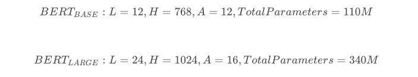
如今已经增加了多个模型，中文是其中唯一一个非英语的模型。
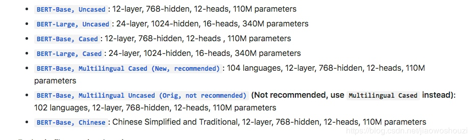
从模型的层数来说其实已经很大了，但是由于transformer的残差（residual）模块，层数并不会引起梯度消失等问题，但是并不代表层数越多效果越好，有论点认为低层偏向于语法特征学习，高层偏向于语义特征学习。

#### 预训练模型

首先我们要了解一下什么是预训练模型，举个例子，假设我们有大量的维基百科数据，那么我们可以用这部分巨大的数据来训练一个泛化能力很强的模型，当我们需要在特定场景使用时，例如做文本相似度计算，那么，只需要简单的修改一些输出层，再用我们自己的数据进行一个增量训练，对权重进行一个轻微的调整。

预训练的好处在于在特定场景使用时不需要用大量的语料来进行训练，节约时间效率高效，bert就是这样的一个泛化能力较强的预训练模型。

#### BERT的预训练过程

接下来我们看看BERT的预训练过程，BERT的预训练阶段包括两个任务，一个是Masked Language Model，还有一个是Next Sentence Prediction。

#### Masked Language Model

MLM可以理解为完形填空，作者会随机mask每一个句子中15%的词，用其上下文来做预测，例如：`my dog is hairy → my dog is [MASK]`

此处将hairy进行了mask处理，然后采用非监督学习的方法预测mask位置的词是什么，但是该方法有一个问题，因为是mask15%的词，其数量已经很高了，这样就会导致某些词在fine-tuning阶段从未见过，为了解决这个问题，作者做了如下的处理：

-   80%的时间是采用[mask]，my dog is hairy → my dog is [MASK]
-   10%的时间是随机取一个词来代替mask的词，my dog is hairy -> my dog is apple
-   10%的时间保持不变，my dog is hairy -> my dog is hairy

那么为啥要以一定的概率使用随机词呢？这是因为transformer要保持对每个输入token分布式的表征，否则Transformer很可能会记住这个[MASK]就是"hairy"。至于使用随机词带来的负面影响，文章中解释说,所有其他的token(即非"hairy"的token)共享15%*10% = 1.5%的概率，其影响是可以忽略不计的。Transformer全局的可视，又增加了信息的获取，但是不让模型获取全量信息。
注意：

-   有参数dupe_factor决定数据duplicate的次数。
-   其中，create_instance_from_document函数，是构造了一个sentence-pair的样本。对每一句，先生成[CLS]+A+[SEP]+B+[SEP]，有长（0.9）有短（0.1），再加上mask，然后做成样本类object。
-   create_masked_lm_predictions函数返回的tokens是已经被遮挡词替换之后的tokens
-   masked_lm_labels则是遮挡词对应位置真实的label。

#### Next Sentence Prediction

选择一些句子对A与B，其中50%的数据B是A的下一条句子，剩余50%的数据B是语料库中随机选择的，学习其中的相关性，添加这样的预训练的目的是目前很多NLP的任务比如QA和NLI都需要理解两个句子之间的关系，从而能让预训练的模型更好的适应这样的任务。
个人理解：

-   Bert先是用Mask来提高视野范围的信息获取量，增加duplicate再随机Mask，这样跟RNN类方法依次训练预测没什么区别了除了mask不同位置外；
-   全局视野极大地降低了学习的难度，然后再用A+B/C来作为样本，这样每条样本都有50%的概率看到一半左右的噪声；
-   但直接学习Mask A+B/C是没法学习的，因为不知道哪些是噪声，所以又加上next_sentence预测任务，与MLM同时进行训练，这样用next来辅助模型对噪声/非噪声的辨识，用MLM来完成语义的大部分的学习。
    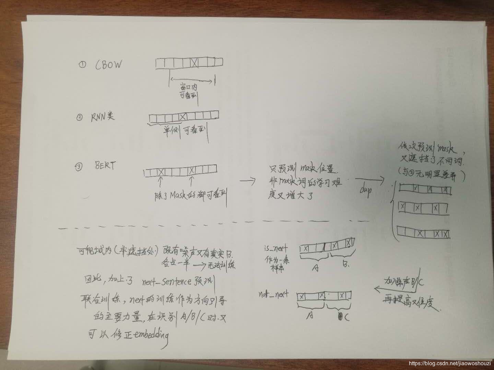

#### 输入

bert的输入可以是单一的一个句子或者是句子对，实际的输入值是segment embedding与position embedding相加，具体的操作流程可参考上面的transformer讲解。

BERT的输入词向量是三个向量之和：

Token Embedding：WordPiece tokenization subword词向量。
Segment Embedding：表明这个词属于哪个句子（NSP需要两个句子）。
Position Embedding：学习出来的embedding向量。这与Transformer不同，Transformer中是预先设定好的值。

#### 总结

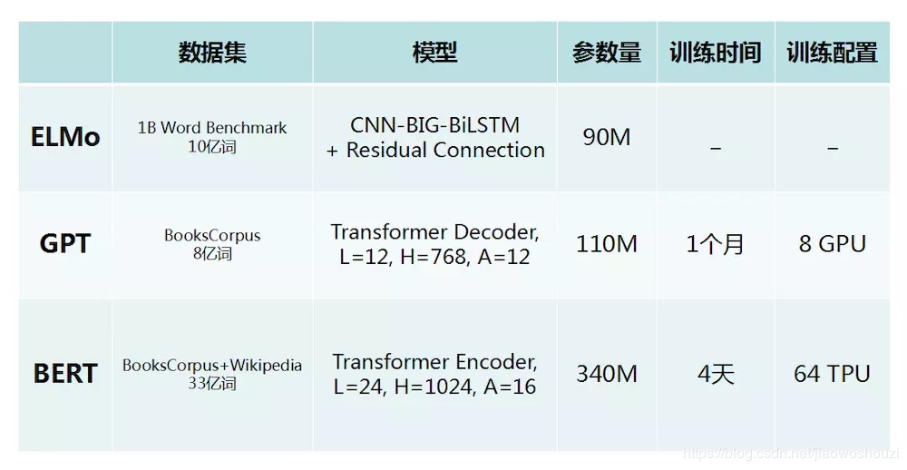
BERT的去除实验表明，双向LM和NSP带了的提升最大。

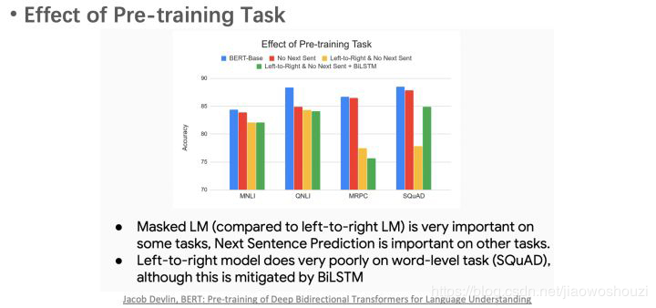
另一个结论是，增加模型参数数量可以提升模型效果。

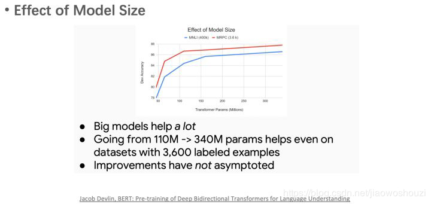
BERT预训练模型的输出结果，无非就是一个或多个向量。下游任务可以通过精调（改变预训练模型参数）或者特征抽取（不改变预训练模型参数，只是把预训练模型的输出作为特征输入到下游任务）两种方式进行使用。BERT原论文使用了精调方式，但也尝试了特征抽取方式的效果，比如在NER任务上，最好的特征抽取方式只比精调差一点点。但特征抽取方式的好处可以预先计算好所需的向量，存下来就可重复使用，极大提升下游任务模型训练的速度。
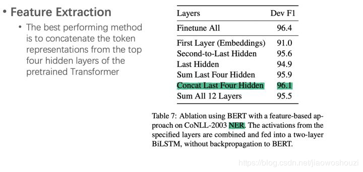
后来也有其他人针对ELMo和BERT比较了这两种使用方式的精度差异。下面列出基本结论：

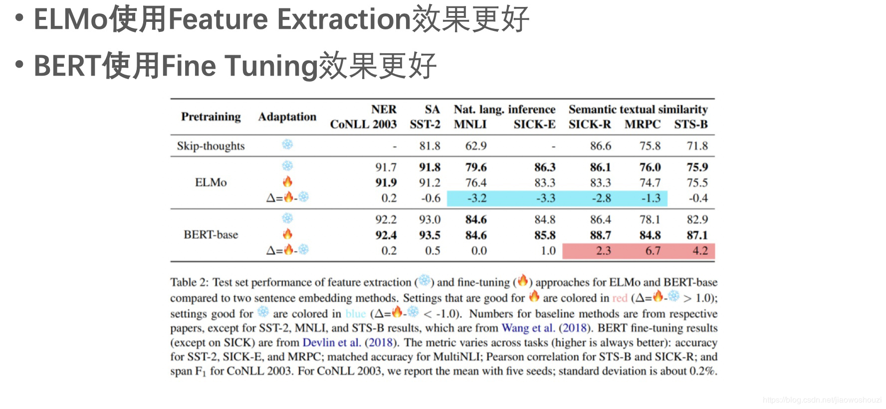
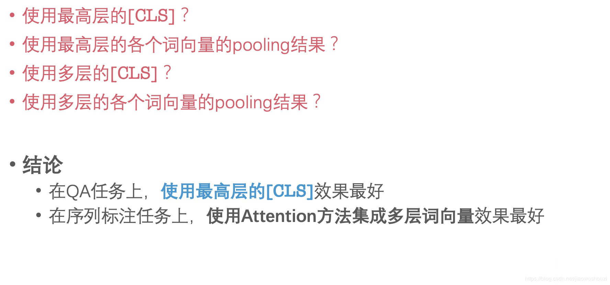
总结下BERT的主要贡献：

-   引入了Masked LM，使用双向LM做模型预训练。
-   为预训练引入了新目标NSP，它可以学习句子与句子间的关系。
-   进一步验证了更大的模型效果更好： 12 --> 24 层。
-   为下游任务引入了很通用的求解框架，不再为任务做模型定制。
-   刷新了多项NLP任务的记录，引爆了NLP无监督预训练技术。

BERT是谷歌团队糅合目前已有的NLP知识集大成者，刷新11条赛道彰显了无与伦比的实力，且极容易被用于多种NLP任务。宛若一束烟花点亮在所有NLP从业者心中。更为可贵的是谷歌选择了开源这些，让所有从业者看到了在各行各业落地的更多可能性。

**BERT优点**

-   Transformer Encoder因为有Self-attention机制，因此BERT自带双向功能
-   因为双向功能以及多层Self-attention机制的影响，使得BERT必须使用Cloze版的语言模型Masked-LM来完成token级别的预训练
-   为了获取比词更高级别的句子级别的语义表征，BERT加入了Next Sentence Prediction来和Masked-LM一起做联合训练
-   为了适配多任务下的迁移学习，BERT设计了更通用的输入层和输出层
-   微调成本小

**BERT缺点**

-   task1的随机遮挡策略略显粗犷，推荐阅读《Data Nosing As Smoothing In Neural Network Language Models》
-   [MASK]标记在实际预测中不会出现，训练时用过多[MASK]影响模型表现;
-   每个batch只有15%的token被预测，所以BERT收敛得比left-to-right模型要慢（它们会预测每个token）
-   BERT对硬件资源的消耗巨大（大模型需要16个tpu，历时四天；更大的模型需要64个tpu，历时四天。

关于BERT最新的各领域应用推荐张俊林的[Bert时代的创新（应用篇）](https://zhuanlan.zhihu.com/p/68446772)

**思考**

-   个人并不认为文章是模型的改进，更认可为任务的设计改进。
-   论文作者只比较了有没有task1的影响，并没有针对task2对比试验。提升是否来自好的预训练任务设计没有明说。
-   bert对nlp领域目前已有知识的有效“整合”，在硬件配置足够的情况下能提高nlp多领域性能

**BERT适用场景**

第一，如果NLP任务偏向在语言本身中就包含答案，而不特别依赖文本外的其它特征，往往应用Bert能够极大提升应用效果。典型的任务比如QA和阅读理解，正确答案更偏向对语言的理解程度，理解能力越强，解决得越好，不太依赖语言之外的一些判断因素，所以效果提升就特别明显。反过来说，对于某些任务，除了文本类特征外，其它特征也很关键，比如搜索的用户行为／链接分析／内容质量等也非常重要，所以Bert的优势可能就不太容易发挥出来。再比如，推荐系统也是类似的道理，Bert可能只能对于文本内容编码有帮助，其它的用户行为类特征，不太容易融入Bert中。

第二，Bert特别适合解决句子或者段落的匹配类任务。就是说，Bert特别适合用来解决判断句子关系类问题，这是相对单文本分类任务和序列标注等其它典型NLP任务来说的，很多实验结果表明了这一点。而其中的原因，我觉得很可能主要有两个，一个原因是：很可能是因为Bert在预训练阶段增加了Next Sentence Prediction任务，所以能够在预训练阶段学会一些句间关系的知识，而如果下游任务正好涉及到句间关系判断，就特别吻合Bert本身的长处，于是效果就特别明显。第二个可能的原因是：因为Self Attention机制自带句子A中单词和句子B中任意单词的Attention效果，而这种细粒度的匹配对于句子匹配类的任务尤其重要，所以Transformer的本质特性也决定了它特别适合解决这类任务。

从上面这个Bert的擅长处理句间关系类任务的特性，我们可以继续推理出以下观点：

既然预训练阶段增加了Next Sentence Prediction任务，就能对下游类似性质任务有较好促进作用，那么是否可以继续在预训练阶段加入其它的新的辅助任务？而这个辅助任务如果具备一定通用性，可能会对一类的下游任务效果有直接促进作用。这也是一个很有意思的探索方向，当然，这种方向因为要动Bert的第一个预训练阶段，所以属于NLP届土豪们的工作范畴，穷人们还是散退、旁观、鼓掌、叫好为妙。

第三，Bert的适用场景，与NLP任务对深层语义特征的需求程度有关。感觉越是需要深层语义特征的任务，越适合利用Bert来解决；而对有些NLP任务来说，浅层的特征即可解决问题，典型的浅层特征性任务比如分词，POS词性标注，NER，文本分类等任务，这种类型的任务，只需要较短的上下文，以及浅层的非语义的特征，貌似就可以较好地解决问题，所以Bert能够发挥作用的余地就不太大，有点杀鸡用牛刀，有力使不出来的感觉。

这很可能是因为Transformer层深比较深，所以可以逐层捕获不同层级不同深度的特征。于是，对于需要语义特征的问题和任务，Bert这种深度捕获各种特征的能力越容易发挥出来，而浅层的任务，比如分词／文本分类这种任务，也许传统方法就能解决得比较好，因为任务特性决定了，要解决好它，不太需要深层特征。

第四，Bert比较适合解决输入长度不太长的NLP任务，而输入比较长的任务，典型的比如文档级别的任务，Bert解决起来可能就不太好。主要原因在于：Transformer的self attention机制因为要对任意两个单词做attention计算，所以时间复杂度是n平方，n是输入的长度。如果输入长度比较长，Transformer的训练和推理速度掉得比较厉害，于是，这点约束了Bert的输入长度不能太长。所以对于输入长一些的文档级别的任务，Bert就不容易解决好。结论是：Bert更适合解决句子级别或者段落级别的NLP任务。

如果有小伙伴坚持看到这里的话深表感谢，本来要继续写源码分析和具体的实践了。时间关系，等下周再抽时间写源码分析与实践部分吧。本文仅用于笔者自己总结自己BERT学习之路，期间引用很多专家学者的观点思路，深表感谢。第一次驾驭这么长的技术文章，每个知识点都想写点，感觉越写越乱。若有读者在阅读本文期间有不好的阅读体验深表歉意。