# ELMo原理解析及简单上手使用

[](https://www.zhihu.com/people/yuchenchen)

[于晨晨](https://www.zhihu.com/people/yuchenchen)[](https://www.zhihu.com/question/48510028)

联想（北京）有限公司 自然语言处理高级研究员

关注他

194 人赞同了该文章

2018年3月份，ELMo[1][2]出世，该paper是NAACL18 Best Paper。在之前2013年的word2vec及2014年的GloVe的工作中，每个词对应一个vector，对于多义词无能为力。ELMo的工作对于此，提出了一个较好的解决方案。不同于以往的一个词对应一个向量，是固定的。在ELMo世界里，预训练好的模型不再只是向量对应关系，而是一个训练好的模型。使用时，将一句话或一段话输入模型，模型会根据上线文来推断每个词对应的词向量。这样做之后明显的好处之一就是对于多义词，可以结合前后语境对多义词进行理解。比如appele，可以根据前后文语境理解为公司或水果。

笔者也看了网上的很多资料，感觉很多资料要么含糊其辞，要么蜻蜓点水，并不能让笔者真正明白ELMo到底是怎么一回事，又是怎么工作的。ELMo的原理也不复杂，只是单纯的看此篇paper又缺乏很多nlp的语言模型（LM）知识的话，就不容易理解了。同时，paper不同于教科书，一点一点的来，paper是假设很多背景点到你都明白的情况下写的。本博客中，笔者试图对EMLo论文所做工作做一个较为清晰的解释，同时基于tensorflow hub的ELMo模型进行简单的上手使用。

目前，深度学习有各种网络结构及各种名称，在笔者眼中，不过是一些数学公式起了名字罢了。ok，开始吧。

## **一、 ELMo原理**

## **1.1 RNN及LSTM基础**

这里先简单介绍下RNN和LSTM。这些对于后面理解ELMo是很有用的。对于此内容的读者可以跳过此内容。

RNN的网络结构如下图图1，这是一层RNN的结构，这个结构是展开图。RNN是有时序的，每个时序里，都是单元的重复。在第t时刻时，假定输入为xtxt，隐状态向量为ht−1ht−1，则下一隐状态htht则由下图图2的公式产生。

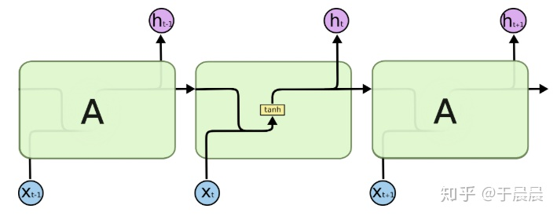

**[图1：单层RNN结构的展开图[4\]](https://link.zhihu.com/?target=http%3A//blog.yucc.me/p/89ae5a9d/1.png)**

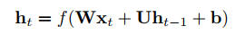

**[图2：htht的产生公式[3\]](https://link.zhihu.com/?target=http%3A//blog.yucc.me/p/89ae5a9d/2.png)**

结合图1和图2，我们知道，htht表示的是隐状态，在图1里也是每个时序的输出。对于文本，就是前文的文本留下来的对后面的推断有用的信息。 其中xtxt是n*1的列向量，htht是m*1的列向量。矩阵WW的维数是m*n，矩阵UU的维数是m*m，bb是m*1的列向量。Wxt+Uht−1+bWxt+Uht−1+b的结果是m*1的列向量。f是针对每个列元素进行分别使用的函数，在图1中取的是tanh函数，实际上取其他函数也没问题。 从图2的公式可以明白，RNN就是结合前文传来的信息WxtWxt及输入的信息Uht−1Uht−1及偏置b的信息，得到输出及下一个因状态htht的神经网络。

总结而言，RNN的输入是n*1的列向量，输出及隐状态是m*1的列向量。 参数个数：mn+mm+m=m(n+m+1)mn+mm+m=m(n+m+1)，其中WW,UU,bb是参数，hh是生成的，不是参数。

RNN有各种问题，比如梯度消失问题，所以下面介绍LSTM。LSTM的结构如下图图3，对于lstm的输入和输出下图图4。关于lstm里面的参数及公式，如下图图5。可以结合图4和图5来理解lstm。lstm是复杂、高级版的rnn。

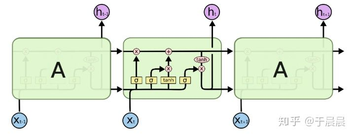

**[图3：lstm的结构展开图](https://link.zhihu.com/?target=http%3A//blog.yucc.me/p/89ae5a9d/3.png)**

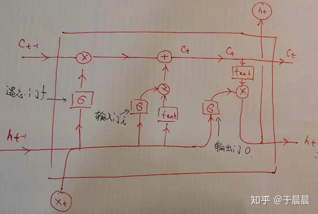

**[图4：lstm的结构展开图，加上标注版](https://link.zhihu.com/?target=http%3A//blog.yucc.me/p/89ae5a9d/4.png)**

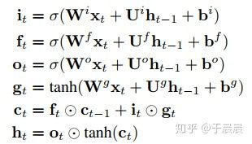

**[图5：lstm的更新公式](https://link.zhihu.com/?target=http%3A//blog.yucc.me/p/89ae5a9d/5.png)**

其中，输入依然为xtxt，维度为n*1的列向量。输出及隐状态htht是m*1的列向量。 ctct是携带信息的列向量，向量维度是m*1。WW系列的维度与RNN的WW一致，均为m*n。UU与RNN的UU一致，均为m*m。bb系列的维度是m*1的列向量。可以看出，lstm的输入与输出/隐状态与rnn是一致的。

图5的公式中it,ft,otit,ft,ot分别表示输入门、遗忘门、输出门三者的结果。这三个门是决定信息是否继续走下去。而tanh是将信息整理到区间(-1,1)的，也就是生成候选信息。同样的，这里σ,tanhσ,tanh这两个函数都是针对列向量的每个元素分别作用的。

到这里，我们可以整理下lstm的神经单元个数及参数个数。我们可以这么理解，比如itit的这个公式，这是一个输入门。我们都很熟悉前馈(全连接)网络，可以将此门视为一个全连接网络层，该网络层的输入是xt,ht−1xt,ht−1，输出为itit（m*1的列向量），该网络的神经网络单元数是m+n个，参数个数是mn+mm+mmn+mm+m。遗忘门和输出门与此一致。同理gtgt的生成，也可以视为一个全连接网络。

所以，在上面的lstm中，单元的总个数是4m，参数的总个数是4m(n+m+1)。

## **1.2 前向lstm语言模型基础 & elmo的双向lstm语言模型**

这里分为两部分，1.2.1讲述一些lstm语言模型的基础，1.2.2讲述elmo中的lstm模型。

## **1.2.1 前向lstm语言模型基础**

给定一串长度为N的词条(t1,t2,…,tN)(t1,t2,…,tN)，前向语言模型通过对给定历史(t1,…tk−1)(t1,…tk−1)预测tktk进行建模，图如下图6（值得注意的是，图6不是ELMo的最终图，只是解释lstm语言模型的图），对应的公式如下图图7。

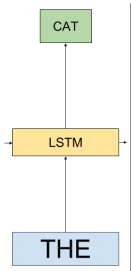

**[图6：前向lstm的语言模型](https://link.zhihu.com/?target=http%3A//blog.yucc.me/p/89ae5a9d/6.png)**

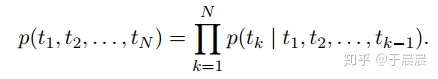

**[图7：前向lstm的语言模型对应的模型公式](https://link.zhihu.com/?target=http%3A//blog.yucc.me/p/89ae5a9d/7.png)**

到了此处，大家可能会迷惑这个网络的输入输出是什么？具体的流程是什么？这个问题很基础又关键。

以“the cat sat on the mat”这句话为例。在某一个时刻k（对应于1.1节中的t时刻）时，输入为the，输出cat的概率。过程是这里面包含了几步，第一步：将the转换成word embedding。所谓word embedding就是一个n*1维的列向量，这个很好理解。那单词怎么转成word embedding的呢？如果大家用过word2vec，glove就知道，就是简单的查表。在本篇paper中，用的不是word2vec，glove，毕竟2018年了。作者用的是cnn-big-lstm[5]生成的word embedding，其实跟word2vec等也差不多，就是提前单独训练好的模型，模型喂入单词就能得到单词的word embedding。总之，在这里一步里，就是简单将单词转换成了n*1的列向量，而这个列向量，对应于1.1节中的输入xtxt。第二步：将上一时刻的输出/隐状态hk−1hk−1（对应于1.1节中的ht−1ht−1）及第一步中的word embedding一并送入lstm，并得到输出及隐状态hkhk对应于1.1中的htht）。其中，隐状态hk−1hk−1是一个m*1的列向量。在1.1中，我们有讲lstm的原理。在这一步里，lstm的输出及隐状态都是hkhk，是一个m*1维的列向量。请大家务必注意hkhk，这个hkhk与我们后文提到elmo向量有着直接的关系。第三步：将lstm的输出hkhk，与上下文矩阵W′W′相乘，即W′hkW′hk得到一个列向量，再将该列向量经过softmax归一化。其中，假定数据集有VV个单词，W′W′是|V|*m的矩阵，hkhk是m*1的列向量，于是最终结果是|V|*1的归一化后向量，即从输入单词得到的针对每个单词的概率。

从上面三步，就可以明白这个前向lstm语言模型的工作流程了。其实很多神经网络语言模型都很类似，除了lstm，还可以用rnn及前馈神经网络，差不多的。

## **1.2.2 elmo的双向lstm语言模型**

有了前面1.1节及1.2.1节的基础，elmo的双向lstm语言模型就很好解释了。ELMo的整体图如下图图8。相对于上面的图6，有两个改进，第一个是使用了多层LSTM，第二个是增加了后向语言模型（backward LM）。

对于多层lstm，每层的输出都是1.1节中提到的隐向量htht，在ELMo里，为了区分，前向lstm语言模型的第j层第k时刻的输出向量命名为hLMk,j−→−hk,jLM→。

对于后向语言模型，跟前向语言模型类似，除了它是给定后文来预测前文。后向lstm语言模型的公式如下图图9所示，可以对照着前向语言lstm语言模型的公式（图7所示）来看。还是非常好理解的。类似的，我们设定后向lstm的第j层的第k时刻的输出向量命名为hLMk,j←−−hk,jLM←。

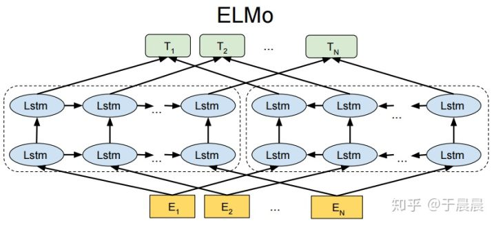

**[图8：ELMo的结果图](https://link.zhihu.com/?target=http%3A//blog.yucc.me/p/89ae5a9d/8.png)**

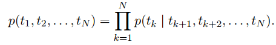

**[图9：后向lstm语言模型的公式](https://link.zhihu.com/?target=http%3A//blog.yucc.me/p/89ae5a9d/9.png)**

图7和图9分别是前向、后向lstm语言模型所要学习的目标函数（注意此处是追求概率最大化的，跟通常的目标函数追求最小化有所不同，要是追求最小化，前面加负号即可）。elmo使用的双向lstm语言模型，论文中简称biLM。作者将图7和图9的公式结合起来，得到所要优化的目标：最大化对数前向和后向的似然概率，如下图图10所示。

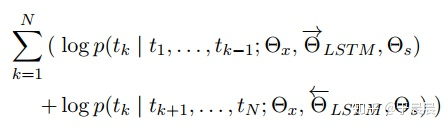

**[图10：elmo双向语言模型的目标函数：最大化以上公式](https://link.zhihu.com/?target=http%3A//blog.yucc.me/p/89ae5a9d/10.png)**

图10中的参数说明，ΘLSTM−→−−−ΘLSTM→表示前向lstm的网络参数，反向的lstm的网络参数同理。两个网络里都出现了ΘxΘx和ΘsΘs，表示两个网络共享的参数。其中ΘxΘx表示映射层的共享，即1.2.1节中提到的第一步中，将单词映射为word embedding的共享，就是说同一个单词，映射为同一个word embedding。ΘsΘs表示1.2.1节中提到的第三步中的上下文矩阵的参数，这个参数在前向和后向lstm中是相同的。

## **1.3 ELMo**

所谓ELMo不过是一些网络层的组合。都有哪些网络层呢？对于每个单词（token）tktk，对于L层的双向lstm语言模型，一共有2L+1个表征（representations），如下图11所示：

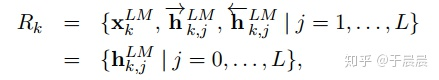

**[图11：每个词条/单词有2L+1个表征](https://link.zhihu.com/?target=http%3A//blog.yucc.me/p/89ae5a9d/11.png)**

其中，hLMk,0hk,0LM是前文提到的word embedding，也就是lstm的输入。对于每一层的双向lstm语言模型，hLMk,j=[hLMk,j−→−;hLMk,j←−−]hk,jLM=[hk,jLM→;hk,jLM←]。值得注意的是，每一层有一个前向lstm的输出，一个后向lstm的输出，两者就是简单的拼接起来的。也就是如果分别都是m*1维的列向量，拼完之后就是2m*1的列向量，就这么简单。

既然ELMo有这么多向量了，那怎么使用呢？最简单的方法就是使用最顶层的lstm输出，即hLMk,Lhk,LLM，但是我们有更好的方法使用这些向量。即如下图图12的方法，我们对于每层向量，我们加一个权重staskjsjtask（一个实数），将每层的向量与权重相乘，然后再乘以一个权重γγ。每层lstm输出，或者每层lstm学到的东西是不一样的，针对每个任务每层的向量重要性也不一样，所以有L层lstm，L+1个权重，加上前面的γγ，一共有L+2个权重。注意下此处的权重个数，后面会用到。为何要乘以γγ，因为下一节1.4节我们会看到，我们会将此向量与另一向量再次拼接，所以此处有一个缩放系数。

笔者思考一个问题，为何不把L+1个向量一起拼接起来？这样子网络可以学的更充分。笔者猜想，可能是考虑维数太高，其实也没那么高了。考虑这些信息有叠加？总之，笔者不确定。

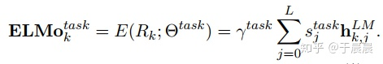

**[图12：ELMo向量的生成](https://link.zhihu.com/?target=http%3A//blog.yucc.me/p/89ae5a9d/12.png)**

总之，看到上图图12，就是我们所说的ELMo向量了。它是多个输出层及输入层，按照一定权重相乘得到的。这个权重怎么来的？针对具体的nlp任务，我们用的时候，需要再次训练去得到的这个权重。最简单的方法，就是权重都设为一样。

## **1.4 ELMo用于有监督的nlp任务**

在1.3节生成了ELMo向量（图12所示）之后，使用方法依然是拼接。将单词/词条的表征xkxk与ELMotaskkELMoktask拼接起来就可以了，即一个单词的最终向量是这样的 [xk;ELMotaskk][xk;ELMoktask]。 这就是最终的使用方法。

原文中有下面一段话，笔者没读太明白。先放在这里。

For some tasks (e.g., SNLI, SQuAD), we observe further improvements by also including ELMo at the output of the task RNN by introducing another set of output specific linear weights and replacing hkhk with [hk;ELMotaskk][hk;ELMoktask].

作者同时提到，通过加入一定的l2正则, λ||w||2λ||w||2，有助于提高模型泛化性能。

## **1.5 预训练的双向语言模型架构**

论文的作者有预训练好的ELMo模型，映射层（单词到word embedding）使用的Jozefowicz的CNN-BIG-LSTM[5]，即输入为512维的列向量。同时LSTM的层数L，最终使用的是2，即L=2。每层的LSTM的单元数是4096。每个LSTM的输出也是512维列向量。每层LSTM（含前、向后向两个）的单元个数是4096个（从1.1节可以知公式4m*2 = 4*512*2 = 4096）。也就是每层的单个lstm的输入是512维，输出也是512维。

一旦模型预训练完成，便可以用于nlp其他任务。在一些领域，可以对biLM（双向lstm语言模型）进行微调，对任务的表现会有所提高，这种可以认为是一种迁移学习（transfer learning）。

## **1.6 ELMo使用方法总结 及 效果展示**

对于预训练好的双向lstm语言模型，我们可以送入一段话，然后模型会得到图11的向量，然后我们加上一定的权重（可训练）即可得到图12的ELMo向量。最终将ELMo向量与xkxk拼接作为单词的特征，用于后续的处理。

对于部分任务，可以对双向lstm语言模型微调，可能有所提升。

至于ELMo的效果，下面可以看图13，总之是很多任务都提升就对了。

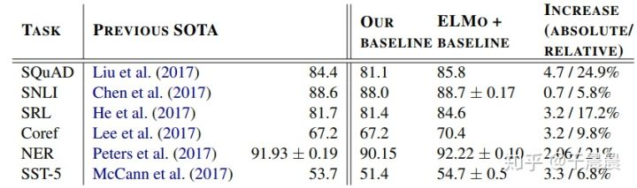

**[图13：ELMo的效果展示](https://link.zhihu.com/?target=http%3A//blog.yucc.me/p/89ae5a9d/13.png)**

## **1.7 ELMo学到了什么**

ELMo到底学到了什么呢？我们前文提到的多义词问题解决了吗？

可以观察下图图14，可以看到，加入elmo之后，可以明显将play的两种含义区分出来，而GLoVe并不能。所以答案很明显。

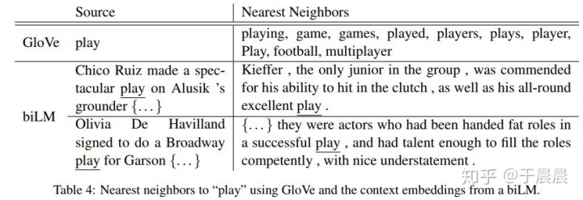

**[图14：ELMo对于消除多义词的效果展示](https://link.zhihu.com/?target=http%3A//blog.yucc.me/p/89ae5a9d/14.png)**

**Word sense disambiguation（词义消歧）**

作者是通过实验证明的，如下图图15。biLM表示我们的模型。第一层，第二层分别使用的结果显示，越高层，对语义理解越好，表示对词义消歧做的越好。这表明，越高层，越能捕获词意信息。

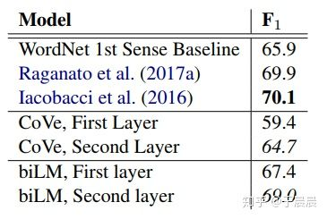

**[图15：ELMo效果展示](https://link.zhihu.com/?target=http%3A//blog.yucc.me/p/89ae5a9d/15.png)**

**POS tagging（词性标注）**

这是另一个任务的实验了，如下图15，第一层效果好于第二层。表明，低层的更能学到词的句法信息和词性信息。

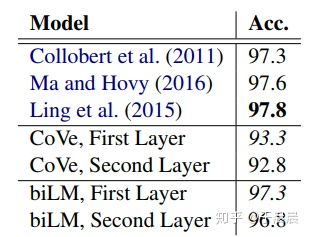

**[图16：ELMo效果展示](https://link.zhihu.com/?target=http%3A//blog.yucc.me/p/89ae5a9d/16.png)**

总体而言，biLM每层学到的东西是不一样的，所以将他们叠加起来，对任务有较好的的提升。

## **1.8 ELMo的缺点**

前文提了这么多elmo的优点，现在说一说缺点。这些缺点笔者是搬运[6]的观点。[6]的观点是站在现在的时间点上（BERT已发布）看的，他的观点如下：

那么站在现在这个时间节点看，ELMO 有什么值得改进的缺点呢？首先，一个非常明显的缺点在特征抽取器选择方面，ELMO 使用了 LSTM 而不是新贵 Transformer，Transformer 是谷歌在 17 年做机器翻译任务的“Attention is all you need”的论文中提出的，引起了相当大的反响，很多研究已经证明了 Transformer 提取特征的能力是要远强于 LSTM 的。如果 ELMO 采取 Transformer 作为特征提取器，那么估计 Bert 的反响远不如现在的这种火爆场面。另外一点，ELMO 采取双向拼接这种融合特征的能力可能比 Bert 一体化的融合特征方式弱，但是，这只是一种从道理推断产生的怀疑，目前并没有具体实验说明这一点。

## **二、 ELMo简单上手**

既然elmo有这么有用，该怎么使用呢？这里介绍一下简单的使用方法。

有三种方法可以使用预训练好的elmo模型。一、elmo官方allenNLP发布的基于pytorch实现的版本[7]；二、elmo官方发布的基于tensorflow实现的版本[8]；三、tensorflow-hub中google基于tensorflow实现的elmo的版本[9]。 本节内容介绍第三个版本。

先简单介绍下tensorflow-hub，hub类似于github的hub，tensorflow-hub的目标就是讲机器学习的算法，包含数据、训练结果、参数等都保存下来，类似于github一样，拿来就可以直接用。所有人都可以在这里提交自己的模型及数据、参数等。这里实现的elmo是google官方实现并预训练好的模型。有人基于此模型+keras写的博客及代码教程大家可以参考下[10][11]，此代码使用的google的elmo的第一个版本，目前最新的是第二个版本。

下面看代码的简单上手使用，大家可能需要先安装tensorflow_hub。

```text
import tensorflow_hub as hub

# 加载模型
elmo = hub.Module("https://tfhub.dev/google/elmo/2", trainable=True)
# 输入的数据集
texts = ["the cat is on the mat", "dogs are in the fog"]
embeddings = elmo(
texts,
signature="default",
as_dict=True)["default"]
```

上述代码中，hub.Module加载模型，第一次会非常慢，因为要下载模型，甚至可能要科学上网。该模型是训练好的模型，也就是lstm中的参数都是固定的。这里的trainable=True是指1.3节中提到的4个权重参数可以训练。texts是输入数据集的格式，也有另一种输入格式，代码如下。signature为default时，输入就是上面的代码，signature为tokens时，就是下面的方式输入。注意最后一行的中括号里的default，表示输出的内容。这个default位置有五个参数可以选，分别为：1. word_emb，表示word embedding，这个就纯粹相当于我们之前提到的lstm输入的位置的word embedding，维数是[batch_size, max_length, 512]，batch_size表示样本的个数，max_length是样本中tokens的个数的最大值，最后是每个word embedding是512维。2. lstm_outputs1，第一层双向lstm的输出，维数是[batch_size, max_length, 1024]。3. lstm_outputs2，第二层双向lstm的输出，维数是[batch_size, max_length, 1024]。4. elmo，输入层及两个输出层，三层乘以权重。其中权重是可以训练的，如1.3节所讲。维数是[batch_size, max_length, 1024]。5.default，a fixed mean-pooling of all contextualized word representations with shape [batch_size, 1024]。 所以可以看到，要想训练权重，要使用elmo这个参数。

```python3
elmo = hub.Module("https://tfhub.dev/google/elmo/2", trainable=True)

# 另一种方式输入数据
tokens_input = [["the", "cat", "is", "on", "the", "mat"],
["dogs", "are", "in", "the", "fog", ""]]
# 长度，表示tokens_input第一行6一个有效，第二行5个有效
tokens_length = [6, 5]
# 生成elmo embedding
embeddings = elmo(
inputs={
"tokens": tokens_input,
"sequence_len": tokens_length
},
signature="tokens",
as_dict=True)["default"]
```

上面生成的embedding，想变成numpy向量，可以使用下面的代码。

```text
from tensorflow.python.keras import backend as K

sess = K.get_session()
array = sess.run(embeddings)
```

至此，关于elmo的所有内容已经完毕了。更多的使用，还需要再探索。谢谢大家。


## **参考资料**

1.  Peters, Matthew E., et al. “Deep contextualized word representations.” arXiv preprint arXiv:1802.05365 (2018).
2.  [https://allennlp.org/elmo](https://link.zhihu.com/?target=https%3A//allennlp.org/elmo)
3.  Kim Y, Jernite Y, Sontag D, et al. Character-Aware Neural Language Models[C]//AAAI. 2016: 2741-2749.
4.  [http://colah.github.io/posts/2015-08-Understanding-LSTMs/](https://link.zhihu.com/?target=http%3A//colah.github.io/posts/2015-08-Understanding-LSTMs/)
5.  Jozefowicz R, Vinyals O, Schuster M, et al. Exploring the limits of language modeling[J]. arXiv preprint arXiv:1602.02410, 2016.
6.  https://zhuanlan.zhihu.com/p/51132034
7.  [https://github.com/allenai/allennlp/blob/master/tutorials/how_to/elmo.md](https://link.zhihu.com/?target=https%3A//github.com/allenai/allennlp/blob/master/tutorials/how_to/elmo.md)
8.  [https://github.com/allenai/bilm-tf](https://link.zhihu.com/?target=https%3A//github.com/allenai/bilm-tf)
9.  [https://tfhub.dev/google/elmo/2](https://link.zhihu.com/?target=https%3A//tfhub.dev/google/elmo/2)
10.  [https://towardsdatascience.com/elmo-embeddings-in-keras-with-tensorflow-hub-7eb6f0145440](https://link.zhihu.com/?target=https%3A//towardsdatascience.com/elmo-embeddings-in-keras-with-tensorflow-hub-7eb6f0145440)
11.  [https://github.com/strongio/keras-elmo/blob/master/Elmo%20Keras.ipynb](https://link.zhihu.com/?target=https%3A//github.com/strongio/keras-elmo/blob/master/Elmo%20Keras.ipynb)

编辑于 2019-04-19