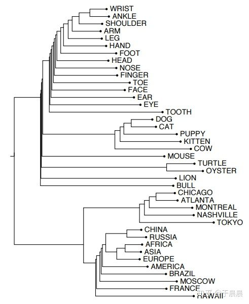
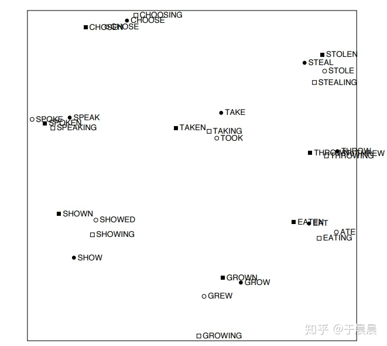
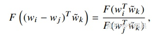
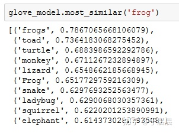

# GloVe算法原理及简单使用

[](https://www.zhihu.com/people/yuchenchen)

[于晨晨](https://www.zhihu.com/people/yuchenchen)[](https://www.zhihu.com/question/48510028)

联想（北京）有限公司 自然语言处理高级研究员

关注他

31 人赞同了该文章

在2013年Tomas Mikolov等人提出word2vec之后，2014年，Jeffrey Pennington, Richard Socher, Christopher D. Manning三人提出了GloVe算法[1][2][3]。其中，GloVe是Global Vector的缩写。在传统上，实现word embedding（词嵌入）主要有两种方法，Matrix Factorization Methods（矩阵分解方法）和Shallow Window-Based Methods（基于浅窗口的方法），二者分别有优缺点，而GloVe结合了两者之间的优点。从论文中的实验，可以看到GloVe方法好于word2vec等方法。

## **一、 背景**

做word embedding的方法，在2014年的时候主要有两种。一种是Matrix Factorization Methods（矩阵分解方法），一种是Shallow Window-Based Methods（基于浅窗口的方法）。关于Shallow Window-Based Methods，一个典型代表就是word2vec的方法，我在博客[5]已经解析过了。Matrix Factorization Methods这种方法，大致可以理解为是一种基于统计的方法，下面以简单例子说明。

一个简单的例子：Window based co-occurrence matrix（基于窗口的共现矩阵）。 窗口长度这里选择为1（通常使用5-10），矩阵具有对称性（与在左侧或右侧无关）。样本数据集：1. I like deep learning. 2. I like NLP. 3. I enjoy flying.

这样就可以得到如下的基于窗口的共现矩阵，如下图图1。


**[图1：基于窗口的共现矩阵](https://link.zhihu.com/?target=http%3A//blog.yucc.me/p/bc3a10ed/1.png)**

有了这个矩阵，每个词的向量就可以表示出来了。比如上图图1中，I就是对应第一行的向量，所以在这个模型中，I的向量表示就是 (0,2,1,0,0,0,0,0)(0,2,1,0,0,0,0,0)，其他的类推。但是使用此矩阵去表示词向量有以下问题：

1.  随着词汇增多，向量的大小会变得很大。
2.  非常高维，需要大量存储空间。
3.  随后的分类模型具有稀疏性的问题。（注：因为维数高，又稀疏，模型分类不易）
4.  模型不够健壮（robust）

对于上述问题的解决方案：Low dimensional vectors（低维向量）。该方案的想法是：将“大多数”的重要信息保存在一个固定的、数量较小的维度的向量。通常这个维度是25-1000维，类似于word2vec。那么，如何减少这个维度呢？

方法一：在共现矩阵X上面进行降维。 降维的方法之一就是Singular Value DecomposiRon（奇异值分解，简称SVD），如下图图2。其中，X~X~表示在最小二乘法的约束下，秩为k最接近X的矩阵。SVD的原理，笔者不太熟悉，这里知道有SVD的方法可以降维就可以了。


**[图2：奇异值分解](https://link.zhihu.com/?target=http%3A//blog.yucc.me/p/bc3a10ed/2.png)**

SVD（奇异值分解）的简单python例子如下图图3。其中数据集依然是：1. I like deep learning. 2. I like NLP. 3. I enjoy flying. 。然后在图4中，输出U矩阵的前两为最大的单个值。


**[图3：奇异值分解得到词向量的简单python例子](https://link.zhihu.com/?target=http%3A//blog.yucc.me/p/bc3a10ed/3.png)**


**[图4：奇异值分解得到词向量的简单python例子](https://link.zhihu.com/?target=http%3A//blog.yucc.me/p/bc3a10ed/4.png)**

再次思考矩阵X。

1.  常用词比如the，he，has等非常常见，对语法有很大影响。解决办法：min(X,t),t 100min(X,t),t 100 或 忽略他们。
2.  接近中心词的词汇权重增加。
3.  使用Pearson correlations代替单纯的计数，然后将负值设为0。
    等等。

图5,6,7分别是论文[4]中发现的有趣的语义、句法、语义信息。



**[图5：SVD得到的有趣的语义信息](https://link.zhihu.com/?target=http%3A//blog.yucc.me/p/bc3a10ed/5.png)**



**[图6：SVD得到的有趣的句法信息](https://link.zhihu.com/?target=http%3A//blog.yucc.me/p/bc3a10ed/6.png)**


**[图7：SVD得到的有趣的语义信息](https://link.zhihu.com/?target=http%3A//blog.yucc.me/p/bc3a10ed/7.png)**

但是SVD（奇异值分解）依然有以下几个问题：

1.  计算代价太大。对于一个n*m的矩阵，计算复杂度是O(mn2)O(mn2)。这就导致会与数百万的文档或词汇不易计算。
2.  难以将新的词汇或文档合并进去。

下图图8是将基于计数的和基于直接预测的两种word embedding方法对比：

基于计数的方法的优点是： 1. 训练非常迅速。 2. 能够有效的利用统计信息。 缺点是：1. 主要用于获取词汇之间的相似性（其他任务表现差） 2. 给定大量数据集，重要性与权重不成比例。

基于预测的方法的优点是： 1. 能够对其他任务有普遍的提高。 2. 能够捕捉到含词汇相似性外的复杂模式。 缺点是：1. 需要大量的数据集。 2. 不能够充分利用统计信息。


**[图8：基于计数的和基于直接预测的两种word embedding方法对比](https://link.zhihu.com/?target=http%3A//blog.yucc.me/p/bc3a10ed/8.png)**

这二者都有优缺点，GloVe的逻辑是，两种方法的优点结合起来。怎么结合的呢？这正是第二节的内容。

## **二、GloVe原理**

要了解GloVe之前，建议学习下word2vec的原理。看懂了word2vec，再看此论文会非常容易，因为里面有很多相通的地方。GloVe原理，里面也不像其他的那么推导公式，一步一步来。这里的原理，很多还是靠自己慢慢理解那种。下面是正文。

首先定义词与词之间的共现次数矩阵为XX，其中XijXij表示单词j是单词i的上下文的次数。 定义Xi=∑kXikXi=∑kXik，表示单词i的上下文的所有单词的总个数。最终Pij=P(j|i)=Xij/XiPij=P(j|i)=Xij/Xi表示单词j出现在单词i的上下文的概率。

可以从一个简单例子看到共现概率的重要性。假定我们关心两个中心词，i和j。其中，我们假定i=ice，j=steam。那么我们可以通过给定不同的单词k，研究他们共现的概率来判定两个单词的关系。比如k = solid（固体），我们会期待比率 Pik/PjkPik/Pjk非常大。同样的，单词k与steam有关，与ice无关，比如k=gas，那么比率就非常小。如果k=water或fashion（时尚），那么或者与二者都有关，或都无关。那么比率就会接近1。下图图9就是他们的概率及比率。通过对比原始的概率，这个比率可以很好的从不相关词汇（water和fashion）中区分相关的词汇（solid和gas）。也很好的区分两个相关词汇。


**[图9：目标单词（target words）ice（冰）和steam（流）及从60亿词条中选择的上下文](https://link.zhihu.com/?target=http%3A//blog.yucc.me/p/bc3a10ed/9.png)**

上面的讨论告诉我们，单词的词向量（word vector）学习应该跟词共现概率的比率有关，而不是他们的概率本身。注意到比率Pik/PjkPik/Pjk依赖于i,j,ki,j,k，最一般的形式如下图图10。


**[图10：词向量推导最一般的形式](https://link.zhihu.com/?target=http%3A//blog.yucc.me/p/bc3a10ed/10.png)**

其中，w∈Rdw∈Rd是词向量，w~∈Rdw~∈Rd是独立的上下文词向量。如果大家看过word2vec的话，此处的w就类似于最终一个词的表示，就是300维的词向量。 w~w~上下文的词向量，也是一个向量，跟ww同维度。首先，我们希望词向量的信息表正在比例Pik/PjkPik/Pjk里。词向量，内部是线性结构，这里希望更简洁的表示，所以这里做了一个相减来表示。不要问为什么要相减，这里面的很多推导都是比较跟着感觉走。就是这样子的。于是得到了下图图11的公式。


**[图11：公式的简单变形](https://link.zhihu.com/?target=http%3A//blog.yucc.me/p/bc3a10ed/11.png)**

主意右边是一个数字，左侧是向量。为了避免我们的网络，比如神经网络，关注到无用的东西。这里进行F里面的两个向量相乘。得到了下图图12中的公式。


**[图12：公式的简单变形](https://link.zhihu.com/?target=http%3A//blog.yucc.me/p/bc3a10ed/12.png)**

可以注意到词共现矩阵中，词和词的上下文词汇是任意的，我们自由的互换他们的位置。也就是我们互换w↔w~w↔w~，也可以互换 X↔XTX↔XT。为了满足这个条件，需要做以下两步操作。

第一步，我们的目标是要图12的公式满足同态（homomorphism）。至于什么是同态，笔者不太熟悉。可以看下图图13。假定我们认为满足下图图13的公式就是满足了同态性，满足了上述需求。



**[图13：公式要满足的条件，同态性](https://link.zhihu.com/?target=http%3A//blog.yucc.me/p/bc3a10ed/13.png)**

对比上图图12的公式，我们可以得到下图图14。


**[图14：对比图13得到](https://link.zhihu.com/?target=http%3A//blog.yucc.me/p/bc3a10ed/14.png)**

对于图13的公式，F是指数函数，F=exp，这一点应该很容易想到，因为图13中，两个变量的相减经过函数F等于两个变量经过函数F之后相除，显然是一个指数函数。于是有了图15。


**[图15：图13公式的一个解](https://link.zhihu.com/?target=http%3A//blog.yucc.me/p/bc3a10ed/15.png)**

第二步，注意到，图15中改变i和k的位置，会改变公式的对称性。所以为了保证对称性，为w~kw~k添加偏置b~kb~k。如下图图16。


**[图16：修正对称性后的公式](https://link.zhihu.com/?target=http%3A//blog.yucc.me/p/bc3a10ed/16.png)**

到目前为止，我们从图10的公式推导到了图16的公式，也就是我们训练最终的词向量要满足图16的公式。于是我们可以定义我们的目标函数（或者叫损失函数）如下：


J′=∑i,j=1V(wTiw~j+bi+b~j−logXij)J′=∑i,j=1V(wiTw~j+bi+b~j−logXij)


其中V是单词的总个数。但是上述目标函数还有一个问题，就是无论单词i和单词k之间出现的频率多少，都作为一个样本进行训练。那么对于那么单词i和单词k之间不常见的组合，或偶尔出现的组合，也进行拟合，其实这些拟合的是一些噪声，这显然不利于模型的鲁棒性/健壮性（robust）。怎么办呢？最简单的办法就来了，让那些出现次数较少的组合权重低一些。于是变为了下图土17。


**[图17：GloVe目标函数](https://link.zhihu.com/?target=http%3A//blog.yucc.me/p/bc3a10ed/17.png)**

上图中f(Xijf(Xij是权重系数。权重系数应当遵循下面三个原则：

1.  f(0)=0f(0)=0。
2.  f(x)递增，以保证罕见的组合不会给与过多的权重。
3.  对于较大的x值，f(X)应该比较小，以保证频繁出现的组合不会给过多的权重。

有了上面三个原则，于是设计出了以下的权重函数，如图图18，其函数图像如图图19：


**[图18：GloVe目标函数的权重函数](https://link.zhihu.com/?target=http%3A//blog.yucc.me/p/bc3a10ed/18.png)**


**[图19：GloVe目标函数的权重函数的函数图像](https://link.zhihu.com/?target=http%3A//blog.yucc.me/p/bc3a10ed/19.png)**

图19中权重函数的α=3/4α=3/4。xmaxxmax依赖于数据集，论文作者选取的xmax=100xmax=100，同时实验中发现α=3/4α=3/4效果好于α=1α=1，这与word2vec的选取3/4似乎有所巧合。

最终，我们训练得到了一个单词的向量表示ww和上下文向量w~w~。最终的向量也是使用了一个trick，将二者相加，作为单词的向量,实验表明，二者相加效果对比单独使用，略有提升。

至此，GloVe的原理推导完了。其实，也不能叫做推导，作者在论文里也只是说明这个损失函数怎么一步步得出来的。

## **三、GloVe部分结果展示**

具体的实验结果，我不在此处张贴了。总之，作者对比了其他结果，总体上好于word2vec。有兴趣看具体结果的可以看原始论文[1]。这里只是简单展示一点。对frog（青蛙）这个单词，求最相似的单词，得到了如图20的结果。可以看到图中都是青蛙之类的词汇，表明了结果的有效性。


**[图20：GloVe对词frog求最相似的词向量的结果图](https://link.zhihu.com/?target=http%3A//blog.yucc.me/p/bc3a10ed/20.jpg)**

下图图21是我自己加载了GloVe预训练的模型[6]得到的最相似的单词的结果。



**[图21：加载GloVe预训练模型，笔者对词frog求最相似的词向量的结果图](https://link.zhihu.com/?target=http%3A//blog.yucc.me/p/bc3a10ed/21.png)**

## **三、Glove简单使用**

在[3]里可以找到论文作者基于维基百科及推特还有其他数据集分别训练的多个GloVe模型，可以下载下来，解压缩，使用gensim工具包进行使用。我这里没有自己用数据集进行训练，只使用了他们训练好的模型。

这里以[6]为例。依然使用python的gensim工具包。首先需要将这个训练好的模型转换成gensim方便加载的格式(gensim支持word2vec格式的预训练模型格式）。这个只需要进行一次即可。

```python3
from gensim.scripts.glove2word2vec import glove2word2vec


glove_input_file = 'glove.840B.300d.txt'
word2vec_output_file = 'glove.840B.300d.word2vec.txt'
```

转换过模型格式后，就可以使用里面的词向量了。

```text
from gensim.models import KeyedVectors


# 加载模型
glove_model = KeyedVectors.load_word2vec_format(word2vec_output_file, binary=False)
# 获得单词cat的词向量
cat_vec = glove_model['cat']
print(cat_vec)
# 获得单词frog的最相似向量的词汇
print(glove_model.most_similar('frog'))
```

对于预训练的word2vec及预训练的GloVe，笔者均使用了。在笔者的文本分类任务中，GloVe效果比word2vec效果高了一个百分点。

后续更新

如果有后续更新，将会在本网址更新：

[GloVe算法原理及简单使用](https://link.zhihu.com/?target=http%3A//blog.yucc.me/p/bc3a10ed/)

。

## **参考资料**

1.  Pennington J, Socher R, Manning C. Glove: Global vectors for word representation[C]//Proceedings of the 2014 conference on empirical methods in natural language processing (EMNLP). 2014: 1532-1543.
2.  [https://github.com/stanfordnlp/GloVe](https://link.zhihu.com/?target=https%3A//github.com/stanfordnlp/GloVe)
3.  [http://nlp.stanford.edu/projects/glove/](https://link.zhihu.com/?target=http%3A//nlp.stanford.edu/projects/glove/)
4.  Rohde D L T, Gonnerman L M, Plaut D C. An improved model of semantic similarity based on lexical co-occurrence[J]. Communications of the ACM, 2006, 8(627-633): 116.
5.  [http://blog.yucc.me/p/a634168a/](https://link.zhihu.com/?target=http%3A//blog.yucc.me/p/a634168a/)
6.  [http://nlp.stanford.edu/data/wordvecs/glove.840B.300d.zip](https://link.zhihu.com/?target=http%3A//nlp.stanford.edu/data/wordvecs/glove.840B.300d.zip)

编辑于 2018-11-27