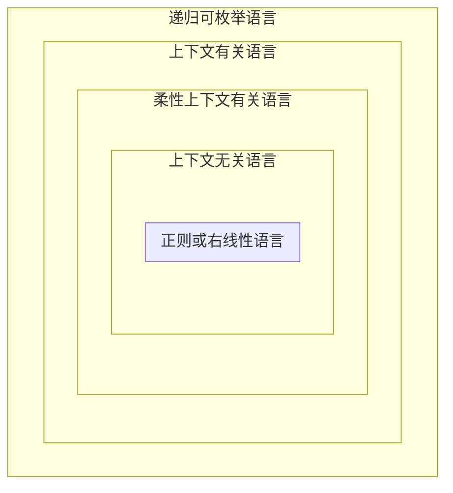

# Ch16 语言和复杂性

## 16.1 Chomsky层级

形式语言（formal language）是在有限字母表上的符号串的集合。

不同的形式化方法写的语法的类别具有不同的生成能力。

如果一种语法能够定义一种语言，而另一种语法不具备这个能力，就说明前一种语法具有更加强大的生成能力或者更大的复杂性。

Chomsky层级是一种理论工具，可以用于比较不同形式化方法的表达能力或者复杂性。

| 类型 | 通用名称       | 规则基干                                                     | 语言学例子                                       |
| ---- | -------------- | ------------------------------------------------------------ | ------------------------------------------------ |
| 0    | Turing等价     | $\alpha\rightarrow\beta,\text{s.t.}\alpha\neq\varepsilon$    | 中心语驱动的短语结构语法、词汇功能语法、最简方案 |
| 1    | 上下文有关     | $\alpha A\beta\rightarrow\alpha\gamma\beta,\text{s.t.}\gamma\neq\varepsilon$ |                                                  |
| -    | 柔性上下文有关 |                                                              | 树邻接语法、组合式范畴语法                       |
| 2    | 上下文无关     | $A\rightarrow\gamma$                                         | 短语结构语法                                     |
| 3    | 正则           | $A\rightarrow xB, A\rightarrow x$                            | 有限状态自动机                                   |

Chomsky层级包含了4种语法：（图16.1和 图16.2）

-   正则（或者右线性）语言：与正则语法或者正则表达式等价。正则语法可以是右线性的，也可以是左线性的。
    -   右线性规则的右边只有一个单独的非终极符号，左边最多只有一个非终极符号。
    -   如果在右边只有一个非终极符号，它必定是符号串中的最后一个符号。
    -   左线性语法的右边是可逆的（右边必须至少以一个单独的非终极符号开始）。
-   上下文无关语言：上下文无关规则可以把任何一个单独的非终极符号重写为由终极符号构成的符号串。这个单独的非终极符号也可以重写为 $\varepsilon$。
-   柔性上下文无关语言：可以被上下文有关语法刻画。是上下文有关语言的真子集，也是上下文无关语言的真超集。
-   上下文有关语言：可以被上下文有关语法刻画。规则是以“非递减”（nondecreasing）的方式把符号串 $\delta$ 重写为符号串 $\Phi$ ，使得 $\Phi$ 中的符号至少与 $\delta$ 中的符号一样多
-   递归可枚举语言：可以被Turing等价语法，也叫0型语法，或者叫无限制语法来刻画，即0型语法生成的符号串可以由Turing机列出（或者枚举）。语法除了要求规则的不能是空符号串 $\varepsilon$ 之外，对于规则的形式再没有其他限制。任何非零的符号串都可以重写为任何其他的符号串（或者 $varepsilon$ ）。0型语法刻画了递归可枚举语言，

## 16.2 正则语言的判定

证明一种语言是正则语言的方法：为这种语言建立起正则表达式，再根据正则语言对于并运算、毗连运算、Kellne\*运算、补运算、交运算等都是封闭的就可以了。

### 16.2.1 抽吸引理（pumping lemma）

如果一种语言能够被有限状态自动机模拟，那么根据这种记忆约束量来判定任何符号串是否在该语言中。这个记忆约束量对于不同的符号串不会增长得很大。

如果一个正则语言具有任意长的符号串（比自动机中的状态数还长），那么在该语言的自动机中必定会存在某种回路。即如果一种语言没有这种回路，那么它就不是正则语言。

抽吸引理：设$L$是一个有限的正则语言。那么，必定存在着符号串$x,y,z$，使得对于 $n\geq 0$，有 $y\neq\varepsilon$，并且 $xy^n z\in L$。

如果一种语言是正则语言，那么就存在着一个符号串$y$，这个$y$可以被适当的抽吸。

上下文无关语言也有一个抽吸引理，这个引理可以用来鉴别一种语言是不是上下文无关的。

### 16.2.2 证明各种自然语言不是正则语言

证明过程存在纰漏。

## 16.3 自然语言是上下文无关的吗？

在交叉序列依存（cross-serial
dependencies）中，语言中的单词或者更大的结构按照从左到右的顺序联系的形式。如果一种语言具有任意长的交叉序列依存。

## 16.4 计算复杂性和人的语言处理

句子理解的困难：意思太复杂、句子的歧义特征严重、使用少见的单词、书写质量太差，这些问题似乎都与记忆的有限性有关

人的剖析模型，称为依存定位理论（Dependency Locality Theory，DLT）

-   DLT认为，判断客体的相对性的困难来源于句子中动词的前面出现了两个名词

-   DLT提出，把一个新的单词w结合到句子之中的开销是与单词w以及该单词w所结合的句法项目之间的距离成正比的

计算复杂性似乎都是与记忆有关的。

计算复杂性与概率剖析之间的关系。

由于记忆因素引起的计算复杂性和由于信息论和统计剖析因素引起的计算复杂性之间的关系。

## 16.3 小结

-   两种关于计算机复杂性的思想

    -   形式语言的计算复杂性

    -   人的句子的计算复杂性

-   语言可以使用生成能力来刻画。

    -   如果一种语法能够定义的语言用其他的语法不能定义，那么就说这种语法比其他语法具有更大的生成能力或者更大的计算复杂性。

    -   Chomsky层级是建立在语法生成能力基础上的不同语法的层级。

        -   Turing等价语法

        -   上下文有关语法

        -   上下文无关语法

        -   正则语法

-   抽吸引理：用于证明一种给定的语言不是正则的。

    -   英语不是正则语言，也不是上下文无关语言

    -   瑞士德语和Bambara语不是上下文无关语言，但是柔性上下文有关语言。

-   人类在剖析某些中心嵌套句子时存在困难，是人类的记忆的有限性造成的剖析困难

-   自然语言识别和剖析的计算复杂性

    -   在一个潜在地无限长的句子中，为了保持词汇和一致关系的特征歧义而引起的在某些基于合一的形式化方法中（如词汇功能语法）识别句子的问题，是NP完全问题

    -   双层形态剖析（或者只是词汇形式和表层形式之间的映射）也是NP完全问题

-   加权上下文无关语法（每个规则一个权重）和概率上下文无关语法（非终极符号的规则的权重之各为1）具有相等的表达能力
