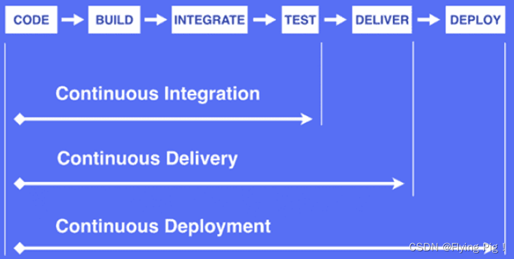

****# 持续集成与持续交付与持续发布

## 开发流程简介

开发工作流程：编码→构建→集成→测试→交付→部署

### 持续集成

持续集成（Continuous Integration）开发者在编码过程中，频繁地将代码合并到服务器仓库中的Develop分支，然后系统自动构建、测试，并且根据测试结果，确定新代码能否与原代码正确的集成。

优点：

* 快速发现错误。每完成一个功能或者修复一个Bug，就集成到Develop分支，从而快速发现错误、修改问题；
* 防止功能开发分支与Develop分支产生巨大分歧，从而到后期集成难度过大

目的：让产品可以快速迭代，同时保持高质量。核心措施是代码集成到主分支前，必须通过自动化测试，只要存在错误的测试用例就不能集成 ，从而尽早发现问题。

### 持续交付

持续交付（Continuous Delivery）是在持续集成的基础上，将集成后的代码部署到更加贴近真实运行环境（类生产环境中），从而保证软件不受更新影响，随时可以交付。

### 持续部署

持续部署（Continuous Deployment）：代码通过评审之后，部署到生产环境，从而保证代码在任何时刻都是可以部署的，满足生产阶段的需要。

## DevOps环境

CI/CD提供了完整的DevOps环境，对整个开发团队能够提升开发效率，从而频繁部署、快速交付以及开发与测试的完全自动化。

### 工作流程

* 提交：工作人员向代码仓库提交代码
* 测试（第一轮）：代码仓库中的 `Commit`操作配置钩子（Hook），当提交代码或者合并请求时，激活自动化测试
  * 单元测试：针对每个函数的功能进行测试
  * 集成测试：针对整个产品的功能进行测试
  * 端到端测试：从用户界面直达数据库的全链路测试
* 构建：将通过第一轮测试的代码合并到Develop分支后，交付给相关的测试或者运维部门
  * 构建工具：Jenkins、Travis、Codeship、Strider
* 测试（第二轮）：全面测试，以自动化为主
* 部署：将通过第二轮测试的代码打包成可以部署的版本，发布到生产环境中，并且重新启动应用服务器
  * 部署工作：Ansible、Chef、Puppet
* 回滚：当发现问题时，回滚到上个版本

## 工具介绍

### Jenkins概述

Jenkins：是基于Java开发的持续集成、交付、部署的基于Web界面的开源软件项目，用于自动化地执行各种任务，包括构建、测试和部署，其正准备是一个持续集成的工具平台或者工具框架，其具体工作依靠安装插件。

### GitLab概述

GitLab：是基于Ruby on Rails 开发的开源软件项目，基于Web界面的用于自托管的Git项目仓库，可以浏览源代码、管理缺陷和注释，管理团队对仓库的访问，易于浏览提交过的版本，并且拥有文件的历史库，还提供了代码片段收集功能，从而实现代码利用，方便日后查找

## 项目部署方式

### 手动部署

### 自动化部署

自动化部署减轻工作量

## 持续集成的工作流程

* 开发者提交新版本到GitLab Server
* GitLab触发Jenkins结点执行一次Build
* Jenkins控制若干Slave按时事先设置的脚本进行Build

[^1]: 钩子程序属于监控机制，监控Git仓库发生事件，从而激活Jenkins自动执行测试脚本
