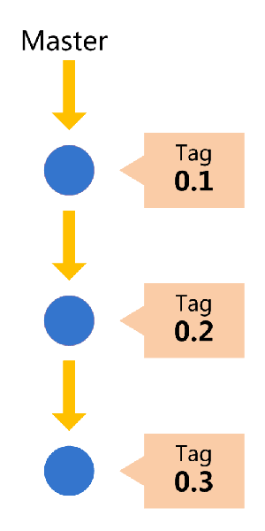
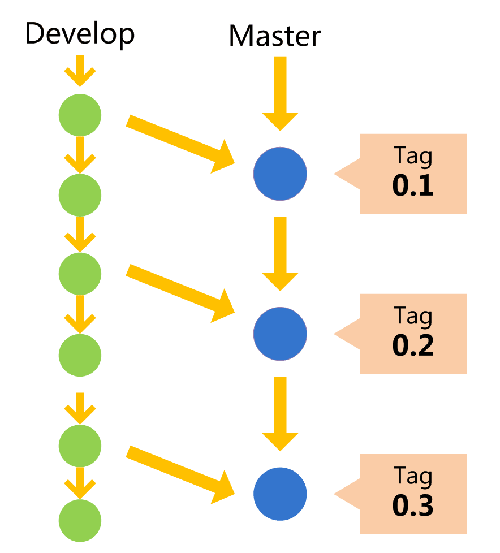
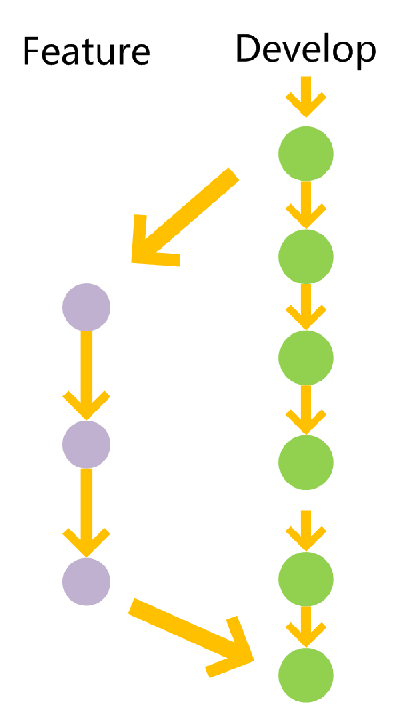
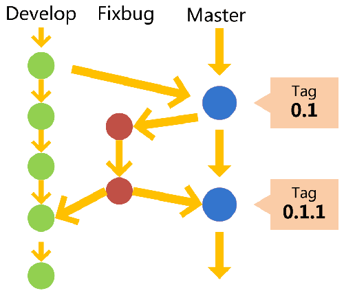
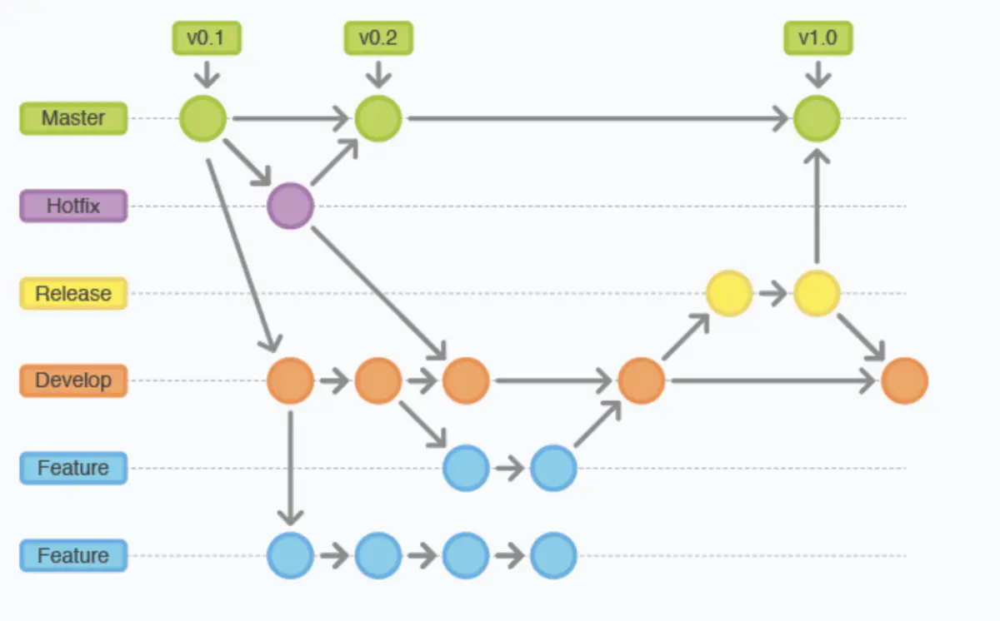

<!--
_class: lead gaia
_paginate: false
-->

# Git培训

## 基础知识和使用方法

---

## Git基本介绍

* Git是什么？
* Gitea是什么？
* 为什么使用Git？
* 为什么使用Gitea？

---

## Git是什么？

* 分布式版本控制系统
* 跟踪文件随时间的变化状态
  * 拥有文件的当前状态
  * 拥有项目的完整历史记录

---

## 为什么使用Git？

* 文档说明
  * 对项目变更的原因进行记录
* 历史记录
  * 查看项目所有的变更状态
  * 撤销更改：随时回退到以前提交的时间点
  * 方便尝试：利用分支和记录可以尝试多种路径
* 解决冲突
  * 系统能够自动合并有冲突的文件，
  * 无法自动解决的也会展示冲突内容
  * 合并开发：不同的分支上的代码可以合并到主分支上

---

## Gitea是什么？

* 网页版的Git存储库管理系统
  * 项目管理
  * 团队管理
  * 合作开发

---

## 为什么使用Gitea？

* 文档跟踪
  * 基于工单记录缺陷或者功能
* 分支协作
  * 使用分支和合并请求进行合作
* 工作进展评估
  * 基于PR列表，查看工作进展
* 团队进展评估
  * 基于提交历史，查看团队进展

---

## 关键概念~存储库

* 存储库（Repository）
  * 代码、文件存储
* 暂存区（Stash）
  * 未提交内容
* 工作区（Work）
  * 编辑内容
* 克隆（Clone）
  * 下载存储库到本地
* 派生（Fork）
  * 通过派生拥有独立的存储库

---

## 关键概念~历史记录

* 提交（Commit）
  * 将文件提交到存储库
* 提交信息（Commit Message）
  * 提交原因，方便理解
* 标签（Tag）
  * 特定提交，记录发布的版本
  * 标记版本号，然后再发布软件

---

## 关键概念~个人开发

* 分支（Branch）
  * 独立提交，修改错误或者创建新功能
  * 修改与发布分离
* 迁出（Checkout）
  * 切换分支，刷新工作区，报告冲突
  * 变更分支前将未提交的内容放到暂存区

---

## 关键概念~合作开发

* 合并请求（Pull Request，PR）
  * 请求他人审查（Review）工作
  * 开发与测试结束后，提前PR合并到项目主分支
* 工单（Issue）
  * 提出工单、讨论功能、跟踪缺陷
* 维基（WiKi）
  * 轻量级页面管理

---

## 分支（Branch）

* 主分支（Master）
  * 创建新项目就创建默认分支，作为主分支
  * 不对主分支进行提交
* 开发分支（Develop）
  * 功能的集成分支
* 维护分支（FixBug）
  * Bug修复分支
  * 必须从Master中拉取
* 功能分支（Feature）
  * 开发新功能或者尝试新实验的分支
* 预发布分支（Release）
  * Bug修复或者功能开发完成后发布产品的分支

---

## 主分支

* 代码库应该有一个，并且只有一个主分支
* 所有给用户的正式版本，都在这个主分支上发布



---

## 开发分支

* 开发时使用的分支
  * 命名：`Develop/版本号`
* 分支用来生成最新隔夜版本（nightly）
* 并开发分支合并到主分支后再发布版本



---

## 临时分支

* 功能分支
  * 命名：`Feature/功能名称`
  * 创建新功能就创建新分支
  * 完成一个功能分支，就实现一次部署
* 预发布分支
  * 命名：`Release/版本号~功能名称~发布日期`
  * 发布新版本就创建新分支
  * 必须解决发布分支下面的所有工单
* 维护分支
  * 命名：`FixBug/版本号~问题概述`
  * 命名：`FixBug/版本号~#issueid~日期`

使用完成后，应该删除 ，常驻分支只有Master和Develop

---

## 功能分支

* 开发某个特定功能
* 工作流程
  * 基于Develop创建功能分支
  * 开发完成后，合并到Develop
  * 删除功能分支



---

## 预发布分支

* 发布正式版本之前（即合并到Master分支之前）
  * 基于预发布的版本进行测试
* 工作流程
  * 基于Develop创建预发布分支
  * 测试没有问题后，合并到Master
  * 再合并到Develop
  * 删除预发布分支

---

## 维护分支

* 软件正式发布后
  * 创建分支，修补Bug
* 工作流程
  * 基于Master创建维护分支
  * 维护结束后，合并到Master
  * 再合并到Develop
  * 删除维护分支



---

## 分支描述图



---

## 分支管理

* 创建分支
  * 新功能创建新分支
  * 新发布创建新分布
* 合并分支（Merge）：
  * 将工作结束的分支合并到主分支或者其他分支
  * 通常是将功能分支合并到主分支

---

## 存储库（Repository）

* 创建存储库
* 添加协作者
* 配置存储库
  * 设定名字
  * 设置主分支
  * 配置WiKi
* 与其他系统集成
  * 向钉钉发送消息

---

## 项目查看（Project）

* 代码
* 工单
* 合并请求
* 项目
* 百科
* 动态（Activity）

---

## 代码

* README.md：项目介绍
* 历史提交
* 分支
* 标签
* 大小

---

## 提交（Commit）

* 文件提交到存储库
  * `git add hello.c`
  * `git commit -m "feature: hello.c"`
* 提交结果初始化
  * `git reset--soft $SHA`: 工作区变更，提交不变更
  * `git reset--hard $SHA`: 工作区变更，提交也变更
* 提交内容恢复
  * `git revert $SHA`: 工作区不变更，恢复原始提交，增加新提交

---

## 提交信息(Commit Message)

* 信息格式
  * header: 头描述，必须有
  * 空白行: 文件文本对齐
  * body: 更新的详细描述
  * footer: 更新的脚注，补充说明

```html
<header>
  <空白行>
<body>
  <空白行>
<footer>
```

---

## 信息格式

* header 格式
  * `<type>(<scope>): <subject>`
    * 例：`add(Chinese): 加入中文化界面`
    * 例：`fix(显示错误): 中文界面显示太小`
* body 格式
  * 描述做的内容，不描述做的状态
    * 例：“修改README.md”，不是“README.md修改完成”
* footer 格式
  * 引用某个工单：`update #123`, `refactor #123`
  * 关闭某个工单：`close #123`, `fixes #123`, `resolve #123`
  * 关闭多个工单：`close #123, #234, #345`

---

## commit message -> header -> type 类型

* type（类型）：用于说明commit的类别，规定为如下几种
  * feature：新增功能；
  * fix：修复bug；
  * docs：修改文档；
  * refactor：代码重构，未新增任何功能和修复任何bug；
  * build：改变构建流程，新增依赖库、工具等（例如webpack修改）；
  * style：仅仅修改了空格、缩进等，不改变代码逻辑；
  * perf：改善性能和体现的修改；
  * chore：非src和test的修改；
  * test：测试用例的修改；
  * ci：自动化流程配置修改；
  * revert：回滚到上一个版本；

---

## commit message -> header -> scope

* scope（范围）：可选输入，补充说明

---

## commit message -> header -> subject

* subject（主题）：commit 的简要说明
  * 描述做的内容，不描述做的状态
  * 行尾不需要标点符号

---

## 项目设置

* 仓库
* 协作者
* 分支
* 标签
* Web钩子
* 部署密钥
* LFS

---

## 文件处理

* 创建
* 编辑
* 改名或者移动
* 创建合并请求

---

## 文件夹处理

* 创建
* 改名或者移动

---

## 合作开发

* 工单
  * 基于工单创建分支
* 分支
  * 基于分支创建合并请求

---

## 工单

* 创建工单
  * 标题要清晰
  * 指定处理人员
* 管理工单
  * 指定完成时间和里程碑
* 评论工单
  * 项目组共同解决问题
  * 记录问题解决的历史经验

---

## 工单操作手册

* 创建“Bug”和“Feature”标签
  * 问题分类
* 使用日程表和里程碑
  * 管理进度
* 提交时使用工单编号
  * 提交会显示在问题的历史记录中
  * 加上关键词可以直接关闭工单

---

## 合并请求操作手册

* 每件事都创建合并请求
  * 标题要清晰
  * 值得项目组共同关注
* 测试合并请求
  * 代码单独克隆，编译并测试
* 合并请求时遵守流程
  * 制定规范化合并流程

---

## 标签（Tag）

* 标签命名
  * `v版本.里程碑.序号`
    * 例：`v1.2.1`
    * 版本：架构调整或者升级
    * 里程碑：新功能上线或者模块调整
    * 序号：Bug修复

---

## 维基（WkKi）

* 当 `README.md` 过长时，使用WiKi管理文档
* WiKi是独立的Git项目，可以克隆到本地修改
* WiKi操作
  * 添加页面
  * 添加链接

---

## 人员管理

* 创建组织
  * 研发部
* 创建团队
  * 口扫组
* 团队人员添加
  * 组织名称→团队名称→团队成员管理

---

## 参考文献

* [Git 使用规范流程](http://www.ruanyifeng.com/blog/2015/08/git-use-process.html)
* [Git 分支管理策略](https://www.ruanyifeng.com/blog/2012/07/git.html)
* [Git Commit Guidelines](https://elegant.oncrashreboot.com/git-commit-guidelines#header)
* [How to Write a Git Commit Message](https://chris.beams.io/posts/git-commit/)